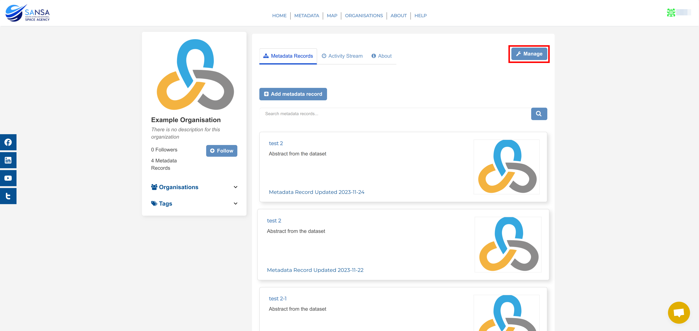
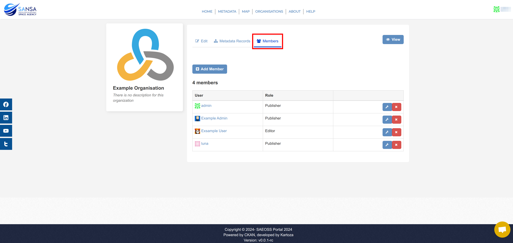
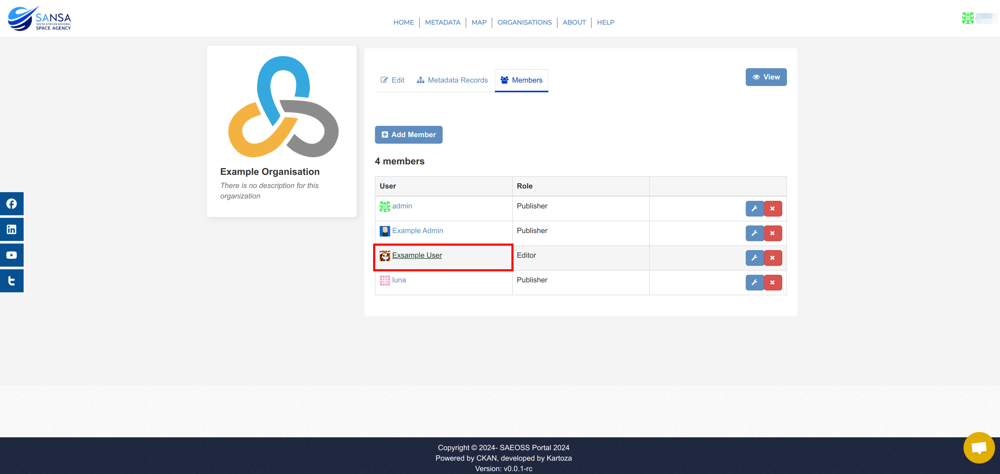
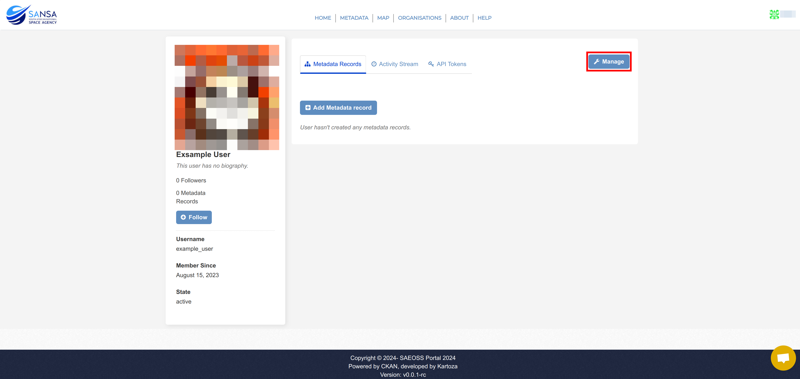
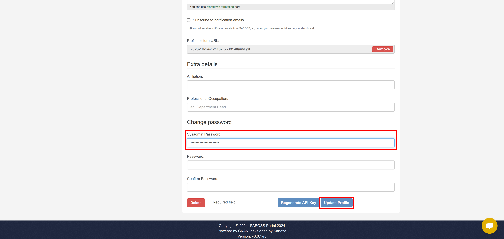
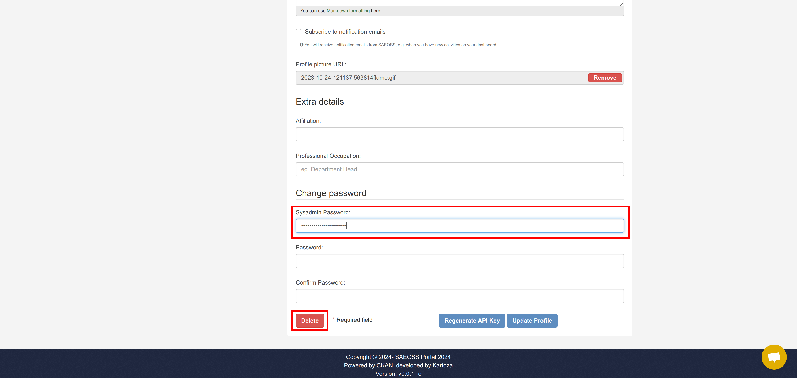
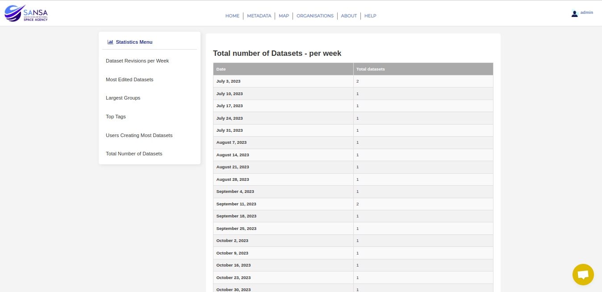

# Administrator Guide
<!-- Narrative Instructions on how admin users will use the product/platform -->
<!-- Replace all of the titles with relevant titles -->

## Creating a system admin account

*Please note a system administrator cannot be created via the web interface. This needs to be done via the terminal command in the server*

1. Open up a terminal in the server
2. Run the following command  `docker exec -it saeoss_ckan-web_1 poetry run ckan sysadmin add admin`
3. Answer the prompts in order to create the new admin user

*After the account’s successful creation you can log into the site with the admin user account created earlier*

## Manage user accounts

*A sysadmin user has full access to user accounts*

### Method 1

1. To find a user’s profile, enter the following address in your internet browser https://{sitename}/user/ ('/user/' has been appended to the website’s url)
2. You can search for a specific profile using the search box provided

3. You can search by any part of the user profile, including their e-mail address.
      - This is useful if, for example, a user has forgotten their user ID
      - For non-sysadmin users, the search on this page will only match public parts of the profile, so they cannot search by e-mail address.
4. On their user profile, you will see a “Manage” button. From there you will be able to view the user settings page. You can delete the user or change any of its settings, including their username, name and password.
5. To save any changes enter your sysadmin password in the box

### Method 2

1. Navigate to an organisation's home page and then click on `Manage`.

      

2. Then click on the `Members` tab.

      

3. Then click on a user's name that you would like to manage.

      

4. You will be redirected to the user's profile page. On this page you should click on the `Manage` button.

      

5. You will be redirected to the `Change details` page, here you can manage the user's profile details. Once you have made your changes to the user's profile, scroll down and enter your `Sysadmin Password` (i.e. the password you use to log in to the administrator account), and then click on the `Update Profile` button.

      

6. If you would like to remove the user, you can scroll down and enter your `Sysadmin Password` (i.e. the password you use to log in to the administrator account), and then click on the `Delete` button.

      

## Add Organisation

*A sysadmin user has full access to organizations. For example, you have access to every organization as if you were a member of that organization. Thus most management operations are done in exactly the same way as in the normal web interface*

1. Click on “Organisations” link in navigation bar
2. Click on “Add organisation”
3. Fill out the required fields
4. If you do not upload a thumbnail, a predefined image will show on web portal
5. Save changes and the organisation will have been added

## Adding a user to an organisation

1. Click on “Organisations” link in navbar
2. Click on the organisation you want to add a user to
3. Click on “Manage” button
4. Navigate to members
5. Click on “Add Member” button
6. Search for username or invite by email

7. Choose their role

*Publisher: Can add/edit and delete datasets, as well as manage organization members.*

*Editor: Can add and edit datasets, but not manage organization members.*

*Member: Can view the organization's private datasets, but not add new datasets.*

## Edit member access to organisation

1. Click on “Organisations” link in navbar or enter link http://{sitename}:5000/organization/
2. Choose  “Organisations”
3. Click on “Manage” button
4. Navigate to members
5. Remove member by clicking on “x” button
6. Edit member by clicking on wrench icon

## Managing organizations and datasets

A sysadmin user has full access to user accounts, organizations and datasets. For example, you have access to every organization as if you were a member of that organization. Thus most management operations are done in exactly the same way as in the normal web interface.

For example, to add or delete users to an organization, change a user’s role in the organization, delete the organization or edit its description, etc, visit the organization’s home page. You will see the ‘Admin’ button as if you were a member of the organization. You can use this to perform all organization admin functions. For details, see the User guide.

Similarly, to edit, update or delete a dataset, go to the dataset page and use the ‘Edit’ button. As an admin user you can see all datasets including those that are private to an organization. They will show up when doing a dataset search.

## Moving a dataset between organizations

1. Search for the dataset on the Search page (http://{sitename}/dataset/)
2. Click on the dataset to view
3. Click on 'Manage' button in the top right
4. In the field 'Responsible organisation Name:' select the organisation name you want to transfer the dataset to

5. Save changes

## Permanently deleting datasets

*A dataset which has been deleted is not permanently removed from CKAN; it is simply marked as ‘deleted’ and will no longer show up in search, etc. The dataset’s URL cannot be re-used for a new dataset*

1. Navigate to the dataset’s “Edit” page, and delete it.
2. Click on your profile in the top right corner of the navigation bar

3. Select 'Sysadmin settings' in the dropdown
4. Select 'Trash'

5. From this page you can purge metadata records/ organisations or groups

## Usage statistics

To access the `Usage Statistics`, click on the profile icon in the top navigation bar. Choose the `Usage Statistics` option from the dropdown menu.

*The Usage Statistics section provides valuable insights into various aspects of system usage, including dataset revisions, most edited datasets, group activities, tags, user contributions, and total dataset counts.*

**Navigation Tip:**

Users can easily access detailed information by clicking on the name of the respective table in the `Usage Statistics` section. Additionally, they can scroll through the tables to explore the variety of insights available at a glance.