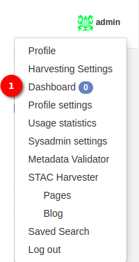
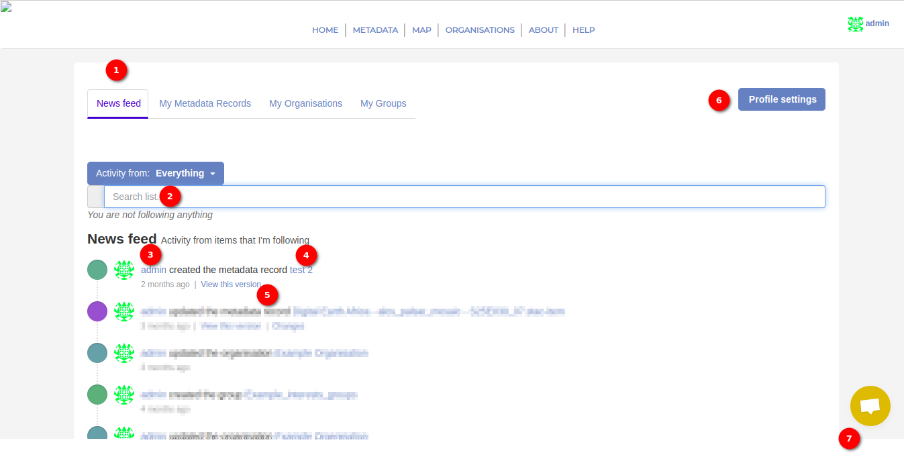
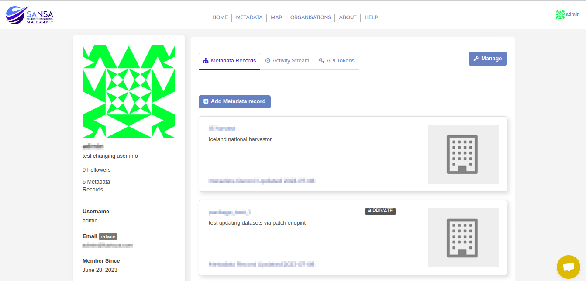
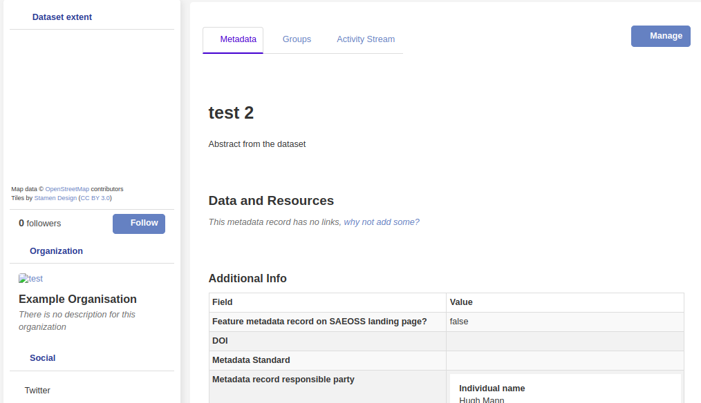
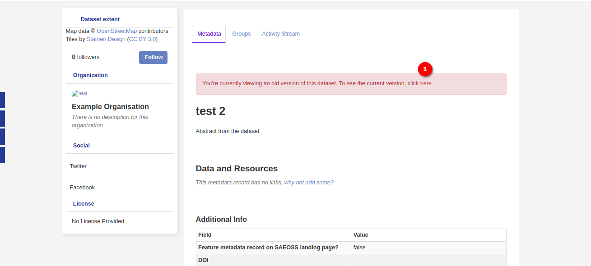
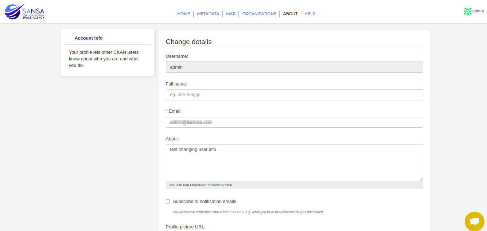
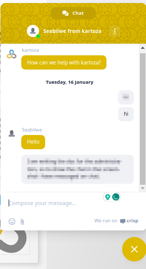
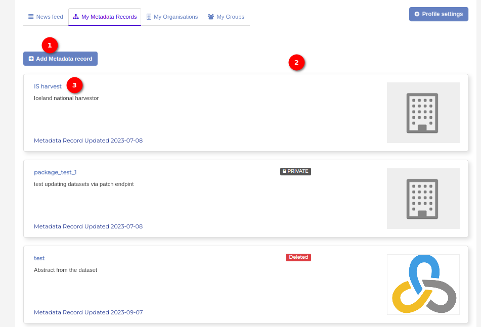
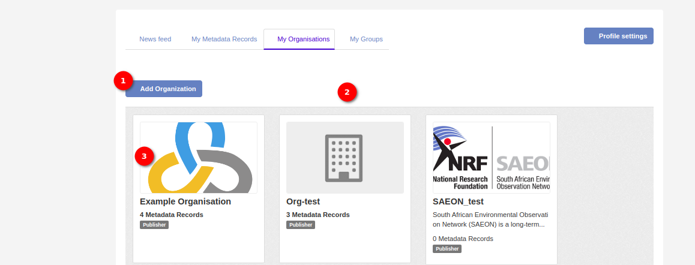
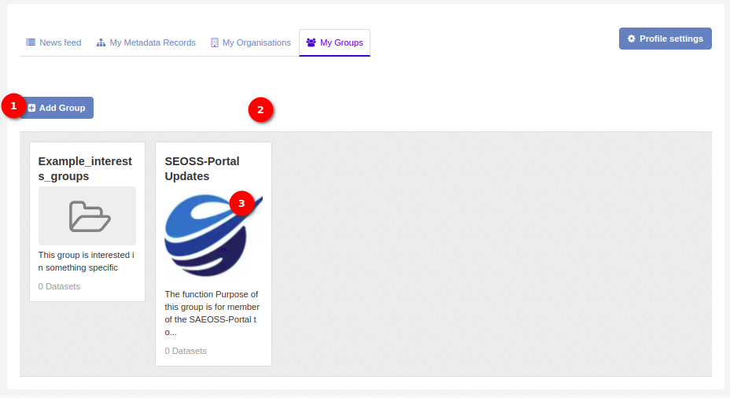

# Dashboard Manual

Welcome to the Administrator Dashboard – the centralised hub for overseeing and managing all aspects of the system. When the administrator clicks on the profile icon, a seamlessly integrated popup model unfolds, offering a plethora of options to streamline administrative tasks. Among these options, the crown jewel is the `Dashboard`.

1. **Dashboard** Upon selecting the `Dashboard` option, the administrator is ushered into a world of organised efficiency, where every click brings the administrator closer to the pulse of the system. Here, the administrator will find a carefully curated set of options designed to streamline the management tasks seamlessly.

    **NEWS FEED**

    

    1. **Viewing the News Feed:** The `News Feed` is the first thing the administrator sees upon accessing the Dashboard. It provides a chronological display of updates, announcements, and important events related to your system. Stay informed and up-to-date with the latest information at a glance.

    2. **Search List:** To streamline the access to specific news feeds, utilise the `Search List` feature. Enter keywords, usernames, or dataset names to quickly locate and filter relevant updates within the `News Feed`. This ensures that administrators can find the information they need efficiently.

    3. **Username:** `Usernames` in the `News Feed` are clickable links. When the administrator clicks on a username, it opens a detailed profile of that particular user. Gain insights into user activities, roles, and contributions to enhance understanding of system dynamics.

        

    4. **Dataset Name:** Clickable dataset names within the `News Feed` allow the administrator to delve deeper into specific datasets. By clicking on a dataset name, the administrator can open a dedicated view providing detailed information about that particular dataset. This feature facilitates quick access to essential data management insights.

        

    5. **View This Version:** Discover the details of a specific version of a dataset by clicking on the `View This Version` link within the `News Feed`.

        

        1. **Check Latest Version** The administrator can check the latest version of the dataset by clicking on the click `here` link.

    6. **Profile Settings Button:** Access your profile settings with ease by clicking on the `Profile Settings` button. This option allows the administrator to customise their personal preferences, update account information, and manage security settings directly.

        
    
    7. **Chat Option:** Enhance collaboration and communication by utilising the `Chat Option`. Engage in real-time discussions, ask questions, and share insights directly from the `News Feed`. This feature fosters a collaborative environment, ensuring that communication is seamlessly integrated into your administrative workflow.

        

    **My Metadata Record**

    Welcome to the `My Metadata Record` tab, where the administrator can have the power to manage and organise metadata seamlessly. This user-friendly interface provides tools to oversee, add, and view metadata records effortlessly.

    

    1. **Add Metadata Record:** To start managing the metadata, click on the `Add Metadata Record` button. This initiates the process of creating a new metadata record, allowing you to input essential details and specifications.

    2. **List of Metadata:** The main section of the tab displays a list of existing metadata records. Each entry showcases vital information such as the metadata name, description, and date of creation. Use this comprehensive list to quickly scan and locate specific metadata records.

    3. **Clickable Name of Metadata:** The names of the metadata records are clickable links. By clicking on a metadata name, the administrators can access a dedicated view providing detailed information about that particular metadata record. This includes information such as associated datasets, creation date, and any additional metadata attributes.

    **My Organisaton**

    Welcome to the `My Organisations` tab, the centralised control center for managing and overseeing the various organisations within the system. This user-friendly interface provide the tools to efficiently add, explore, and view details about different organisations.

    

    1. **Add Organization:** To initiate the process of adding a new organisation, click on the `Add Organisation` button. This action prompts a form where the administrator can input essential details such as organisation name, description, and any relevant attributes.

    2. **List of Organizations:** The main section of the tab displays a list of existing organisations, each represented by a distinct organisation card. These cards provide key information such as the organisation name, description, and any associated metadata. Use this comprehensive list for a quick overview of the organisational structure.

    3. **Clickable Organization Cards:** The organisation cards are clickable. By clicking on a specific organisation card, administrator open a dedicated view that provides detailed information about that particular organisation. This includes associated user groups, metadata, and any additional organisational details.

    **Mu Groups**
    
    

    Welcome to the `My Groups` tab, the central hub for managing and overseeing the groups within the system. This user-friendly interface empowers administrators to efficiently add, explore, and view details about different groups.

    1. **Add Group:** To create a new user group, click on the `Add Group` button. This initiates the process of adding a group, allowing the administrator to input essential details such as the group name, description, and any relevant attributes.

    2. **List of Groups:** The main section of the tab displays a list of existing user groups, each represented by a distinct group card. These cards provide key information such as the group name, description, and any associated metadata. Use this comprehensive list for a quick overview of the groups.

    3. **Clickable Group Cards:** The group cards are clickable. By clicking on a specific group card, the administrators can open a dedicated view that provides detailed information about that particular group.
