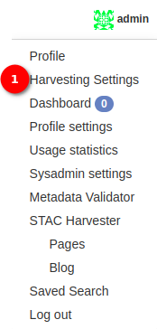
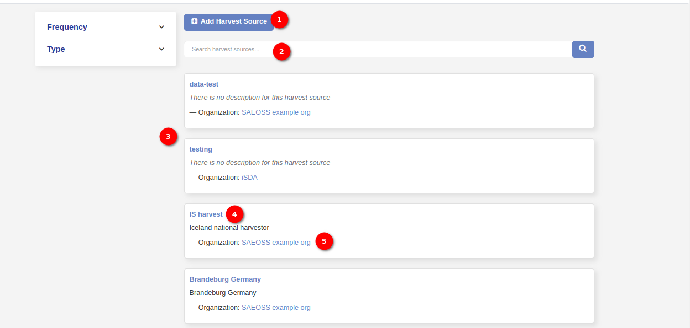
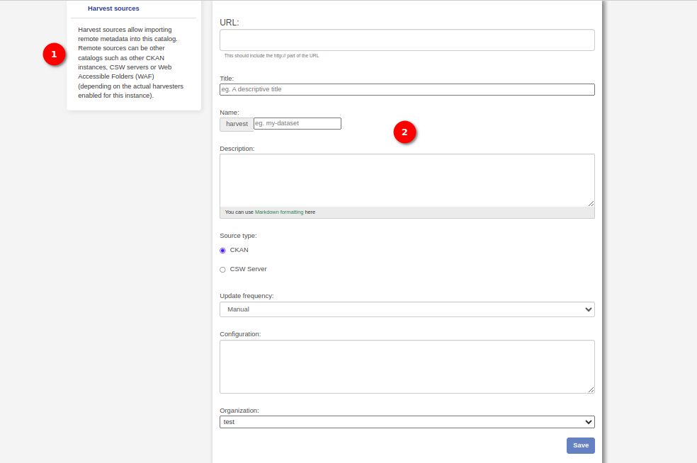
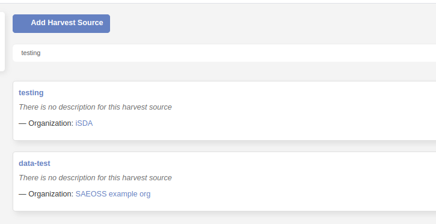
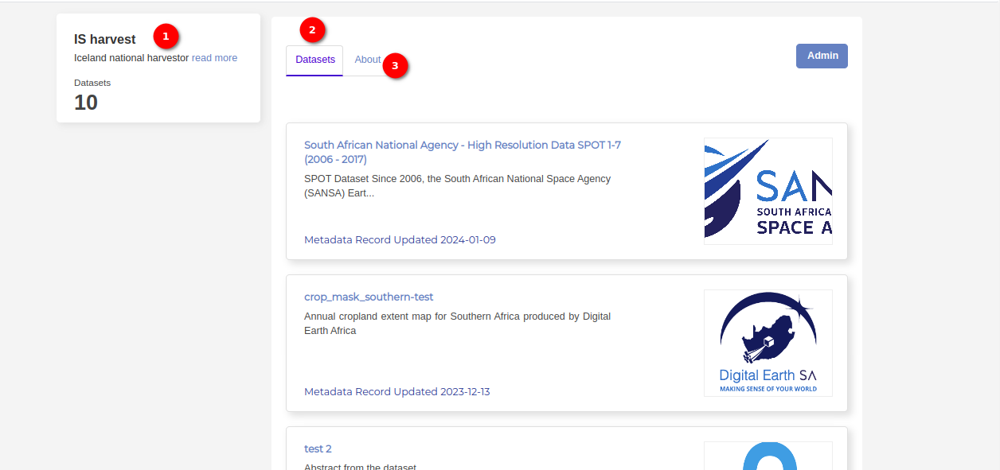
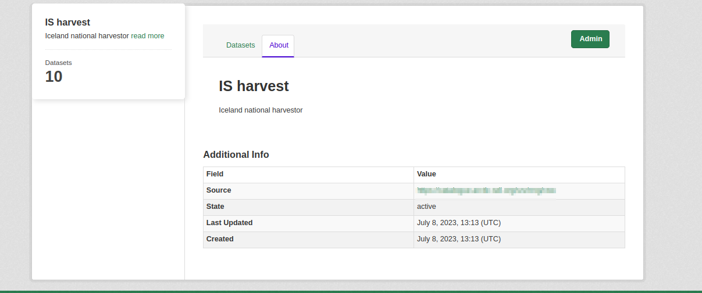
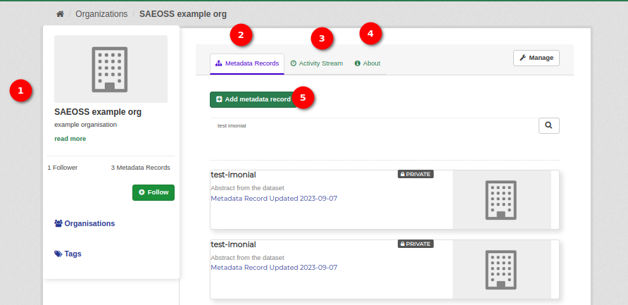

# Harvesting Settings
<!--To be Populated-->

To access the Harvesting Settings, administrators can follow these steps:

- Click on the user profile icon located in the top right corner of the application interface. This icon is typically represented by an image or username associated with the user's profile.

- Within the user profile menu, identify and click on the `Harvest Settings` option. This option is designed to provide administrators with direct access to the Harvesting Settings page.

1. **Harvesting Setting** Upon clicking the `Harvest Settings` option, administrators will be automatically redirected to the `Harvest Settings` page. This page contains a range of configurable options and parameters related to the harvesting functionality.

    

    1. **Add Harvest Resource Button:** The `Add Harvest Resource` button is a key feature that enables administrators to create new harvest resources within the system. Clicking on this button opens a new harvest page, providing a user-friendly interface for entering details and configuring the new harvest resource.

        

        1. **Message Card on Left Corner:** A message card in the left corner provides essential information. It communicates that harvest sources facilitate the import of remote metadata into the catalog. Remote sources can include other catalogs like CKAN instances, CSW servers, or Web Accessible Folders (WAF). The availability of these options depends on the enabled harvesters for the instance.
        
        2. **Form Fields:** 

            - **URL:** Input field for specifying the URL of the remote metadata source.

            - **Title:** Input field for providing a title to identify the harvested resource.

            - **Name:** Input field for assigning a name to the harvested resource.

            - **Description:** Input field to provide a brief description of the harvested resource.

            - **Source Type:** Radio button options with:

                - Option 1: CKAN
                - Option 2: CSW Server

            - **Update Frequency:** Dropdown menu with options for selecting the update frequency:

                - Manual
                - Monthly
                - Weekly
                - Biweekly
                - Daily
                - Always

            - **Configuration:** Field for additional configuration settings related to the harvest source.

            - **Organisation:** Dropdown menu allowing administrators to choose from available organisations.

            - **Save Button:** The button to confirm and save the entered details, creating the new harvest resource.

    2. **Search Bar:** The search bar enhances user efficiency by allowing administrators to quickly locate specific harvest resources within the system. Administrators can input keywords or relevant terms to filter and find specific harvest resources from the existing list.

        

    - The list of harvest resources presents a comprehensive overview of available resources.
    Each entry in the list includes:

    3. **Title:** Clicking on the title navigates administrators to detailed information about the specific harvest resource.

        

        1. **Information Card:** An information card is displayed on the top left side, providing a quick overview:

            - **Title:** The title of the dataset.

            - **Description with Read More Link:** A concise description of the dataset with a `Read More` link for additional details. This link opens the About tab when clicked.

            - **Number of Datasets:** The total number of datasets available.

        2. **Dataset Tab:** The dataset tab is the default view upon accessing the dataset section. It displays a list of dataset versions in descending order of the most recently updated first.

            **Each dataset version entry includes:**

            - **Image:** A visual representation associated with the dataset.

            - **Title:** Clicking on the title navigates to detailed information about the specific dataset version.

            - **Description:** A brief overview providing insights into the content of the dataset.

            - **Date Updated:** Indicates the last update date of the dataset version.

        3. **About Table:** Under the `About` section, a table provides additional information about the dataset:

            

            - **Source:** The source URL of the dataset.

            - **State:** The current state of the dataset, with `active` indicating its availability.

            - **Last Updated:** Specifies the date and time (in UTC) of the last update to the dataset.

            - **Created:** Indicates the date and time (in UTC) when the dataset was initially created.

    4. **Organisation Name:** Clicking on the organisation name directs administrators to information related to the associated organisation.

    

    1. **Card:** A card displayed in the left corner provides a quick overview of the organisation:
        
        - **Organisation Details:** Includes essential information about the organisation.

        - **Follow Button:** Allows users to follow the organisation.

        - **Organisation Link:** Clickable link leading to a detailed view of the organisation.

        - **Tag Link:** Clickable link providing access to tags associated with the organisation.

    2. **Metadata Records:** The `Metadata Records` section presents a list of data metadata associated with the organisation.

        - **Clickable Title:** Each entry features a title that, when clicked, directs users to detailed information about the specific metadata record.

        - **Description:** A brief overview of the metadata record, providing insights into its content.

        - **Updated Date:** Indicates the last date the metadata record was updated.

    3. **&Active Stream:** This is where the administrator sees the latest activities on his account. This includes account registration, metadata record upload

    4. **About:** The `About` section provides additional details about the organisation.

    5. **Add Metadata Record Button:** The `Add Metadata Record` button serves as a quick action feature for administrators to add new metadata records associated with the organisation.
