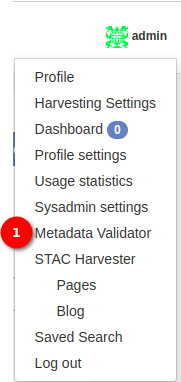
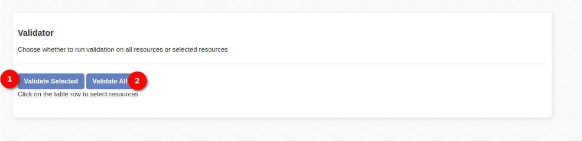

# Metadata Validator documentation

The `Metadata Validator` page provides a convenient interface for validating metadata resources. Regularly validate metadata to maintain data quality and adherence to standards.

1. **Metadata Validator:** Click on the profile icon to reveal the available options. Choose the `Metadata Validator` option to navigate to the validation page.

**Selecting Resources for Validation:**

On the Metadata Validator page, a comprehensive list of resources is displayed.
Administrators can easily select specific resources for validation by clicking on the checkboxes next to the resource entries.

Use this feature to choose individual resources or a combination of resources based on validation requirements.
Once the desired resources are selected, proceed to click on the `Validate Selected` button to initiate the validation process for the chosen resources.

**Resource Validation Conditions:**

Metadata is validated only under the following conditions:
It is explicitly set as an `STAC` resource, either through upload or if harvested as an `STAC` resource.

**Validation Options:**

1. **Validate Selected:**

- Use this option to validate specific metadata resources individually.
- Select the desired metadata resources on the page.
- Click on the `Validate Selected` button to initiate the validation process for the chosen resources.

2. **Validate All:**

- This option allows you to validate all metadata resources on the page simultaneously.
- Click on the `Validate All` button to trigger the validation process for all available resources.
