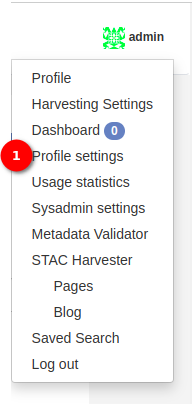
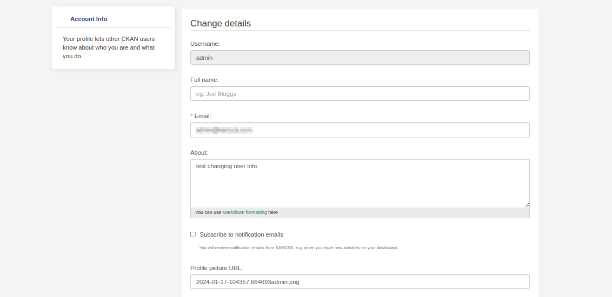

# Profile Settings Documentation

**Accessing Profile Settings:**
- Click on the profile icon to access a dropdown menu.
- Choose the `Profile Settings` option to navigate to the profile settings page.

1. **Profile Settings:** The administrator can click on the `Profile Settings` option to open the edit profile page.

**Extra Rights for Admin:**

- Admins have additional privileges to update user profiles.

- Enter the admin password at the end of the form for the changes to take effect.

- This extra security step ensures that admin actions are authorised and secure.

**Note:**

- Profile Settings offer a user-friendly interface for administrators to manage personal and account-related information.

- Admins, with extra rights, play a crucial role in maintaining user profiles and ensuring the overall integrity of the system.

- Regularly review and update profile settings to align with personal preferences and security best practices.
