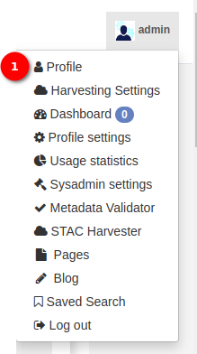
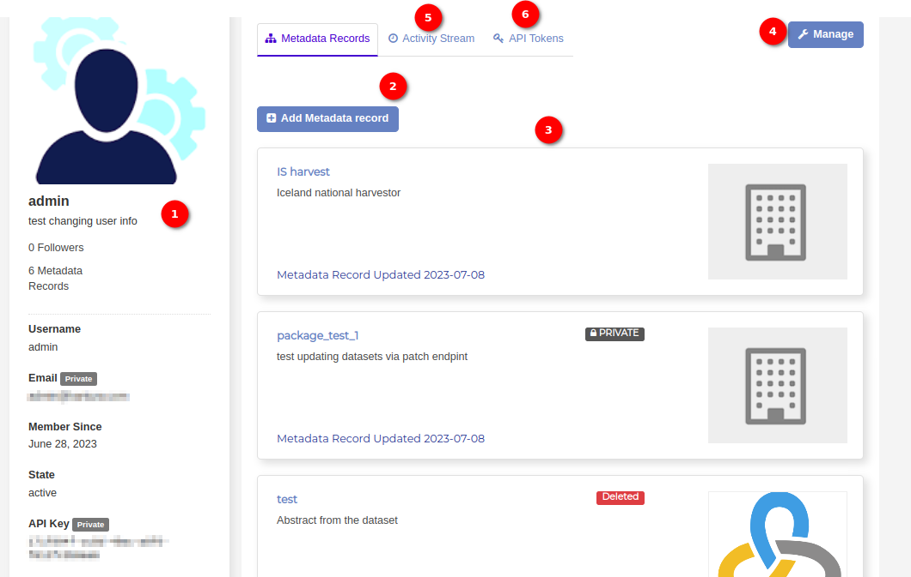
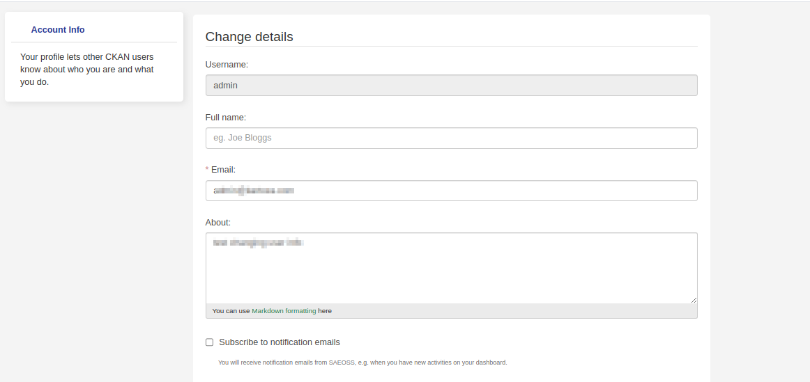
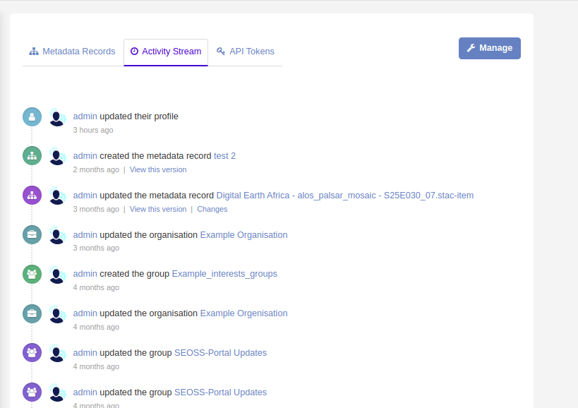
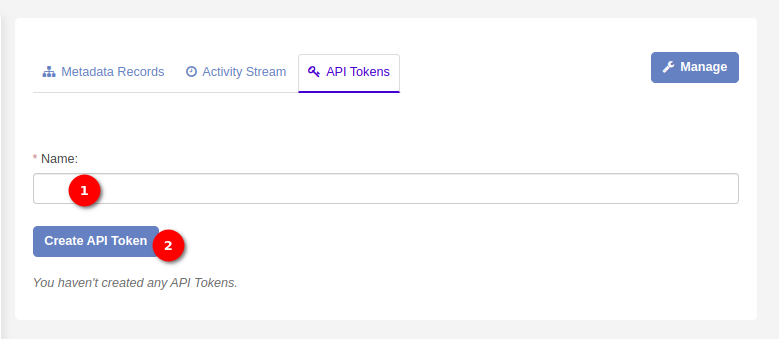

# Profile Manual

The Administrator `Profile` option is a feature designed to provide administrators with easy access to and control over their account settings and personal information within the system. This manual outlines the steps to access and utilise the various functionalities available in the administrator's profile.

1. **Profile:** Click on the `Profile` option to view the profile page. The administrators can manage their accounts using this page.

    

    **Metadata Record**

    1. **Profile Section:** The profile section serves as a comprehensive display of an administrator's information. Information includes the profile image, username, description, followers count, and metadata records count. Additionally, details such as email, member since date, state, and API Key are visible.

        **Displayed Information:**

        - **Profile Image:** A visual representation associated with the administrator's account.

        - **Username:** The unique identifier for the administrator.

        - **Description:** A brief overview or description associated with the administrator's profile.

        - **Followers Count:** Indicates the number of followers linked to the administrator's account.

        - **Metadata Records Count:** Displays the total number of metadata records associated with the 
        administrator.

        - **Email:** The email address associated with the administrator's account.

        - **Member Since Date:** The date when the administrator's account was created.

        - **State:** Indicates the current status of the administrator's account (e.g., active).

        - **API Key:** Displays the API key associated with the administrator's account.

    2. **Add Metadata Record:** To start managing the metadata, click on the `Add Metadata Record` button. This initiates the process of creating a new metadata record, allowing the administrator to input essential details and specifications. For more detailed instructions on adding metadata records [click here](../../user/manual/metadata.md)

    3. **List of Metadata:** By default the `Metadata Records` tab opens when the administrator clicks on the profile option. The main section of the tab displays a list of existing metadata records. Each entry showcases vital information such as the metadata name, description, and date of creation. Use this comprehensive list to quickly scan and locate specific metadata records.

    4. **Manage Button:** The `Manage` button empowers administrators to update and modify their account details seamlessly. Clicking on the `Manage` button triggers the opening of the `Edit Profile` page, providing administrators with the ability to change various account details. Within the `Edit Profile` page, administrators can conveniently update information such as username, email, profile picture, and other relevant details. This feature ensures administrators have control over their account information, allowing for accurate and up-to-date user profiles. For detailed instructions on managing the account [click here](./profile-settings.md)

    

    5. **Activity Stream:** This is where the administrators can see the latest activities of their accounts. This includes account registration, metadata record upload, profile update etc.

    

    6. **API Tokens:** This is where the administrator can create an API token, which can later be used to upload data.

        

        1. **Name:** Input field where the administrator can input their name for creating the `API Token`.

        2. **Create API Token Button:** Click on the `Create API Token` button, to create the API token. 

