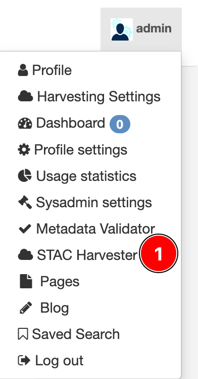
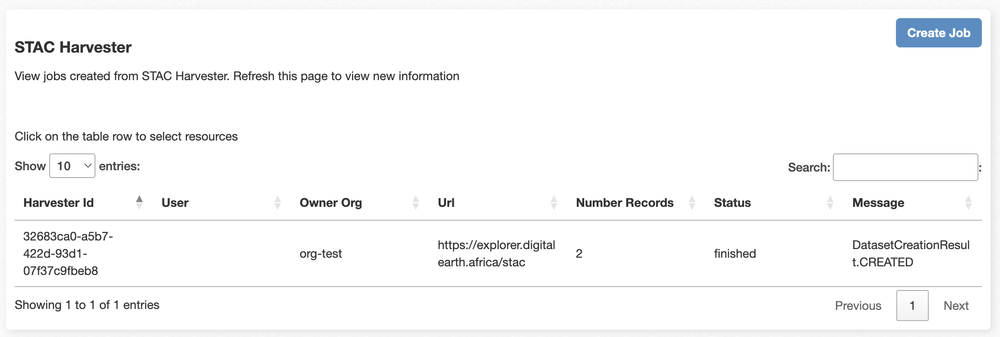
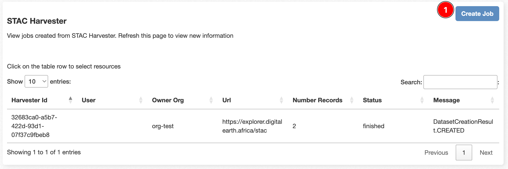
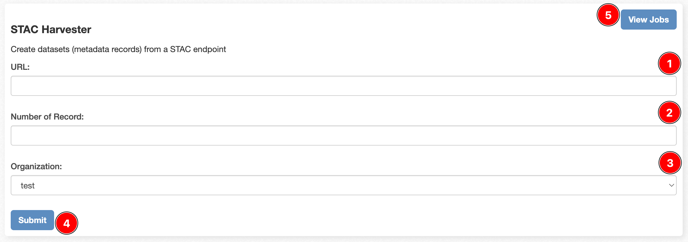

# Stac Harvester

STAC, or [SpatioTemporal Asset Catalog](https://stacspec.org/en), is a standard specification for consistently organising 
geospatial assets. It provides a common way to describe and discover geospatial data, making it easier for developers and 
users to work with Earth observation data. CKAN supports STAC harvesting, allowing users to import metadata and datasets 
from external STAC catalogs into their CKAN instance.

**Stac Harvester**

1. `Stac Harvester` is a user interface for administrators to configure and monitor the STAC harvesting process. 
It includes options to trigger manual harvests and view the status of ongoing or completed harvest jobs.

A list of created jobs for Stac Harvester will be displayed after clicking on `Stac Harvester`. In that list, 
the following information is available:

1. **Harvester Id**: A unique identifier for each harvest job. It helps in tracking and referencing specific harvesting processes.
2. **User**: If a CKAN user initiates the harvesting manually, information about the user who triggered the harvest.
3. **Owner Org**: An organisation associated with the datasets.
4. **Url**: The URL of the STAC catalog or source from which the harvesting is performed.
5. **Number Records**: A count of individual records within the STAC catalog is being harvested. This count indicates 
how many geospatial datasets or assets will be imported into CKAN during harvesting.
6. **Status**: Indicates the current status of the harvest job. Common statuses include `Running`, `Finished`, `Failed`, 
or `Pending`.
7. **Message**: Any log messages or error messages generated during the harvesting process. This information helps 
diagnose issues or understand the outcome of the harvest.

**Create Job**

1. `Create Job` is initiating a new harvesting job to fetch metadata from an external STAC catalog and import it into 
the CKAN instance. This action involves configuring the harvester with specific parameters.

1. **URL**: The URL of the STAC catalog or source from which the harvesting will perform.
2. **Number Records**: This count indicates how many geospatial datasets or assets will be imported into CKAN during 
harvesting.
3. **Organization**: The organisation associated with the datasets.
4. **Submit**: Once you have completed the required information and configured the job to your satisfaction, you can use 
the `Submit` button to confirm and save the job configuration.
5. **View Jobs**: Is a feature that allows users to inspect and monitor the details of a specific harvesting job. 
This functionality is helpful for administrators or users who want to review the status, logs, and other relevant 
information associated with a particular STAC harvesting job.
