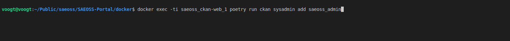
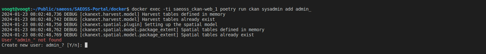
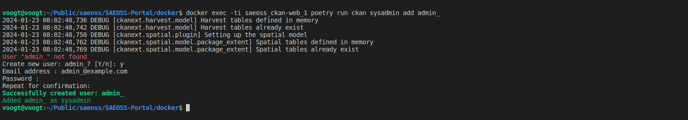
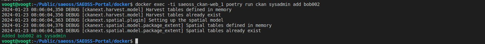
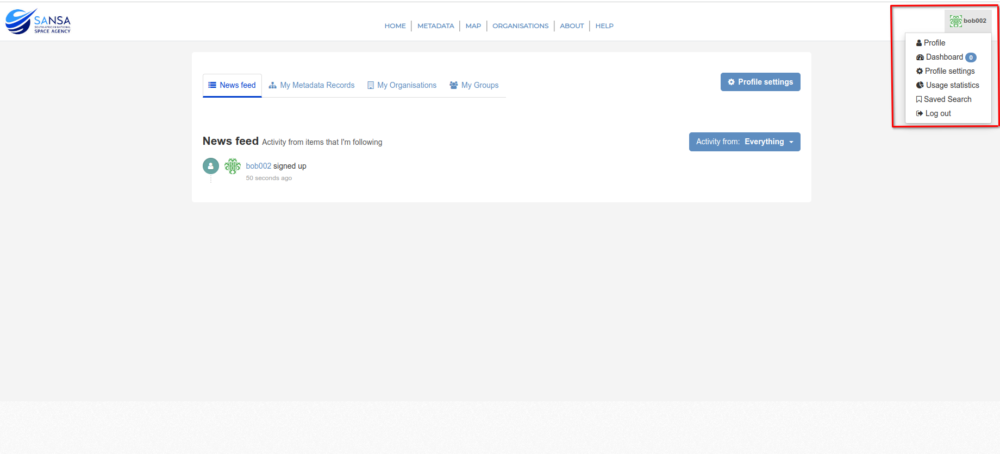
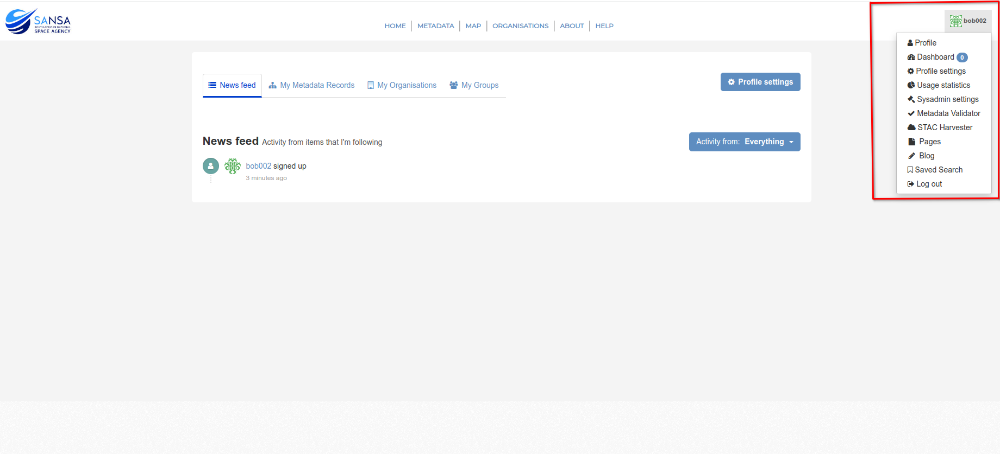

# Documentation: Creating SuperUser

## Creating SuperUser from Terminal

To create a superuser, open the terminal.
Use the following command to add a superuser with the username `admin`:

```bash
docker exec -ti saeoss_ckan-web_1 poetry run ckan sysadmin add admin
```
- Replace `admin` with the desired username for the superuser.



After running the command to add a superuser, the system typically asks for confirmation. Users are prompted to confirm whether they indeed want to create a superuser. The user is expected to input either `Y` for Yes or `n` for No based on their intention to create a superuser.



If the user chooses `Y` then they need to provide the email and password for the administrator account.



## Converting Normal User to SuperUser

Existing users can be elevated to superuser status through the terminal.
Use the following command, replacing <username> with the username of the registered user:

```bash
docker exec -ti saeoss_ckan-web_1 poetry run ckan sysadmin add <username>
```



This command promotes the specified user to superuser status.

Before the superuser privileges



After the superuser privileges



**Important Notes:**

- Superusers have elevated privileges and can access and modify system-wide settings.
- Superusers can only be created via the terminal and not through the CKAN site.

**Important Security Considerations:**

- Superuser and super admin credentials should be kept secure.
- Regularly review and update superuser/admin credentials to enhance system security.
