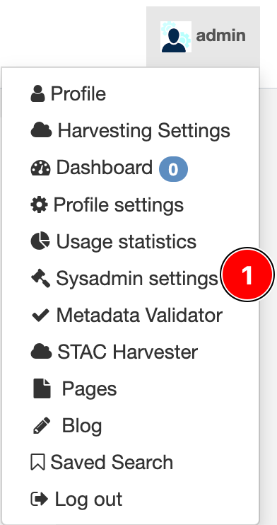
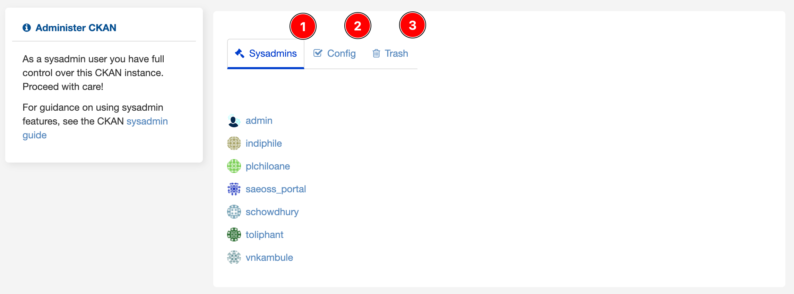
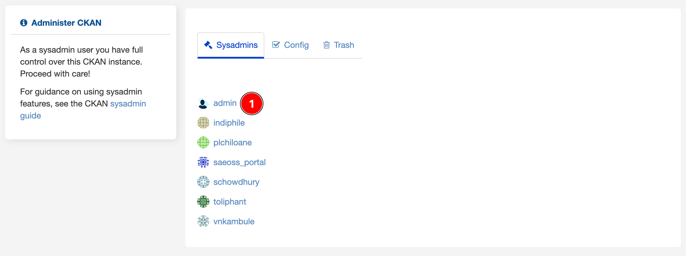
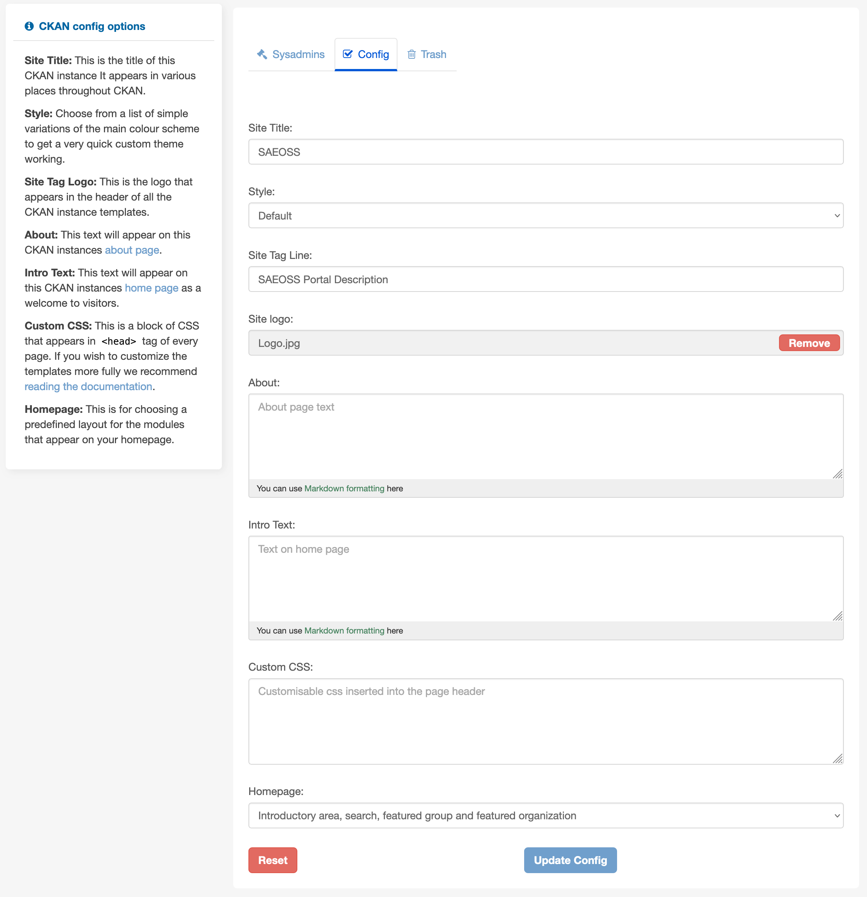
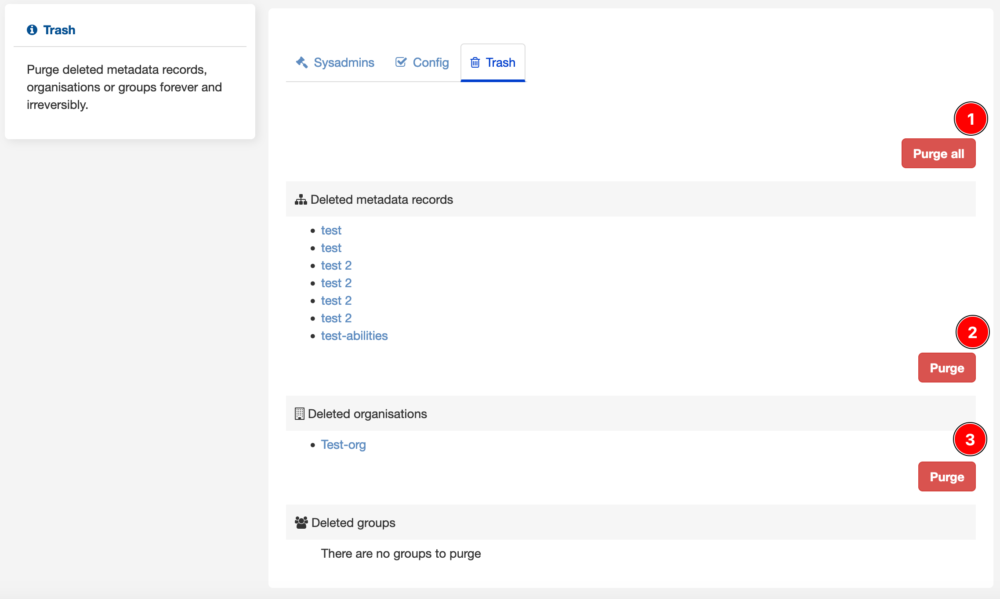

# Sysadmin settings

Sysadmin settings are designed to provide administrator access to manage accounts, organisations, and datasets. Certain 
administration tasks are unavailable through the web UI but require access to the server where CKAN is installed. 
This manual covers the administration features in the web UI.

1. Click on the `Sysadmin settings` option to have control of CKAN's instance. 

    
**Sysadmins**

The first tab, `Sysadmin`, has the list of all sysadmin users. By clicking on one user, the administrator can manage 
the user account as if it were in the [profile](profile.md).

**Config**

The second tab, `Config`,  is a page where the administrator can change some configurations from the web interface. 
It is simple customisation to customise the `look and feel` of CKAN.

**Config**

The third tab, `Trash`, is a page that shows all deleted datasets, organisations, and groups. It allows the 
administrator to delete them permanently.

1. **Purge all**: To remove permanently all deleted datasets, organisations, and groups.
2. Purge: To remove permanently all deleted metadata records
3. Purge: To remove permanently all deleted organisation
