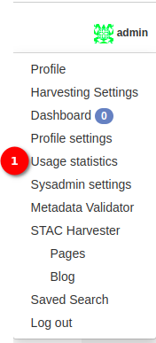
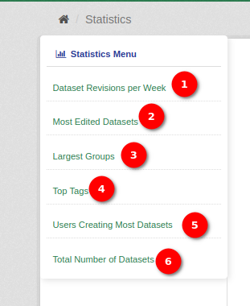
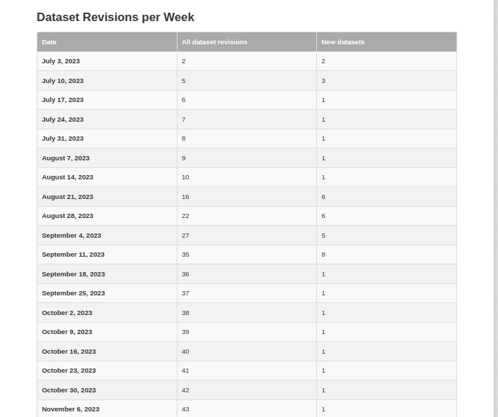
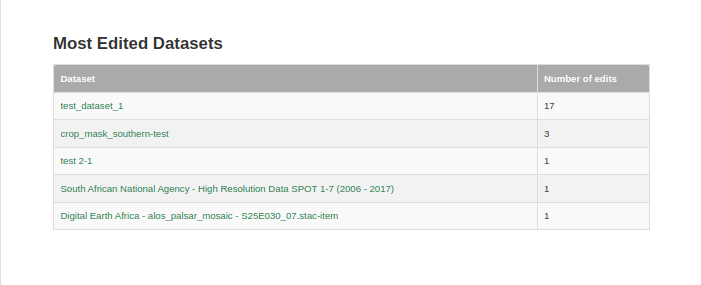
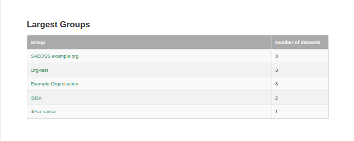
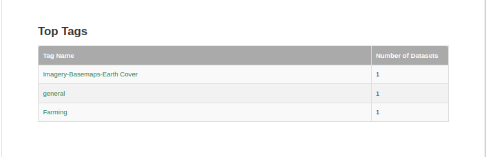
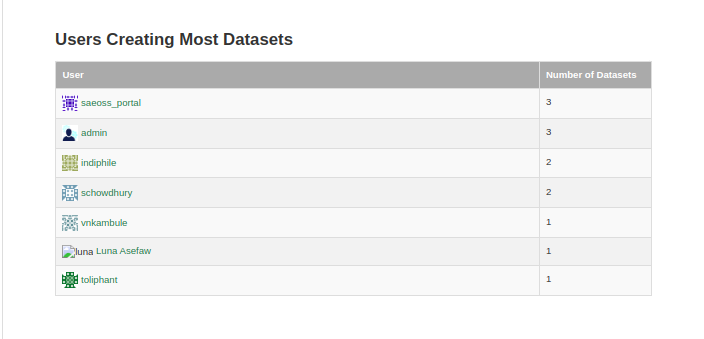

# Usage Statistics Documentation

1. **Accessing Usage Statistics:** Administrators can access the `Usage Statistics` feature by clicking on the profile icon, revealing an option to view usage statistics.

    

    **Usage Statistics**
    Upon selecting `Usage Statistics`, a card is presented, displaying the names of various tables capturing different aspects of system usage.
    
    **Tables include:**

    - Dataset Revisions per Week

    - Most Edited Datasets

    - Largest Groups

    - Top Tags

    - Users Creating Most Datasets

    - Total Number of Datasets

    **Interacting with Tables:**

    Administrators have the option to interact with the tables in two ways:

    - **Clickable Names:** By clicking on the name of a table, administrators can view detailed information within that specific table.

    - **Scrolling:** Administrators can scroll through the down to view all the tables and their respective statistics.

        1. **Dataset Revisions per Week:**

        

        This table displays the dataset revisions and new datasets created per week.

        - **Date:** The specific date of the dataset revisions.
        - **All Dataset Revisions:** The total number of revisions made to all datasets on that date.
        - **New Datasets:** The number of new datasets created on that date.

        2. **Most Edited Datasets:**

        

        This table identifies the most edited datasets, showcasing the dataset name and the corresponding number of edits.

        - **Dataset (Clickable):** Clicking on the dataset name navigates to detailed information about that specific dataset.
        - **Number of Edits:** Indicates how many times the dataset has been edited.

        3. **Largest Groups:**

        

        This table highlights groups with the highest number of datasets, providing insights into active and influential user communities.

        - **Group:** Clicking on the group name leads to detailed information about that specific group.
        - **Number of Datasets:** Indicates the total number of datasets associated with the group.

        4. **Top Tags:**

        

        This table lists the top tags based on the number of datasets associated with each tag.

        - **Tag Name:** Clicking on the tag name provides additional details about datasets tagged with that specific category.
        - **Number of Datasets:** Indicates the total number of datasets tagged with a particular category.

        5. **Users Creating Most Datasets:**

        

        This table recognizes users who have created the most datasets, displaying the user name and the corresponding number of datasets created.

        - **User:** Clicking on the user name leads to detailed information about that specific user.
        - **Number of Datasets:** Indicates how many datasets the user has created.

        6. **Total Number of Datasets:**

        

        This table provides a snapshot of the total number of datasets on specific dates.

        - **Date:** The date for which the total number of datasets is recorded.
        - **Total Datasets:** The overall count of datasets available on that date.
