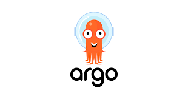

# System Architecture

In this section, we outline the system architecture using ER Diagrams, Software Component Diagrams etc. and key libraries / frameworks used in this project.

## Frameworks Used

The following is a list, with brief descriptions, of the key components used in creating this platform. Please refer to their individual documentation for in-depth technical information.

| Logo | Name | Notes |
|------------|---------|----------------|
|{: style="height:30px"} | [CKAN](https://ckan.org/) | CKAN is an open-source DMS (data management system) for powering data hubs and data portals. CKAN makes it easy to publish, share and use data.|
|{: style="height:30px"} | [CKAN](https://www.postgresql.org/) | PostgreSQL is a powerful, open source object-relational database system with over 35 years of active development that has earned it a strong reputation for reliability, feature robustness, and performance.|
|{: style="height:30px"} | [Pycsw](https://pycsw.org/) | pycsw allows for the publishing and discovery of geospatial metadata via numerous APIs (CSW 2/CSW 3, OpenSearch, OAI-PMH, SRU), providing a standards-based metadata and catalogue component of spatial data infrastructures.|
| {: style="height:30px"}  |  [Docker](https://docker.com) | Accelerate how you build, share, and run applications. Docker helps developers build, share, and run applications anywhere — without tedious environment configuration or management. |
| {: style="height:30px"}  | [Maplibre](https://maplibre.org/) | Open-source mapping libraries for web and mobile app developers. |
| {: style="height:30px"}  | [Ckanext-harvest](https://github.com/ckan/ckanext-harvest) | Remote harvesting extension for CKAN. |
| {: style="height:30px"}  | [Jenkins](https://www.jenkins.io/) | It is used to continually create and test software projects, making it easier for developers and DevOps engineers to integrate changes to the project and for consumers to get a new build. |
| {: style="height:30px"} | [Argo](https://www.argodevops.co.uk/) | Argo Events is an event-driven workflow automation framework and dependency manager that helps you manage Kubernetes resources, Argo Workflows, and serverless workloads on events from a variety of source. |

## High-level architecture

This is the high-level system architecture relating to the interaction between the applications.

## CKAN Components
<!-- 
The following diagram represents the docker containers, ports and volumes that are used to compose this platform.

The docker volumes are used for the following purposes, with the following typical storage allocations:

NAME | CAPACITY | ACCESS | MODES | NOTES
-- | -- | -- | -- | --
media-data | 10Gi | RWX | azurefile | Used for the uploaded files, example for XLS of file of importer. Azurefile and size is sufficient, mostly these files are not big.
redis-data | 10Gi | RWX | azurefile | Used by redis for database backup (to make queue persistence when redis rerun).
static-data | 10Gi | RWX | azurefile | Used for the static files.
 -->

## Data Model

The following diagram represents all of the database entities that are created by PostgreSQL. Right click the image and open it in its own tab to see it at full resolution.

**Note:** *Click on the image to open an enlarged view*

For more details on the relationship between the entities, constraints and higher degree of analysis of the database, please click [here](https://saeoss-portal.vercel.app/)
