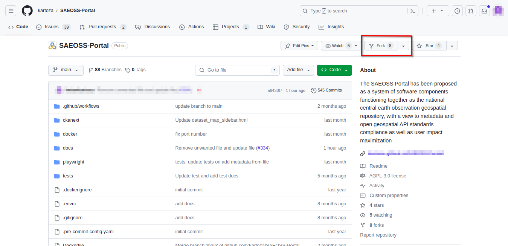

# Building the dev environment

This section covers the process of building and running the application from your IDE.

> 🚩 **NOTE:** *Make sure you have gone through the [IDE Setup Process](ide-setup.md) before following these notes.*

<!-- 
Press `Ctrl -> P` 1️⃣ and then `>`and search for `Rebuild`. Select `Dev Containers: Rebuild and Reopen in Container`2️⃣. This will essentially mount your code tree inside a docker container and switch the development context of VSCode to be inside the container where all of the python etc. dependencies will be installed.


Once the task is running, a notification 1️⃣ will be shown in the bottom right of the VSCode window. Clicking in the notification will show you the setup progress 2️⃣. Note that this make take quite a while depending on the internet bandwidth you have and the CPU power of your machine.


## Open a dev container terminal

Open  terminal within the dev container context by clicking the `+`icon in the terminal pane 1️⃣. The new terminal 2️⃣ will show up in the list of running terminals 3️⃣


## Install FrontEnd libraries

```
make frontend-dev
```


## Run django migration

```
cd /home/web/project/django_project
python manage.py migrate
```
## Create super user

```
cd /home/web/project/django_project
python manage.py createsuperuser
```

During this process you will be prompted for your user name (defaults to root), email address and a password (which you need to confirm). Complete these as needed.


## Viewing your test instance

After completing the steps above, you should have the development server available on port 2000 of your local host:

```
http://localhost:2000
```


The site will be rather bare bones since it will need to be configured in the admin area to set up the theme etc. -->

## Setting Up a Development Environment

Developers should follow the provided instructions to establish their development environment, ensuring consistency in tools and configurations across the team while fostering collaboration. This streamlined approach also boosts productivity, simplifies scalability, and bolsters security by isolating sensitive data.

Below are the steps to effectively and accurately set up a productive developer environment:

### 👩‍💻 Getting the Source Code

To contribute to the project, you need to fork and clone the repository. This allows you to view and edit the code in your own repository, from which you can create pull requests to merge any changes.

#### 1. Navigate to the GitHub Repository

Go to the SAEOSS-Portal GitHub Repository: https://github.com/kartoza/SAEOSS-Portal

#### 2. Fork the Repository

Follow the instructions for setting up a proper developer environment, which includes forking the repository.



#### 3. Navigate to Your Forked GitHub Repository

Access your forked repository, usually found in your personal repositories, at: https://github.com/{Your-Github-Handle}/SAEOSS-Portal
> **NOTE:** *Replace {Your-Github-Handle} with your GitHub handle name to fork your repository.*

#### 4. Clone the Repository

Clone the forked repository to your local machine using Git. This allows you to make changes to the code.

```bash
git clone https://github.com/{Your-Github-Handle}/SAEOSS-Portal.git
```

#### 5. Create a New Branch

Before making any changes, create a new branch for your feature or bug fix. This keeps your changes isolated from the main branch.

```bash
git branch {name_of_your_new_branch}
```
> **NOTE:** *Replace {name_of_your_new_branch} with the preferred name of your branch.*

You can also clone the main repository, but this workflow is generally not recommended. We strongly advise developers to follow the aforementioned workflow.

```bash
git clone https://github.com/kartoza/SAEOSS-Portal.git
```

🪧 Now that you have the built the project, move on to the [Design](design.md) documentation.
