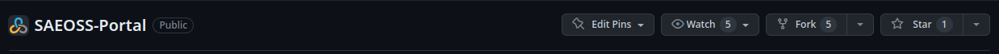

## Setting Up a Development Environment

Developers should follow the provided instructions to establish their development environment, ensuring consistency in tools and configurations across the team while fostering collaboration. This streamlined approach also boosts productivity, simplifies scalability, and bolsters security by isolating sensitive data.

Below are the steps to effectively and accurately set up a productive developer environment:

### 👩‍💻 Getting the Source Code

To contribute to the project, you need to fork and clone the repository. This allows you to view and edit the code in your own repository, from which you can create pull requests to merge any changes.

#### 1. Navigate to the GitHub Repository

Go to the SAEOSS-Portal GitHub Repository: https://github.com/kartoza/SAEOSS-Portal

#### 2. Fork the Repository

Follow the instructions for setting up a proper developer environment, which includes forking the repository.



#### 3. Navigate to Your Forked GitHub Repository

Access your forked repository, usually found in your personal repositories, at: https://github.com/{Your-Github-Handle}/SAEOSS-Portal
> **NOTE:** *Replace {Your-Github-Handle} with your GitHub handle name to fork your repository.*

#### 4. Clone the Repository

Clone the forked repository to your local machine using Git. This allows you to make changes to the code.

```bash
git clone https://github.com/{Your-Github-Handle}/SAEOSS-Portal.git
```

#### 5. Create a New Branch

Before making any changes, create a new branch for your feature or bug fix. This keeps your changes isolated from the main branch.

```bash
git branch {name_of_your_new_branch}
```
> **NOTE:** *Replace {name_of_your_new_branch} with the preferred name of your branch.*

You can also clone the main repository, but this workflow is generally not recommended. We strongly advise developers to follow the aforementioned workflow.

```bash
git clone https://github.com/kartoza/SAEOSS-Portal.git
```

## Quick Installation Guide
This project is a [ckan](https://ckan.org/) extension, it can be installed standalone. To deploy this project we use  [docker,](http://docker.com/) so you need to have docker running on the host.

> **NOTE:** *Docker is needed to continue with the quick installation guide. Ensure you have docker installed on your system before continuing.*

Build docker images

```bash
cd SAEOSS-Portal/docker
./build.sh
```

Start up and Run down the project

```bash
./compose.py --compose-file docker-compose.yml --compose-file docker-compose.dev.yml up
./compose.py --compose-file docker-compose.yml --compose-file docker-compose.dev.yml down
```

After starting up, the project is available on your local host at http://localhost:5000 


### Operations

#### Rebuild solr index

```bash
# check if there are any datasets that are not indexed
ckan search-index check

# re-index
docker exec -it saeoss_ckan_web_1 poetry run ckan search-index rebuild
```


#### Operate harvesters

You may use the various `ckan harvester <command>` commands to operate existing harvesters.

Create a job:

```bash
docker exec -t saeoss-ckan_harvesting-runner poetry run ckan harvester job <source-id>
```

#### Send notifications by email

This needs to be run periodically (once per hour is likely enough).

```bash
docker exec -it saeoss_ckan_web_1 ckan saeoss send-email-notifications
```

Additionally, in order for notifications to work, there is some configuration:

- The CKAN settings must have `ckan.activity_streams_email_notifications = true`
- The CKAN settings must have the relevant email configuration (likely being passed
  as environment variables)
- Each user must manually choose to receive notification e-mails - This is done in
  the user's profile
- Each user must manually follow those entities (datasets, organizations, etc) that
  it finds interesting enough in order to be notified of changes via email

#### Refresh pycsw materialized view

This needs to be run periodically (once per hour is likely enough).

```bash
docker exec -t ckan dalrrd-emc-dcpr pycsw refresh-materialized-view
```

#### Create sysadmin user

After having initialized the database you can now create the first CKAN
sysadmin user.

```bash
docker exec -ti saeoss_ckan_web_1 poetry run ckan sysadmin add admin
```

Answer the prompts in order to provide the details for this new user.
After its successful creation you can login to the CKAN site with the `admin`
user.


#### Initialize CKAN database

The first time you launch it you will need to set up the ckan database (since
the ckan image's entrypoint explicitly does not take care of this, as
mentioned above). Run the following command:

```bash
docker exec -ti saeoss_ckan_web_1 poetry run ckan db init
```

Afterwards, proceed to run any migrations required by the ckanext-dlarrd-emc-dcpr extension

```bash
docker exec -ti saeoss_ckan_web_1 poetry run ckan db upgrade --plugin dalrrd_emc_dcpr
```

Now you should be able to go to `http://localhost:5000` and see the ckan
landing page. If not, you may need to reload the ckan web app after
performing the DB initialization step. This can done by sending the `HUP`
signal to the gunicorn application server (which is running our ckan
flask app):

```bash
docker exec -ti saeoss_ckan_web_1 bash -c 'kill -HUP 1'
```


#### Generate pycsw DB view

In order to be able to serve the system's datasets through various OGC standards, create a DB materialized view
in order to integrate with pycsw:

```bash
docker exec -ti saeoss_ckan_web_1 poetry run ckan dalrrd-emc-dcpr pycsw create-materialized-view
```


#### Ingest a collection of metadata from a given directory (currently CBERS xml files)

create datasets (metadata records) from files stored in a directory

```bash
docker exec -ti saeoss_ckan_web_1 poetry run ckan saeoss ingest cbers --source-path <path> --user <username>
```


#### Perform STAC Fetch and create datasets from STAC endpoint  

create datasets (metadata records) from stac endpoint

```bash
docker exec -ti saeoss_ckan_web_1 poetry run ckan saeoss stac create-stac-dataset --url <url> --user <username> --max <max_number_of_records>
```

## Architecture

### High-level System Architecture

### Date Model


## Workflow