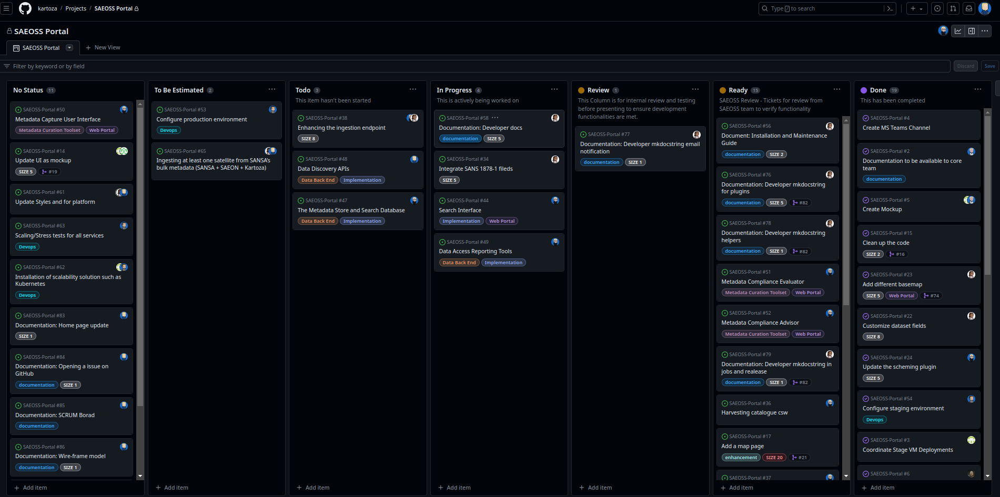
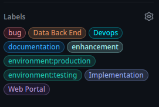
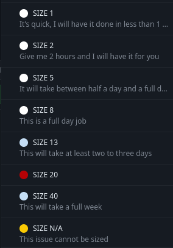

## SCRUM Board: 

We use scrum to track the work assigned and done by developer every week.

The SCRUM board for SAEOSS-portal can be found [Here](https://github.com/orgs/kartoza/projects/37/views/2). The order of issues on the SCRUM board will dictate the order of working on the tickets, meaning if the developer is blocked on a ticket he will default to working on the next ticket in the line.

A description of the columns making up the scrum board is as follows:

- No Status - Tickets not ready to be worked on yet or have been reverted due to a technical blocker. This colum is also revered to as the backlog and serves as a placeholder for all tickets which needs to be addressed.

- To Be Estimated - This colum serves as a planning column where tickets are moved when planning the weekly sprint. Tickets are sized and assigned to team members.

- Todo - These are tickets which were planned for the current week sprint and is tickets where the development team will draw work from.

- In Progress - These are tickets the development team is currently working on.

- Review - Tickets in review and are usually addressed by internal testers to ensure the functionalities have been correctly implemented and are functioning as expected.

- Ready - Tickets in the ready column are tickets which have passed internal testing and are made available for the client to review. Once the client has found the work done to resolve the ticket satisfactory they can close the ticket with a comment. 

- Done - This column is reserved for tickets which has been implemented, tested and ultimately accepted by the client, marking development of the ticket as done. 

This GitHub project repository serves as a project planning and progress tracking platform for the development teams and clients. This repository is public and for anyone to view. The repository can be accessed [here](https://github.com/kartoza/SAEOSS-Portal)

### Tickets: 
Tickets on the [SAEOSS-Portal GitHub board](https://github.com/kartoza/SAEOSS-Portal/issues) are created first as issues and converted into tickets to work on during the sprint at the SAEOSS-Portal catchup meeting. This workflow ensures work required by the client gets done as well as allows the opportunity to clear up any doubts as to work that needs to be done. When issues are created a clear description of what needs to happen is required as well as any accompanying screenshots or videos. If a developer has any doubt, he can simply comment on the ticket and the creator of the ticket as well as any assigned developers will be notified via e-mail. 

#### Labels:  

Tickets have accompanying labels which will be assigned by the development team once reviewing the ticket. These labels aim to give a better description of the type of issue as well as keeping development on track with coordinated effort. During the development of the product some team member can be assigned to deal with only certain types of tickets. The team lead or technical lead on the project will upon reviewing the ticket assign the ticket to the correct team member and also add necessary labels. 

#### Size:  

Each issue is sized according to its expected time to accomplish. Labels are rated by size with the following labels: 

 

* size [N/A] - Applied to issues where size is not applicable. 
* Size [1] - It's quick I will have this done in about 1 hour. 
* Size [2] - Give me 2 hours and I will have it for you. 
* Size [5] - It will take between half a day and a full day. 
* Size [8] - This is a full-day job. 
* Size [13] - I'm going to need about a day and a half to two days. 
* Size [20] - It will take at least two to three days. 
* Size [40] - This will take a full week. 

Tickets larger than SIZE 8 are usually broken down into smaller tickets/tasks to better display development progress. SIZE N/A labels are reserved for tasks which are difficult to estimate, like debugging and complex issue. 

