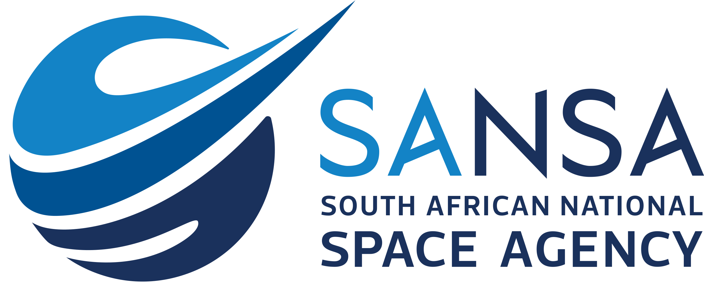

# SAEOSS-Portal

## Overview
The SAEOSS-Portal has been proposed as a system of software components functioning together as the national central earth observation geospatial repository, with a view to metadata and open geospatial API standards compliance as well as user impact maximisation.

<!-- ## key Consepts
Main focus of the platform (areas - admin -user and so on) -->

<!-- 
A **project** (dashboard) is the most important feature of GeoSight. Projects
combine different elements (Reference datasets, indicators, and context layers)
and enable data visualization/analysis for all end users. 

**Context layers** are geospatial layers used to contextualise the information
presented in a project.

**Indicators layers** derive from spreadsheets or other intelligence assets
harvested by the platform.

**Widgets** are visual components such as charts generated by performing data
analysis on country/regional levels and the indicator data. -->

## Disclaimer

The software provided by this project is provided 'as is'. All information provided within the platform should be independently verified before using as the basis for action. The contributors and developers of this platform take no responsibility for any loss of revenue, life, physical harm or any other adverse outcome that may occur as a result of the use of this platform. 

### purpose

### Scope of project
Our scope is to create a robust, information sharing platform for datasets related to intrest of SANSA and SAEONN.

### Project Roadmap

#### Contributing
We would love to collaborate with you! But first, please read our [contributor
guidelines](about/contributing.md) which describe how to report
issues, plan and contribute feature additions etc.

#### Code of Conduct
Our community in this project is aligned with our [Code of
Conduct](about/code-of-conduct.md) - please be sure to read and abide by that
document in all interactions with out community.

#### Diversity Statement
This project welcomes and encourages participation by everyone.

No matter how you identify yourself or how others perceive you: we welcome you.
We welcome contributions from everyone as long as they interact constructively
with our community.

While much of the work for our project is technical in nature, we value and
encourage contributions from those with expertise in other areas, and welcome
them into our community.

## Project Partners
Joint effort was put forth from SANSA and SEONN to colaborate on this project.

|                                |                                  |
|--------------------------------|----------------------------------|
|{: style="height:30px"}  |{: style="height:30px"}  |

<!-- #### Releases

Our releases are published on our [GitHub releases page](https://github.com/unicef-drp/GeoSight-OS/releases)

| | **Project Badges** | |
| ----------------------- | ----------------------- | ----------------------- |
|  |  |  |
|  |  |  | -->

#### Project Chatroom
We do not yet have a Chatroom set up for this project. Please use the GitHub issue tracker for discussions rather.
<!-- 
#### Contributor License Agreement (CLA)
Contributions to this project will be subject to our [Contributor License Agreement]() (Coming soon) -->

<!-- #### License
This project is open source, published under the [License](about/license.md). 
You can read our license to find out what rights this license bestows to users and contributors. -->

-----------------------------------------------------------------------------
template below
-----------------------------------------------------------------------------

# Template Project Title
<!-- This is the Home Page, replace all of the titles with relevant titles -->

Strapline <!-- replace with one line product description -->

 <!-- change path to main screenshot, InaSAFE is a good reference -->

## Introduction

<!-- Insert introduction paragraphs here -->
<!-- Can also input short video demo of project here (YouTube link, etc) -->
<!-- Can contain Purpose/Why of project and the Scope of Project without use of sub-headings-->

### Purpose

### Scope of Project

### Project Roadmap

[Project Roadmap]()
<!-- Either insert link to roadmap or actual roadmap (Speak to team leads) -->

#### Code of Conduct

<!-- Insert link to Code of Conduct -->
[Code of Conduct]()

#### Diversity Statement

<!-- Insert link to Diversity Statement -->
[Diversity Statement]()

## Project Partners

<!-- Insert Project Partner Logos and/or Links -->

[Project Partner 1]()

[Project Partner 2]()

#### Releases

<!-- Insert links to release pages -->
[GitHub releases page]()
[Releases page]()

| | **Project Badges** | |
| ----------------------- | ----------------------- | ----------------------- |
| https://img.shields.io/github/license/{username}/{repo-name}.svg | https://img.shields.io/github/realese/{username}/{repo-name}.svg | https://img.shields.io/github/commits-since/{username}/{repo-name}/{version}.svg |
| https://img.shields.io/github/issues/{username}/{repo-name}.svg | https://img.shields.io/github/issues-closed/{username}/{repo-name}.svg | https://img.shields.io/github/issues-pr/{username}/{repo-name}.svg |

#### Project Chatroom

<!-- Insert links to chatroom pages if available, otherwise remove -->
[Chatroom]()

#### Contributor License Agreement (CLA)
<!-- Insert links to CLA -->
[Contributor License Agreement]()

#### License

[License]() <!-- Link to project license in about page -->

<!-- Keep the Kartoza Logo at the bottom of the page if the project allows -->
