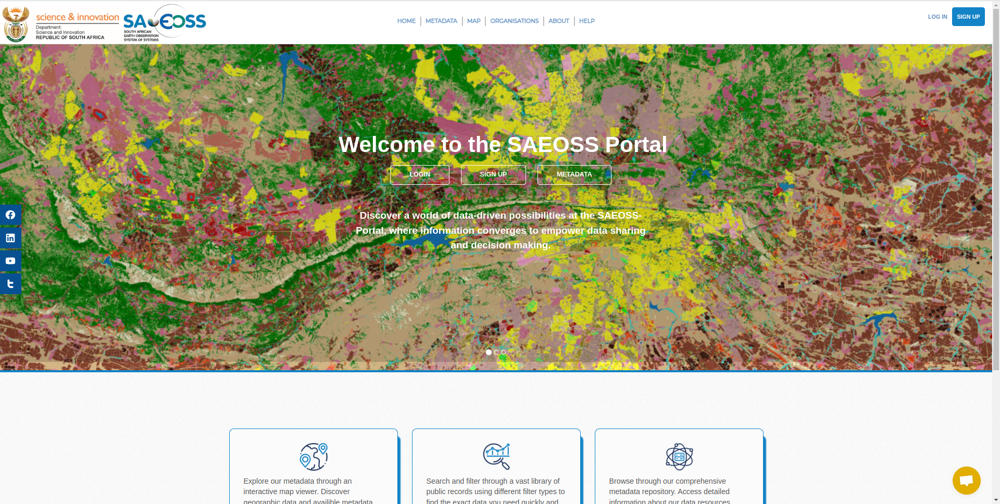

# SAEOSS-Portal
<!-- This is the Home Page, replace all of the titles with relevant titles -->

The SAEOSS-Portal has been proposed as a system of software components functioning together as the national central earth observation geospatial repository, with a view to metadata and open geospatial API standards compliance as well as user impact maximization.
<!-- replace with one line product description -->

 <!-- change path to main screenshot, InaSAFE is a good reference -->

## Introduction

<!-- Insert introduction paragraphs here -->
<!-- Can also input short video demo of project here (YouTube link, etc) -->
<!-- Can contain Purpose/Why of project and the Scope of Project without use of sub-headings-->

### Purpose

The SAEOSS-Portal is designed to be a robust, information sharing platform with the aim of promoting information sharing from various organizations related to the research conducted by the South-African National Space Agency as well as the South-African Environmental Observation Network and other supporting organizations.

<!-- ### Project Roadmap -->
<!--  -->
<!-- [Project Roadmap]() -->
<!-- Either insert link to roadmap or actual roadmap (Speak to team leads) -->

#### Contributing

We would love to collaborate with you! But first, please read our [contributor
guidelines](about/contributing.md) which describe how to report
issues, plan and contribute feature additions etc.

#### Code of Conduct

Our community in this project is aligned with our [code of
conduct](about/code-of-conduct.md) - please be sure to read and abide by that
document in all interactions with out community.

#### Diversity Statement

This project welcomes and encourages participation by everyone.

No matter how you identify yourself or how others perceive you: we welcome you.
We welcome contributions from everyone as long as they interact constructively
with our community.

While much of the work for our project is technical in nature, we value and
encourage contributions from those with expertise in other areas, and welcome
them into our community.

## Project Partners

By partnering up with SANSA (SOuth african National Space Agency), SAEON (South-African Environmental Observation Network) and The Department of Science & Innovation, joint interests sparked the conceptualization of the SAEOSS-portal platform. 

<!-- Insert Project Partner Logos and/or Links -->

<!-- #### Releases -->
<!-- Insert links to release pages -->
<!-- [GitHub releases page]() -->
<!-- [Releases page]() -->

### Project Badges

#### Project Chatroom

Currently we do not have a project chat room. Rather use GitHub issue tracker instead. [GitHub Issue Tracker](https://github.com/kartoza/SAEOSS-Portal/issues)
<!-- Insert links to chatroom pages if available, otherwise remove -->

<!-- #### Contributor License Agreement (CLA) -->
<!-- Insert links to CLA -->
<!-- [Contributor License Agreement]() -->

## Disclaimer

The software provided by this project is provided 'as is'. All information provided within the platform should be independently verified before using as the basis for action. The contributors and developers of this platform take no responsibility for any loss of revenue, life, physical harm or any other adverse outcome that may occur as a result of the use of this platform.

### License

This platform was released under the GNU Affero license. Please take a moment tor review the full extent of the [License](./about/license.md).
<!-- Link to project license in about page -->

<!-- Keep the Kartoza Logo at the bottom of the page if the project allows -->

## Kartoza
The SAEOSS-Portal platform has been developed by [Kartoza](https://www.kartoza.com/), leaders in GIS and Geospatial technology and innovation. 
