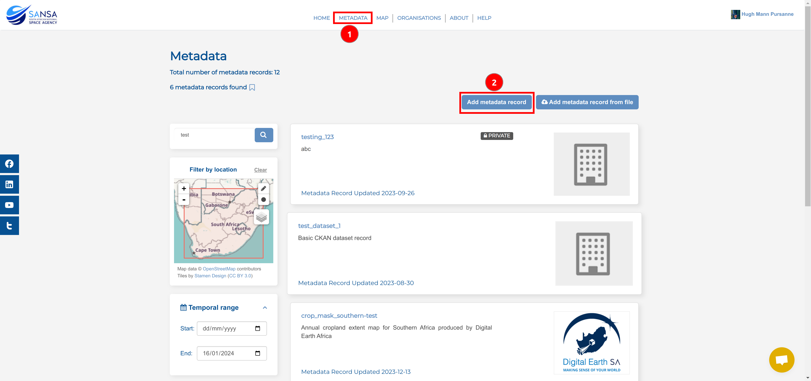
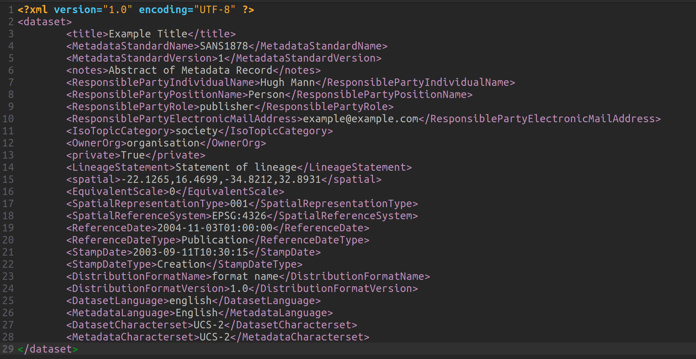

# Upload/Create Metadata

**Applicable roles:** Metadata editor, metadata publisher and system administrator

## Create metadata record using System UI

There are two methods for creating a metadata record in an organisation using the system's user interface.

### Method 1

Navigate to `Metadata` and click on the `Add metadata record` button.

This will take you to the form that needs to be completed in order to create metadata record. Fill in all the necessary information about the record. All fields marked with an asterisk (*) are mandatory. The information you add will become the information that is available on the site about the record you are adding. When adding the metadata record thumbnail, make sure the image URL is a public image link and not a private one. Remember to also make sure that the image ratio is 1:1 for the best results.

### Method 2

Navigate to your profile and click on the `Add metadata record` button then fill out the form.

If you have the permissions to upload metadata records within multiple organisations, you will need to choose the `Responsible organisation Name` to ensure the record is published within the correct organisation.

## Create metadata record using XML upload

Another method to create a metadata record in an organisation is via an XML file upload.

On the metadata page, click on the `Add metadata record from xml file` button.

Then select the XML file on your local machine.

The xml file should look something like this:

