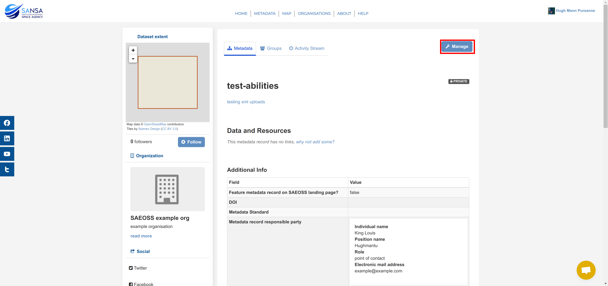

# Edit Metadata

**Applicable roles:** Metadata editor, metadata publisher and system administrator

## Edit metadata record using system UI

Navigate to your profile, but clicking on 1️⃣ the `Profile` drop-down menu and the clicking on 2️⃣ `Profile`:

Then select the metadata record you want to edit:

This will redirect you to the metadata record, on this page click on `Manage` to edit the record:

You will be redirected to the `Edit metadata` page, here you can make changes to the metadata record. If you would like to edit the associated resource(s) of the record click on 1️⃣ the `Resources` tab, and if you do not wish to make changes click on 2️⃣ the `View metadata record` button.

Once you have made your desired changes, you can scroll down and then click on 1️⃣ the `Update Dataset` button. If you would like to remove the record you can click on 2️⃣ the `Delete` button.

