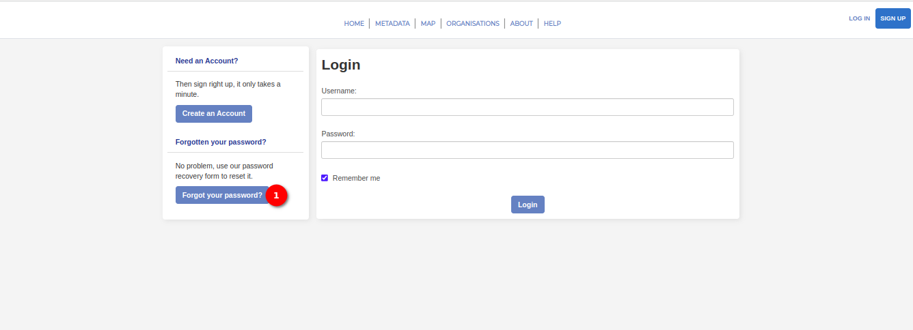
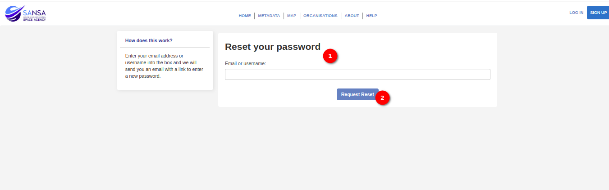

# User Guide: Forgot Password

The Forgot Password feature provides a convenient way for you to reset your password in case you forget it. This guide will walk you through the steps to initiate and complete the password reset process using the `Forgot your Password` button.

Click on the `Forgot your Password` button on the login page. After clicking the button, you will be redirected to the `Reset Password` page.

On the `Reset Password` page, you will find a form with a field to provide either a registered email or username. Enter either your email or username, and click on the `Request Reset` button.

The system will initiate the password reset process. Instructions will be sent to the provided email address or associated account on how to proceed.
