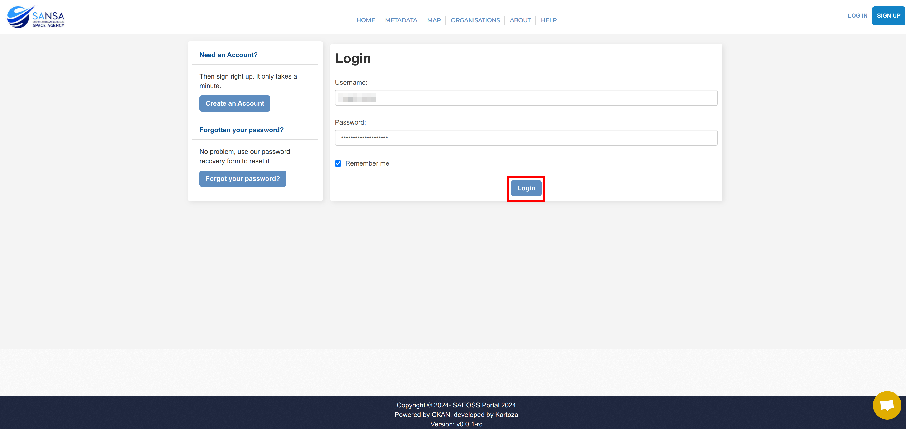
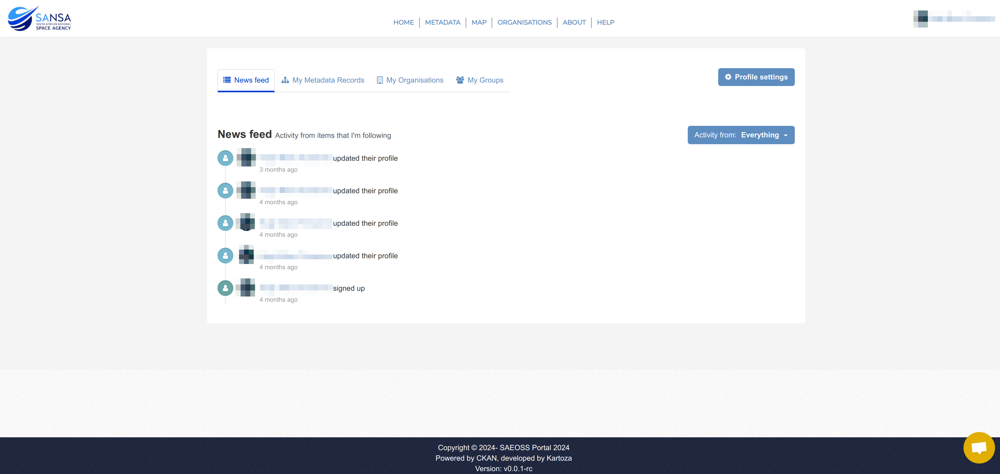

# Logging In

**Applicable roles:** All registered users.

To log in to the site, click on the `LOG IN` button in the top-right corner of the site.

On the Login Page, enter your username and password in the relevant fields. Then click on the `Login` button.

After that you will be redirected to your news feed on your dashboard.

