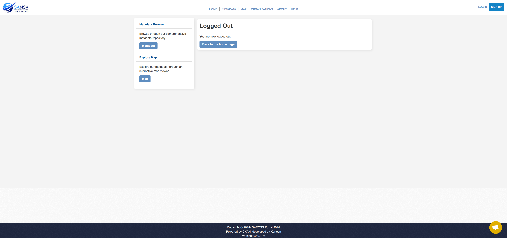

# Logout User Guide

Logging out of the account is a simple process that ensures the security of your session. Here is a quick guide to help you through the logout procedure:

Click on the user profile icon or name to reveal the user-related options.

In the dropdown menu, click on the `Logout` option. After clicking Logout, the system will process the request and redirect you to the logout page.

On the logout page, you will find convenient buttons to perform further actions.

And that is it! You will be successfully logged out and can now explore other sections or return to the system when needed. If you have any questions or require assistance, don't hesitate to reach out to our support team.
