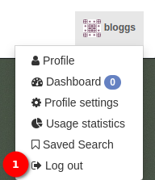
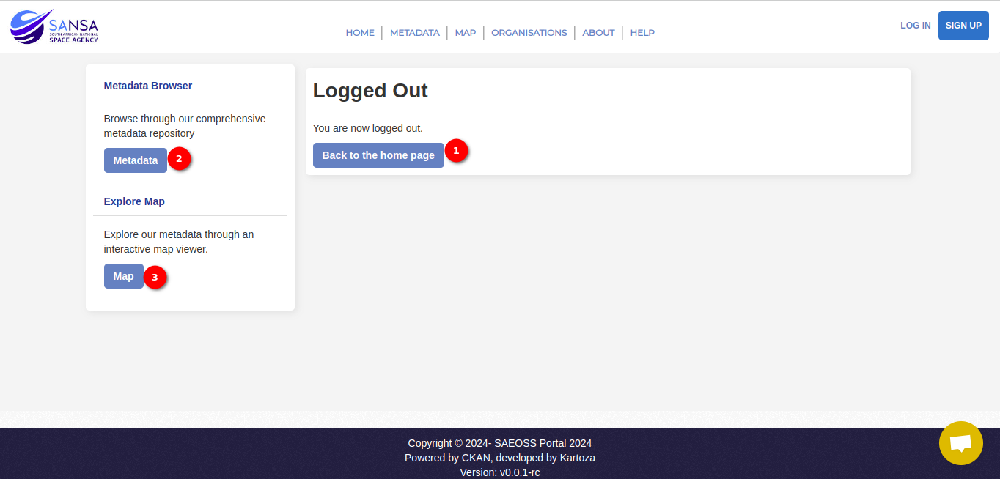

# Logout User Guide

Logging out of the account is a simple process that ensures the security of your session. Here's a quick guide to help the user through the logout procedure:

Click on the user profile icon or name to reveal the user-related options.

In the dropdown menu, click on the `Logout` option. After clicking `Logout`, the system will process the request and redirect the user to the logout page.

## Logout Page

On the logout page, the user will find convenient buttons to perform further actions.

1. **Back to Home Page:** Click the `Back to Home Page` button to return to the main page.

2. **Metadata:** Explore metadata records by clicking the `Metadata` button.

3. **Map:** Access spatial Earth Observation datasets and the map interface by clicking the `Map` button.

And the user will be successfully logged out and can now explore other sections or return to the system when needed. If you have any questions or require assistance, don't hesitate to reach out to the support team.