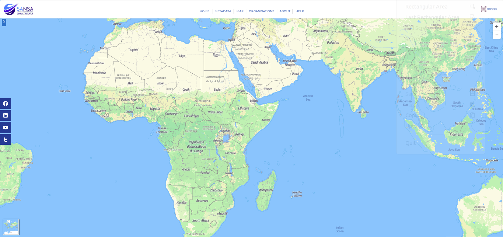

# Map User Guide

## Overview

The `Map` interface on the SAEOSS-Portal provides users with a visual representation of Earth Observation datasets through polygon footprints, showcasing the boundaries covered by respective metadata records. This guide will help you navigate and utilise the various features available on the Map tab.

## Explore Metadata Records

Click on the Right Arrow to open a side panel with a list of available metadata records and search filters.

1. **Search Filters:** Use the search filters to explore metadata records based on content, time, and location.
    
    - Search by Keyword
    - Search by Date

    
    
## Visualise Geographical Areas

- Click on a metadata record to visualise its corresponding geographic area on the map.

- The highlighted area provides a visual reference, and detailed information can be obtained by clicking within it.

## Zoom In and Out

Utilise the `Zoom` functionality to get a closer or broader view of the map.

## Choose Base Map

Select from various Base Map Options to customise your viewing experience.

**Base Map Options**

1. **OpenStreetMap Street View:** Traditional street map displaying road networks and landmarks.

    

2. **OpenStreetMap Hybrid View:** Combined satellite imagery with street map information.

    

3. **OpenStreetMap Pioneer View:** Designed for outdoor activities, highlighting topographic details.

    

4. **OpenStreetMap Neighbourhood View:** Emphasises localised mapping for neighbourhood-level details.

    

## Conclusion

The Map interface empowers users to interact with spatial Earth Observation datasets effectively. Navigate through metadata records, visualise geographic areas, and customise your map view for a comprehensive and enriching experience. Feel free to explore and contribute to the data-rich world of the SAEOSS-Portal!
