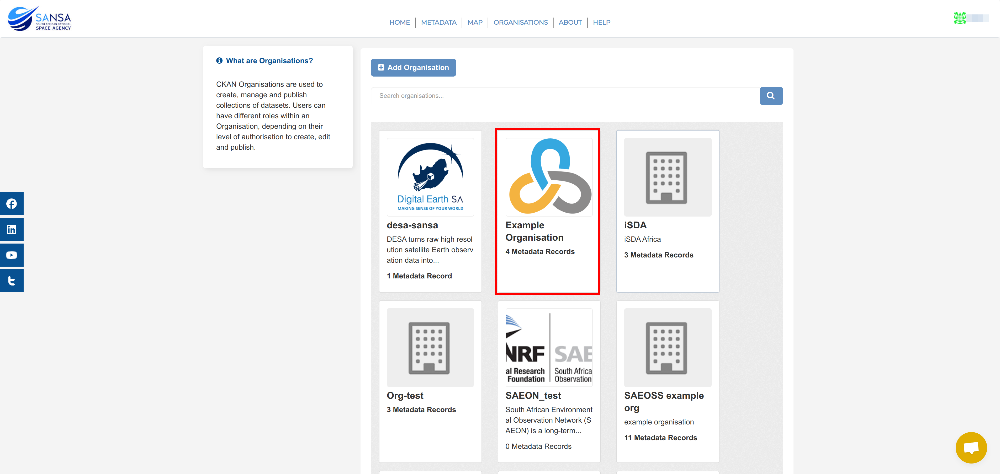
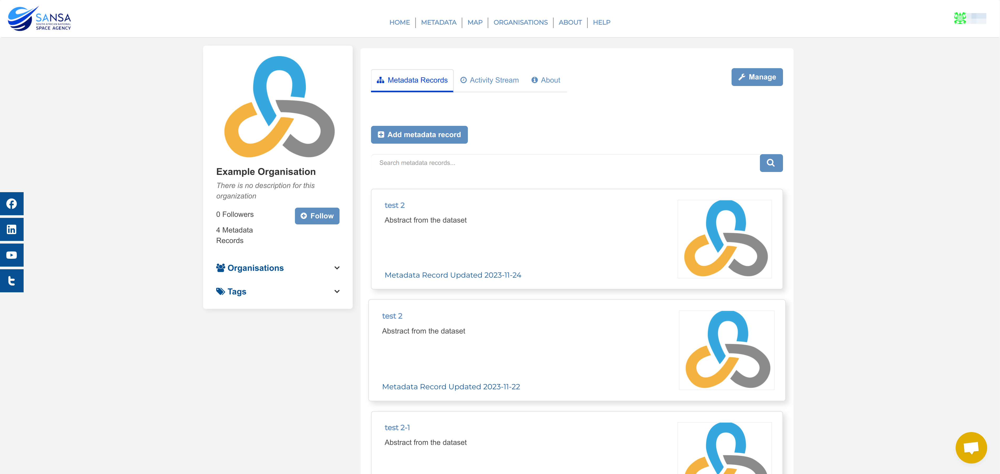
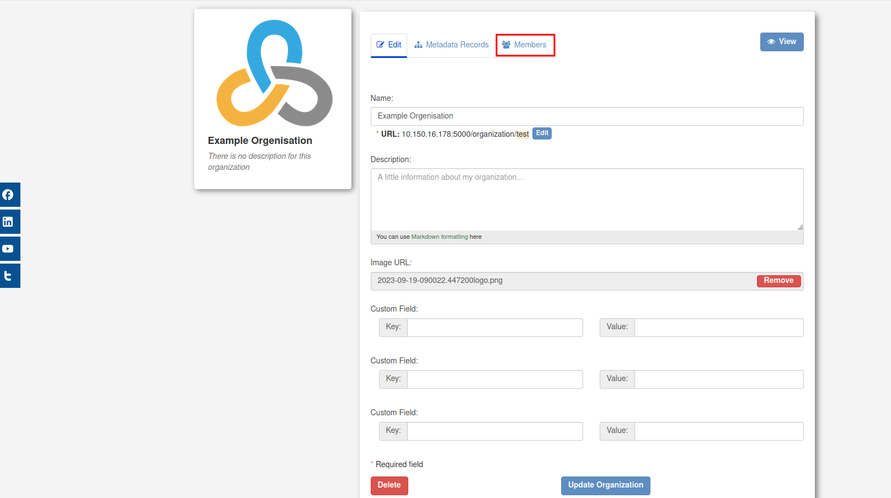
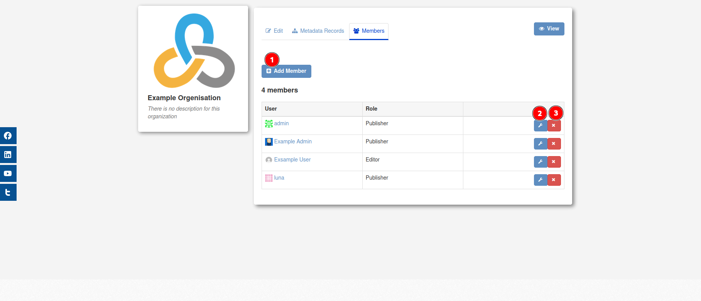
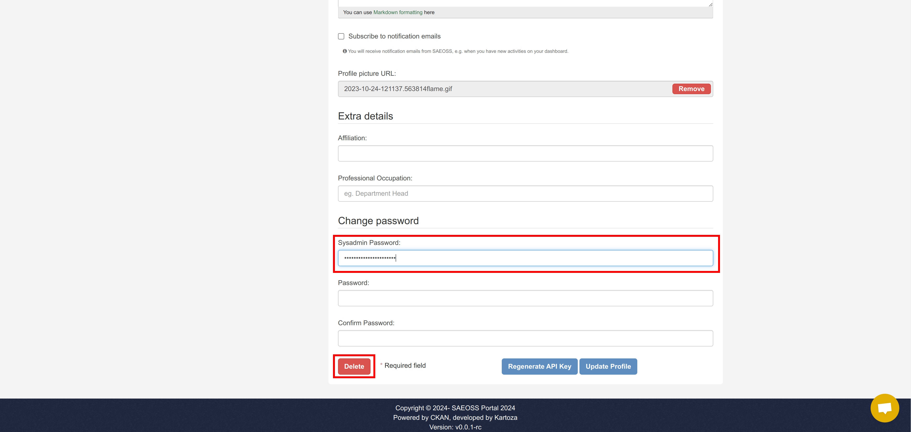

# Organisation Management

**Applicable roles:** System administrator and organisational publisher

## Navigating to Organisations

From any page on the site, click on `ORGANISATIONS` in the navigation bar at the top of the page.

This will redirect you to the Organisations Page. On this page, click on the block of organisation you would like to view.

This will redirect to that organisation's home page.

## Managing organisation members

As a system administrator or an organisational publisher, you have the ability to manage organisation members. First you need to navigate to the organisation and then click `Manage`.

Then click on the `Members` tab.

From here you can:

1. Add new members to the organisation.
2. Edit the member's role.
3. Remove the member from the organisation.

## Managing non-owned profile

As a system administrator, you have the ability to manage a non-owned user profile. To do so, navigate to an organisation's home page and then click on `Manage`.

Then click on the `Members` tab.

Then click on a user's name that you would like to manage.

You will be redirected to the user's profile page. On this page you should click on the `Manage` button.

You will be redirected to the `Change details` page, here you can manage the user's profile details. Once you have made your changes to the user's profile, scroll down and enter your `Sysadmin Password` (i.e. the password you use to log in to the administrator account), and then click on the `Update Profile` button.

If you would like to remove the user, you can scroll down and enter your `Sysadmin Password` (i.e. the password you use to log in to the administrator account), and then click on the `Delete` button.

