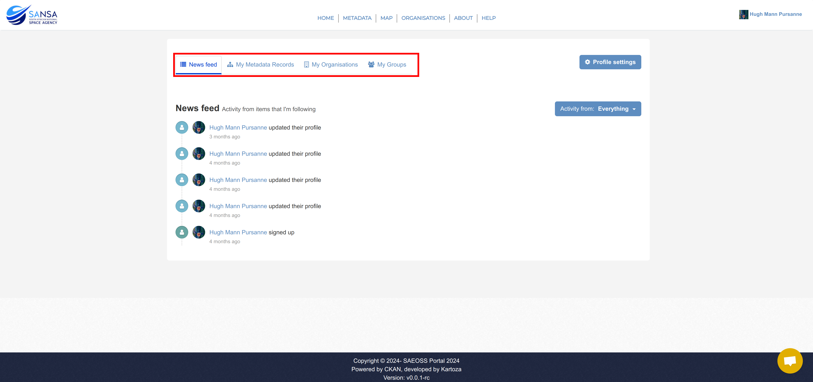

# Profile Settings

**Applicable roles:** All users are able to update their profile details.

## Managing your profile

To manage your account details, log in as normal and you will be redirected to your profile dashboard. On this page, you will be able to view your activity and navigate to view the metadata you have created, organisations that you follow and groups of which you are a member.

There are two methods to manage your profile: [Method 1](#method-1) which is only available through the dashboard and [Method 2](#method-2) which is available from anywhere on the site.

### Method 1

On your profile dashboard, click on the `Profile Settings` button located to the right of the `My Groups` tab.

You will be redirected to the `Change details` page where you will be able to edit your contact information, affiliation, and occupation. You will also have the option of changing your password at the bottom of the form.

When you have made your necessary/desired changes, click on the `Update Profile` button.

### Method 2

In the top-right corner of the site, click on `your username` to open the profile settings dropdown menu.

In this menu click on the `Profile Settings` button.

You will be redirected to the `Change details` page where you will be able to edit your contact information, affiliation, and occupation. You will also have the option of changing your password at the bottom of the form.

When you have made your necessary/desired changes, click on the `Update Profile` button.

