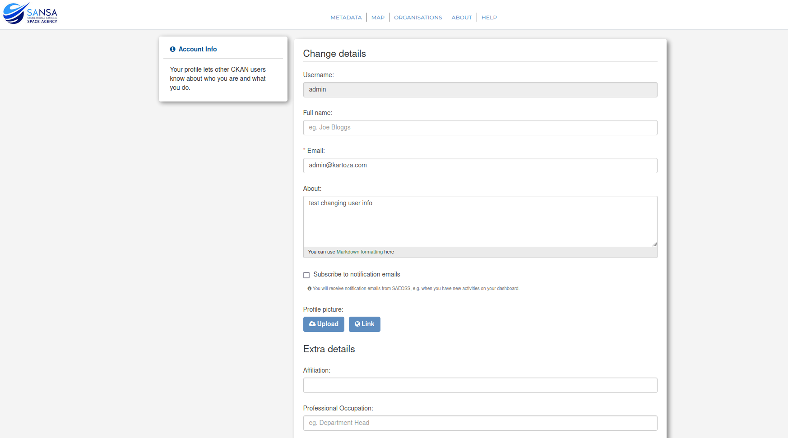

### Managing your profile

**Applicable roles:** All users are able to update their profile details.

To manage your account details, log in as normal, and you will be redirected to your dashboard. On this page, you will be able to view your activity and navigate to view the metadata you have created, organisations that you follow and groups that you are a member of. On the right-hand side of this page, you will see a green button, ‘Profile Settings’. Select this button to edit your account details.

Here you will be able to edit your contact information, affiliation, and occupation, and you will also have the option of changing your password.

