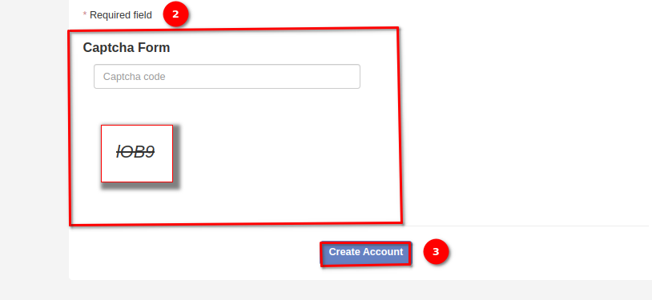

# Create an Account

**Applicable Roles:** Anyone one who can access the site through the internet.

In order to register on the site, click on the `SIGN UP` button on the top right hand corner of the page.

Then fill in the registration form (example below).

Please ensure to fill out all the 1️⃣ required fields marked with a **'*'** to complete the form submission process.

> Please note that your **username needs to be lowercase** and you are required to have a **password with a minimum of 8 characters**.

To create your account, please fill out the 2️⃣ captcha fields and then click on the 3️⃣ Create Account button. Once you have successfully registered, you can request to be added to an organisation using the CRISP help-desk.

Type your request in the designated field and then send it for it to be processed by the help team.

