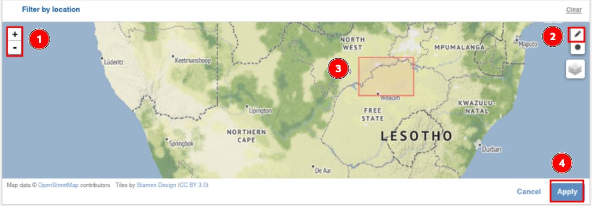
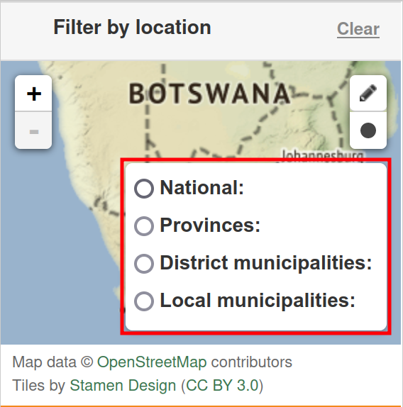
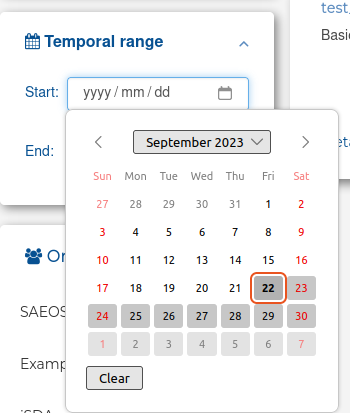
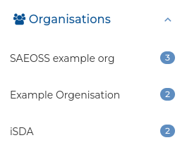
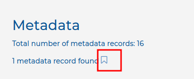
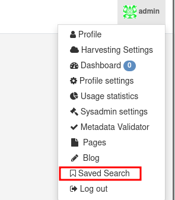

# Search metadata

Users are able to search for metadata on the 'Metadata' tab. Depending on the user role, users can view public or private records. Users can search for data using different filters.

## 1. Search metadata by Text

**Applicable roles**: All

Select 'Metadata' in the navigation bar, located horizontally at the top of the screen.

You can use the search bar to look for specific metadata or you can filter through the results to find suitable records. To use the search bar, click on it and type in the term you are looking for. Click on the little magnifying glass located on the right-hand side of the search bar to see if any records match your search.

**Expected results**: Searching by title, abstract, or by a unique identifier in the search bar will yield results that meet the search criteria.

## 2. Search metadata by Location

**Applicable roles**: All

You can filter the records by their spatial extent to find the records that you are looking for. You can search by location using three methods:

1. Draw a grid: The pencil icon allows you to draw a rectangle over area of interest.
2. Draw a radius: The circle icon allows you to search using proximity radius over area of interest.
3. Select spatial layer: The layers icon allows you to select based on pre-existing boundary layers available on the system.

To filter by drawing a grid, click on the little pen in the top right-hand corner of the map.

Use (1) the plus and minus icons in the top right corner of the map to zoom in and out, and use your mouse to pan around the map canvas by clicking down and dragging your cursor (when it looks like a hand). Click on (2) the pen icon and drag your cursor over the area you are finding metadata for. You should see (3) a red rectangle appear over that area. If you are not happy with the area, click on the little pen to re-draw a selection. If you are happy with the selection, select (4) `Apply`.

To filter by proximity, click on the circle icon in the top right-hand corner of the map.

Use (1) the plus and minus icons in the top right corner of the map to zoom in and out, and use your mouse to pan around the map canvas by clicking down and dragging your cursor (when it looks like a hand). Click on (2) the circle icon and drag from a point on the map. This will draw a buffer area around that point, based on a proximity radius. You should see (3) a red circle appear over that area. If you are not happy with the area, click on the little pen to re-draw a selection.If you are happy with the select, select (4) `Apply`.

To filter by spatial layers, click on the layers icon in the top right-hand corner of the map.

Select the spatial layer you want to apply

This example chose the Provinces layer.

Once you have chosen a desired layer, click on a spatial feature to set the search area (the example selects North West Province).

> **Note:** There is no apply button for this search functionality, clicking on a desired spatial feature automatically applies the filter.The search area will automatically resize to the bounding box of the spatial feature selected and all records that intersect with that particular spatial feature will be returned.

## 3. Search metadata by Temporal range

**Applicable roles**: All

You can filter metadata records using atemporal range. Set the temporal range by selecting a start date, end date, or both a start and end date depending on the temporal extent of the record you are searching for.

Click on the calendar icon, located on the right of the start and end date fields. To clear your results, select 'clear' and to set your extent to today's date, select 'today'.

Please note that the calendar icon is not present in all browsers. In those browsers just click on the date fields and a calendar should appear where you can select a date.

## 4. Search metadata by Organisation

**Applicable roles**: All

You can search for records by the organisations that published them. To do this, simply select the organisation or multiple organisations from whom you would like to view their records. To deselect the organisations, just click on the little 'x' that will appear next to a selected organisation.

Click on the calendar icon, located on the right of the start and end date fields. To clear your results, select 'clear' and to set your extent to today's date, select 'today'.

Note: As an anonymous user or a registered user who does not belong to the specific organisation you filtered by, you cannot see records that are private. This means that the number of records available may not be the number of records that appear.

## 5. Search metadata by other filters

The other filters include:

1. Harvest source
2. Featured metadata records
3. Tags

### Save searches

**Applicable roles:** Registered users, organisational members, editors, publishers and system administrators.

Registered users can save search parameters in order to be able to reproduce a search query at a future date.

Navigate to `Metadata` and select the desired filters. In the image below, the user searched by text, location and temporal range.

Once you have your desired records on screen, click the `Save` icon, which is to the right of the `Search` icon, to save your search.

Once you select it, the icon will be filled.

To view your saved searches, select `Saved Search` (which is located in the drop-down menu under your username) and it will direct you to your saved searches.

To reproduce a search, click on `Apply saved search` on one of your previous searches and the site will automatically redirect you to the results for that search.
