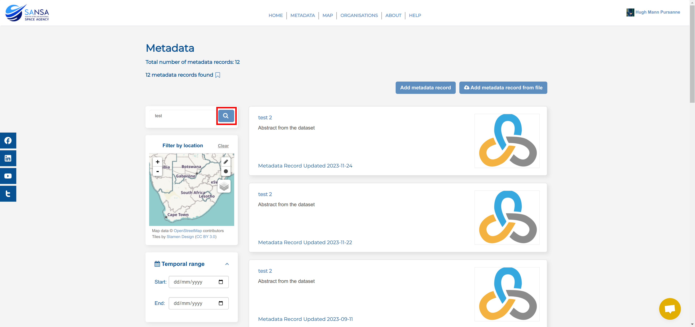
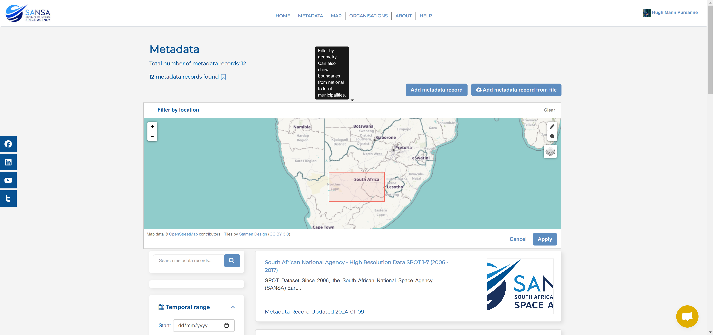
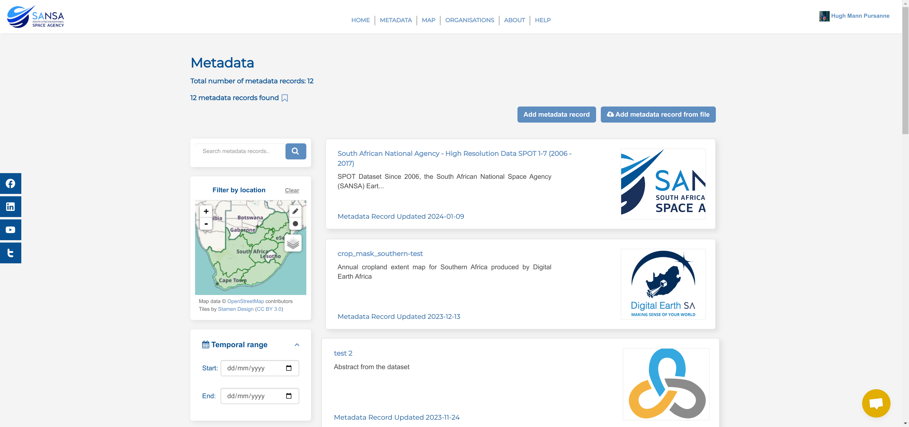

# Search metadata

Users are able to search for metadata on the `Metadata` page. Depending on the user role, users can view public or private records. Users can search for data using different filters.

## 1. Search metadata by Text

**Applicable roles**: All

On the `Metadata` Page, you can use the `Search` bar to look for specific metadata or you can filter through the results to find suitable records.

To use the `Search` bar, click on the text box and type in the term for which you are looking.

Then click on the `Search` button (the magnifying glass) located on the right-hand side of the search bar to see if any records match your search.

**Expected results**: Searching by title, abstract, or by a unique identifier in the search bar will yield results that meet the search criteria.

## 2. Search Metadata by Location

**Applicable roles**: All

You can filter the records by their spatial extent to find the records that you are looking for. You can search by location using three methods:

1. [Search by rectangle](#rectangular-search): The pencil icon allows you to draw a rectangle over area of interest.
2. [Search by radius](#proximity-radius-search): The circle icon allows you to search using proximity radius over area of interest.
3. [Select spatial layer](#spatial-layer-search): The layers icon allows you to select based on pre-existing boundary layers available on the system.

### Rectangular Search

To filter by drawing a rectangle, click on the pencil in the top right-hand corner of the map.

Once you click on the pencil, your cursor will turn in a reticle (a cross with a gap in the centre {: style="height:15px"}), you can click and drag your cursor to draw a rectangle over the area you would like to search.

If you would like to adjust the map view, you can use 1️⃣ the plus and minus icons in the top right corner of the map to zoom in and out, and use your mouse to pan around the map canvas by clicking down and dragging your cursor (when it looks like a hand {: style="height:15px"}). To redraw the rectangular search area, click on 2️⃣ the pencil icon and drag your cursor over the area for which you are searching metadata. You should see 3️⃣ a red rectangle appear over that area. If you are happy with the selection, select 4️⃣ `Apply`.

### Proximity Radius Search

To filter by proximity, click on the circle icon in the top right-hand corner of the map.

Once you click on the circle, your cursor will turn in a reticle (a cross with a gap in the centre {: style="height:15px"}), you can click and drag your cursor to draw a circle over the area you would like to search.

If you would like to adjust the map view, you can use 1️⃣ the plus and minus icons in the top right corner of the map to zoom in and out, and use your mouse to pan around the map canvas by clicking down and dragging your cursor (when it looks like a hand {: style="height:15px"}). To redraw the circular search area, click on 2️⃣ the circle icon and drag your cursor over the area for which you are searching metadata. You should see 3️⃣ a pink circle appear over that area. If you are happy with the selection, select 4️⃣ `Apply`.

### Spatial Layer Search

To filter by spatial layers, hover your mouse over the layers icon on the right-hand side of the map.

Select the spatial layer you want to apply and then move your mouse off the layers popup.

This example chose the Provinces layer.

Once you have chosen a desired layer, click on a spatial feature to set the search area (the example selects the Northern Cape Province).

> **Note:** There is no apply button for this search functionality, clicking on a desired spatial feature automatically applies the filter. The search area will automatically resize to the bounding box of the spatial feature selected and all records that intersect with that particular spatial feature will be returned.

## 3. Search metadata by Temporal range

**Applicable roles**: All

You can filter metadata records using a temporal range. Set the temporal range by selecting a start date, end date, or both a start and end date depending on the temporal extent of the record for which you are searching.

Click on the `Calendar` icon, located on the right of the start and end date fields.

To set your extent to today's date select 1️⃣ `Today`, and if you wish to remove your chosen date click on 2️⃣ `Clear`.

## 4. Search metadata by Organisation

**Applicable roles**: All

You can search for records by the organisations that published them. To do this, simply select the organisation or multiple organisations from whom you would like to view their records.

> Note: The site will reload the page every time you select (or remove) an organisation.

To deselect the organisations, just click on the little `x` that will appear next to a selected organisation.

> Note: As an anonymous user or a registered user who does not belong to the specific organisation you filtered by, you cannot see records that are private. This means that the number of records available may not be the number of records that appear.

## 5. Search metadata by other filters

The other filters include:

1. **Harvest source:** Allows you filter by harvest sources that have been added to the portal.
2. **Featured metadata records:** Allows you filter by records that have been tagged to be featured on the landing page of the portal.
3. **Tags:** Allows you to filter by tags that have been associated with records

## Save searches

**Applicable roles:** Registered users, organisational members, editors, publishers and system administrators.

Registered users can save search parameters in order to be able to reproduce a search query at a future date.

Navigate to `Metadata` and select the desired filters. In the image below, the user searched by text, location and temporal range.

Once you have your desired records on screen, click the `Save` icon, which is to the right of the `Search` icon, to save your search.

Once you select it, the icon will be filled.

To view your saved searches, open 1️⃣ the profile drop-down menu and select 2️⃣ `Saved Search`.

This will redirect you to the `Saved Searches` page where you can see all of your saved searches.

To reproduce a search, click on 1️⃣ `Apply saved search` on one of your previous searches and the site will automatically redirect you to the `Metadata` Page and display results for that search. You can also choose to delete a previously saved search by clicking on 2️⃣ the `Delete saved search` button.

