# How To Use the Platform

The aim of this guide is to provide help with common operations over the SAEOSS portal, this is an open-ended document 
as the portal is still under development, further features added to the portal should be reflected here as well, 
the following operations are currently covered: 

* Organisation creation, update and deletion
* User creation, update and deletion
* System admin creation, update and deletion
* Dataset creation, update and deletion
* Data harvesting and operations over harvesting sources and jobs.
* Stac Harvesting

## Organisation creation, update and deletion

As SAEOSS Portal depends on CKAN, handling datasets follow a specific pattern, each dataset belongs to an organisation 
(custom behaviour can be added to allow datasets without organisations). In order to create organisations a system 
admins can either use the UI or the API (creating organisations by non system admin users can be enabled by changing 
**ckan.auth.user_create_organizations** configuration in the ckan-dev-settings.ini file), 
the following steps detail creating organisation through the UI:

### Organisation creation

1. Make sure you are logged in with sufficient credentials (i.e system admin).
2. Go to organisation tap in the navbar
   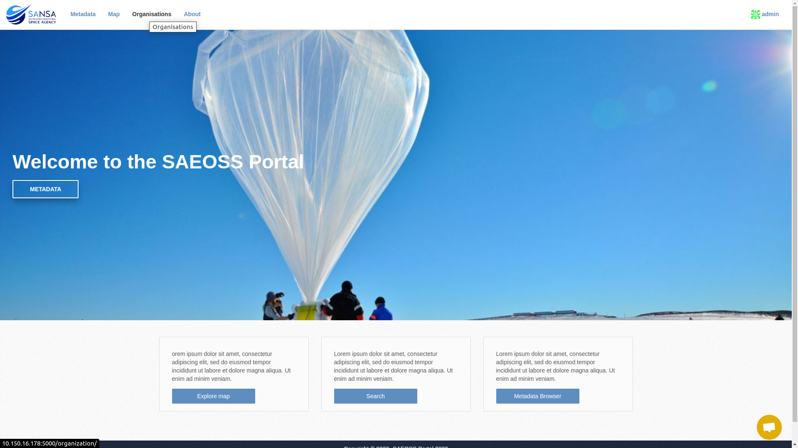

3. On the organisation list page click on create organisation
   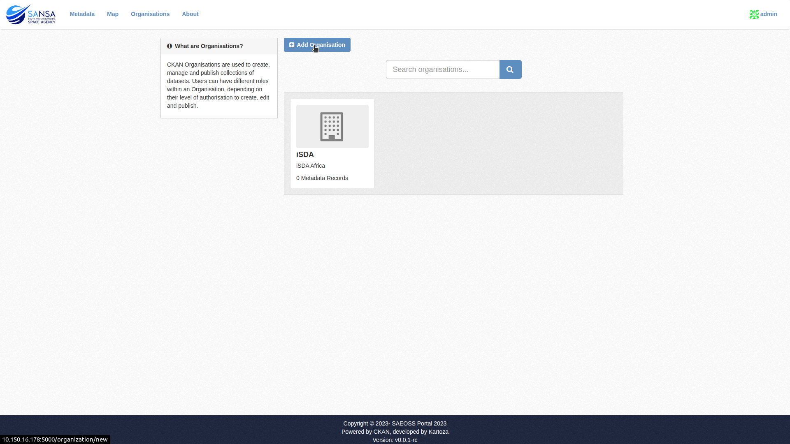

4. Fill in the organisation form and click create
   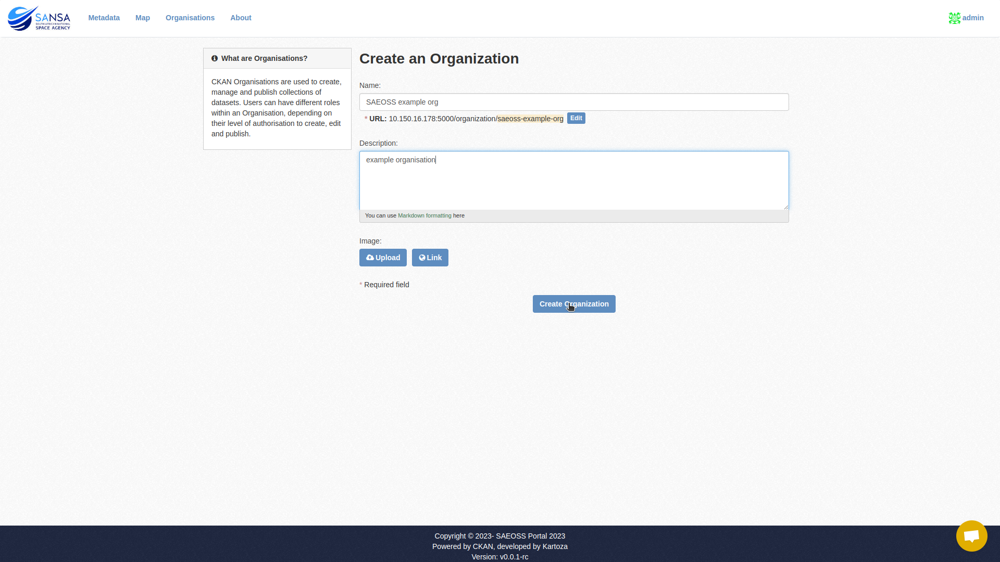

Organisations can also be created through the API, the following steps details how to create an organisation 
through api:

* Make sure that you have an http client (e.g. curl), and the system admin api key is in place (go to system admin 
update below to know how to generate an api key)
* The following command uses curl to as an http client and makes a post request to the /organization_create api endpoint:
```
curl -H "Authorization: 171f894f-cc8d-49ac-a0f6-f012fc2b0ea6" -X POST http://10.150.16.178:5000/api/3/action/organization_create -d '{ "name": "api-org1"}'  
```
Where -H Authorization is followed by the api key, please reach out to the CKAN api guide to see the available options to the previous command,
* The following text is part of the response from the site:
```
{"help": "http://10.150.16.178:5000/api/3/action/help_show?name=organization_create", "success": true, "result": {"approval_status": "approved", "created": "2023-07-05T00:17:21.109526", "description": "", "display_name": "api-org1", "id": "fa2bbeac-f905-44f4-8bd2-bd610c260f01", "image_display_url": "", "image_url": "", "is_organization": true, "name": "api-org1", "num_followers": 0, "package_count": 0, "state": "active", "title": "", "type": "organization", "users": [{"about": null, "activity_streams_email_notifications": false, "capacity": "admin", "created": "2023-06-28T17:36:57.463251"}]}
```

### Organisation Update
Organisation info can be updated through UI or API, the following steps illustrate how the organisation is updated through the UI:

1. Go to organisation page and press manage:
   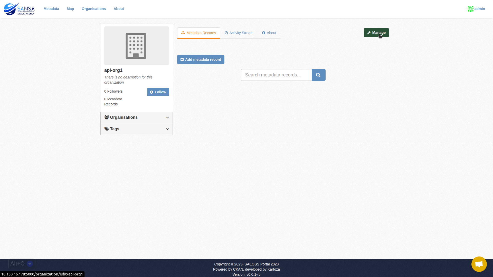

2. Fill the organisation form and press update organisation
   

Updating organisation through API uses the organisation_update endpoint, the following is a curl command that updates the description of an organisation:
```
curl -H "Authorization: 171f894f-cc8d-49ac-a0f6-f012fc2b0ea6" -X POST http://10.150.16.178:5000/api/3/action/organization_update -d '{"id":"api-org1","description": "testing update description update"}'  
```
And the following is a response from the server:
```
{"help": "http://10.150.16.178:5000/api/3/action/help_show?name=organization_update", "success": true, "result": {"id": "fa2bbeac-f905-44f4-8bd2-bd610c260f01", "name": "api-org1", "title": "", "type": "organization", "description": "testing update description update", "image_url": "", "created": "2023-07-05T00:17:21.109526", "is_organization": true, "approval_status": "approved", "state": "active", "display_name": "api-org1", "extras": [], "packages": [], "package_count": 0, "tags": [], "groups": [], "users": [], "image_display_url": ""}}
```

### Organisation Deletion
An Organisation can be deleted through the UI or through the API, the following illustrates the steps to delete an 
organisation through the UI:

1. Go to organisation page and press manage:
  

2. On the organisation management page press delete and confirm:
  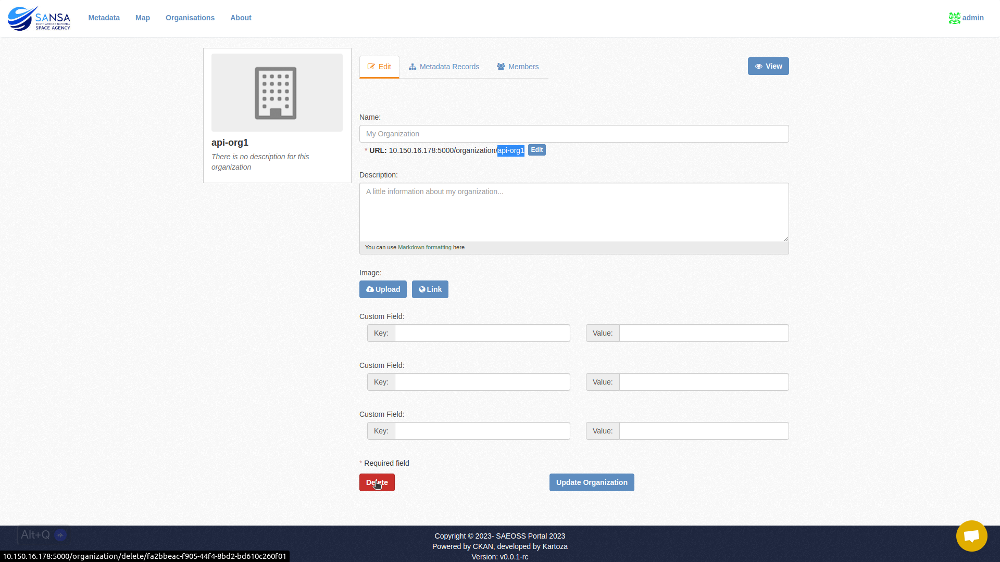

The following is a curl command that to delete an organisation:
```
curl -H "Authorization: 171f894f-cc8d-49ac-a0f6-f012fc2b0ea6" -X POST http://10.150.16.178:5000/api/3/action/organization_delete -d '{"id":"api-org1"}' 
```
And the following is a response from the server:
```
{"help": "http://10.150.16.178:5000/api/3/action/help_show?name=organization_delete", "success": true, "result": null}
```

## User creation, update and deletion

### User Creation
Users can be added to the portals via the UI or API, the following illustrates the steps to create a new user

1. Go to the sign up page:
    
2. Fill in user’s form and click create account
    

Through the API, the name, password and email address of the user are required and other optional info can be provided 
(id, full name, about ..etc. see user_create for more details), the following is a command used to the create a new user:
```
curl -H "Authorization: 171f894f-cc8d-49ac-a0f6-f012fc2b0ea6" -X POST http://10.150.16.178:5000/api/3/action/user_create -d '{"name":"new_user", "password":"12345678","email":"new_user@saeoss.com"}'
```
And the following is the response from the server:
```
{"help": "http://10.150.16.178:5000/api/3/action/help_show?name=user_create", "success": true, "result": {"id": "0bb92df1-30e3-4a63-a3cd-579f5909fde5", "name": "new_user", "fullname": null, "created": "2023-07-07T03:10:38.620397", "about": null, "activity_streams_email_notifications": false, "sysadmin": false, "state": "active", "image_url": null, "display_name": "new_user", "email_hash": "8fb09d9fba81f1b0f0712d11d707ad9b", "number_created_packages": 0, "email": "new_user@saeoss.com", "apikey": null, "image_display_url": null, "extra_fields": {"affiliation": "", "professional_occupation": ""}}}
```
### User Update
A user info can be updated through the UI or through the API, the following are the steps to update a user info

1. Go to user profile:
    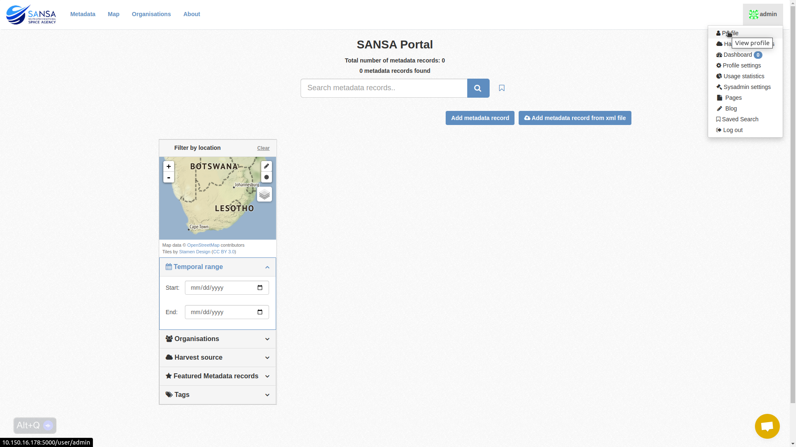
2. Go to manage page
    
3. Fill the form and Click update
    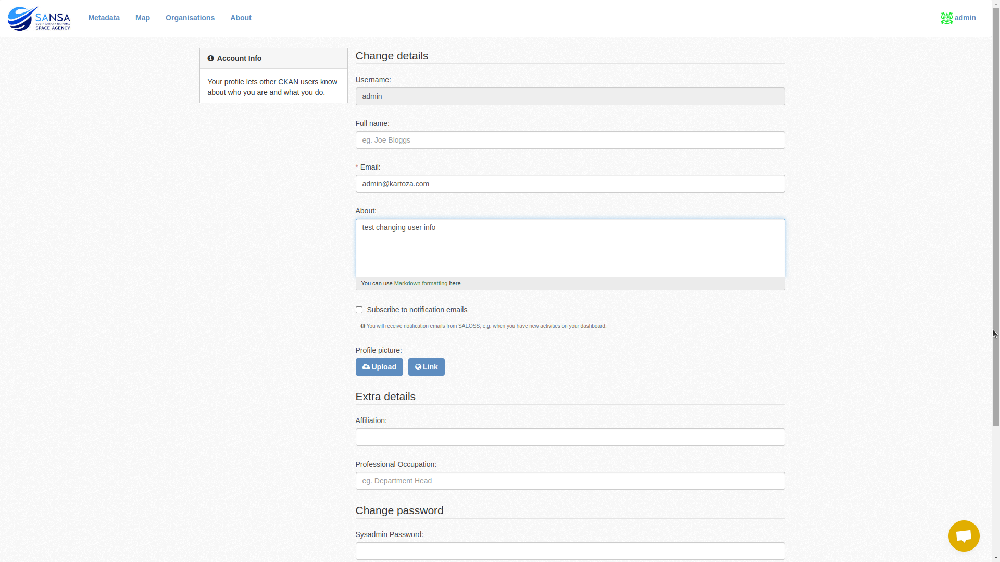

Updating the user through the api uses user_update end point, the following illustrates a curl command to update user 
with id **e74babf7-60c8-447a-8a80-20344421a8a9** and email admin@kartoza.com
```
curl -H "Authorization: 171f894f-cc8d-49ac-a0f6-f012fc2b0ea6" -X POST http://10.150.16.178:5000/api/3/action/user_update -d '{"id":"e74babf7-60c8-447a-8a80-20344421a8a9","email":"admin@kartoza.com", "description":"new description"}'
```
And the following is the response:
```
{"help": "http://10.150.16.178:5000/api/3/action/help_show?name=user_update", "success": true, "result": {"id": "e74babf7-60c8-447a-8a80-20344421a8a9", "name": "admin", "fullname": "", "created": "2023-06-28T17:36:57.463251", "about": "test changing user info", "activity_streams_email_notifications": false, "sysadmin": true, "state": "active", "image_url": "", "display_name": "admin", "email_hash": "d21a6edd024ee32a4e4ffa4242ca56d3", "number_created_packages": 0, "apikey": "171f894f-cc8d-49ac-a0f6-f012fc2b0ea6", "email": "admin@kartoza.com", "image_display_url": "", "extra_fields": {"affiliation": null, "professional_occupation": null}}}
```

### User Deletion
A user can be deleted from the system via the UI or the API, the following illustrates deleting a user through the UI, 
make sure you are logged in as a system admin

1. Go to the users page
    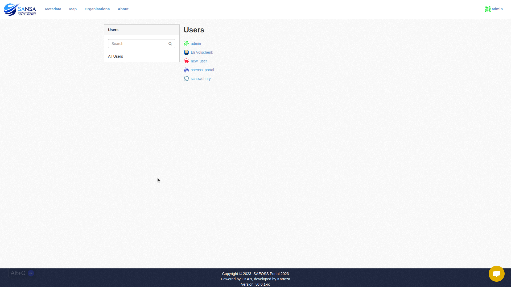
2. Click over the user to be deleted, this will move to the user’s page press manage
    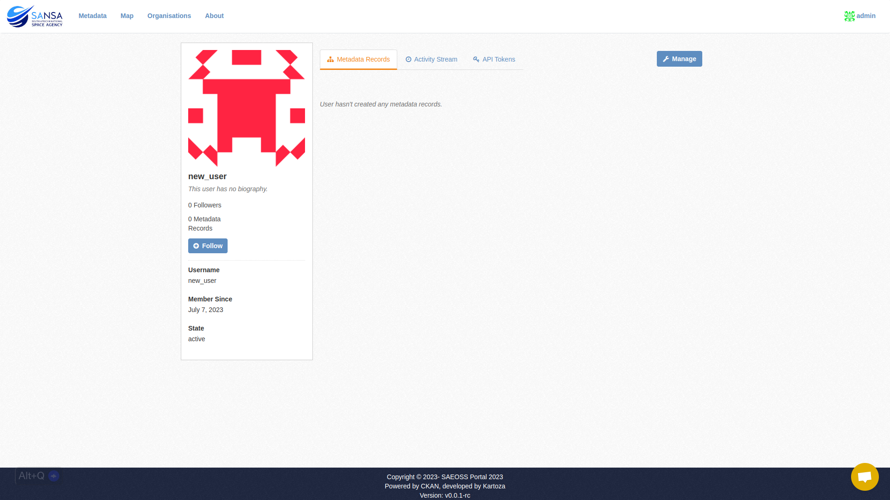
3. At the end of the user’s page, click on delete and confirm deletion
   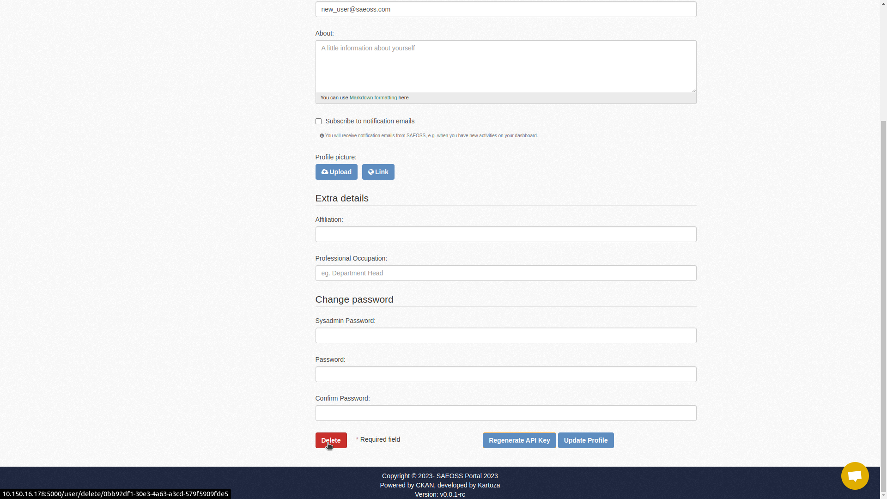

The process so far removes the user from the portal but it still exists with the database, CKAN uses this as a mechanism
 to retain deleted entities, some entities like datasets and organisations can be removed from the database as well by 
going to admin trash page (/ckan-admin/trash, e.g. https://www.saeoss.com/ckan-admin/trash), however users should be 
deleted from the database directly if a complete removal is required.

## System admin creation, update and deletion
### System admin creation
Systems admins aren’t created as normal users through the UI but rather the following command has to be run first inorder 
to create system admins, the system responds with regular questions as email and password insertion, once completed 
the admin will be created:
```
docker exec -ti saeoss-ckan-web-1 poetry run ckan sysadmin add admin
```
### Update System admin
After system admin was created, it can updated the same way as normal user, refer to **User Update** for a guide 
about users update.

### Delete System admin:

After system admin is created it can also be deleted the same way as normal users, please refer to **User deletion** for 
more info, not that you must sign in as a system admin also in order to delete other admins.

## Dataset creation, update and deletion
### Dataset creation:

In order for a user to be able to create a dataset it must be registered first to an organisation (this can be 
customised by changing the CKAN ini file, navigate to unowned datasets, and create datasets if not in organisation 
for more info), to add a user to an organisation, you have to either sign in as a system admin or organisation admin, 
please follow these steps:

1. Go to organisation page and click manage
2. Go to members
   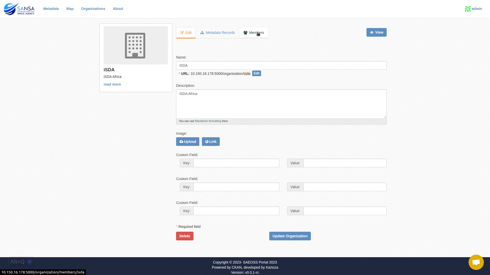
3. Click on add member
   
4. Add a registered user to the organisation with specific role (member, editor and publisher for more info please visit https://docs.ckan.org/en/latest/maintaining/authorization.html#organizations for more info about roles), please note that role Admin is renamed to publisher with SAEOSS portal for convenience (this is a custom renaming and can be named back to admin if requested)  
    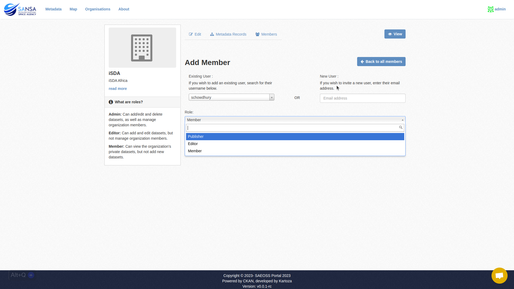

Datasets can also be created through API using the package_create endpoint, the records which required to create the 
dataset can be adhered to scheming (requested by saeoss to  be SANS1878 required fields) the following is a command used 
to create dataset through API where only the name of dataset, lineage, owner_org, notes and whether the dataset is public 
or private are  the current set of required fields:

```
curl -H "Authorization: 171f894f-cc8d-49ac-a0f6-f012fc2b0ea6" -X POST http://10.150.16.178:5000/api/3/action/package_create -d '{"name":"package_test_1","private":"true", "owner_org":"isda","notes":"test creating datasets via API","lineage":"unknown"}'
```

And the following is the server response:
```
{"help": "http://10.150.16.178:5000/api/3/action/help_show?name=package_create", "success": true, "result": {"author": null, "author_email": null, "creator_user_id": "e74babf7-60c8-447a-8a80-20344421a8a9", "doi": "", "featured": "false", "id": "cfa05758-d6aa-4675-9b19-2da1e02e45d9", "isopen": false, "license_id": null, "license_title": null, "lineage": "unknown", "maintainer": null, "maintainer_email": null, "metadata_created": "2023-07-08T11:54:02.382461", "metadata_modified": "2023-07-08T11:54:02.382468", "name": "package_test_1", "notes": "test creating datasets via API", "num_resources": 0, "num_tags": 0, "organization": {"id": "0792d3b6-f7cc-48af-9393-d4fbdb9fe1c1", "name": "isda", "title": "iSDA", "type": "organization", "description": "iSDA Africa", "image_url": "", "created": "2023-07-04T12:08:48.794504", "is_organization": true, "approval_status": "approved", "state": "active"}, "owner_org": "0792d3b6-f7cc-48af-9393-d4fbdb9fe1c1", "private": true, "spatial": "{\"type\": \"Polygon\", \"coordinates\": [[[16.4699, -34.8212], [32.8931, -34.8212], [32.8931, -22.1265], [16.4699, -22.1265], [16.4699, -34.8212]]]}", "state": "active", "title": "package_test_1", "type": "dataset", "url": null, "version": null, "resources": [], "tags": [], "groups": [], "relationships_as_subject": [], "relationships_as_object": []}}
```
### Dataset update:
Authorised users (users with editor and publisher roles in an organisation that owns a dataset) are able to modify a 
dataset either through the UI or API, the following are the steps to update a dataset through the UI:

1. Go to the dataset page and click manage (in order to find the dataset you can search in the /dataset page)
    

2. Fill in the dataset form and click update dataset
    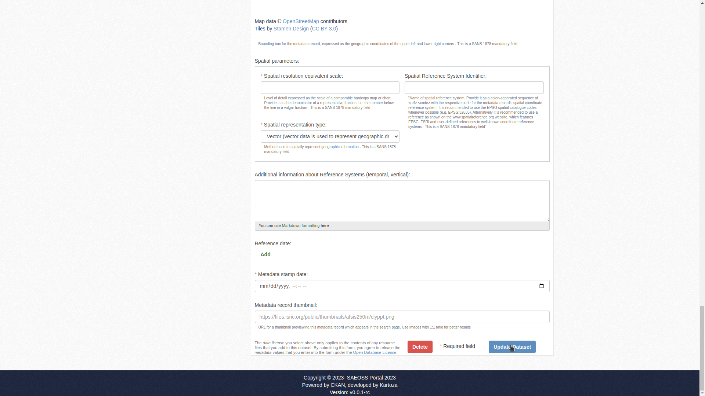

Through the API the dataset can be updated with package_update or package_patch endpoints, with package_update all the 
required fields should be provided and the fields that are not intended to be changed should have values as well, with 
package_patch only the fields to be changed are included, package_patch methods requires the id of the dataset,  the 
following represents a curl command to update the notes field of the previously created dataset:

1. Package_update:
    ```
    curl -H "Authorization: 171f894f-cc8d-49ac-a0f6-f012fc2b0ea6" -X POST http://10.150.16.178:5000/api/3/action/package_update -d '{"name":"package_test_1","private":"true", "owner_org":"isda","notes":"test updating datasets via API","lineage":"unknown"}'
    ```
   The following is the server response:

    ```
    {"help": "http://10.150.16.178:5000/api/3/action/help_show?name=package_update", 
   "success": true, "result": {"author": null, "author_email": null, "creator_user_id": "e74babf7-60c8-447a-8a80-20344421a8a9", 
   "doi": "", "featured": "false", "id": "cfa05758-d6aa-4675-9b19-2da1e02e45d9", "isopen": false, "license_id": null, 
   "license_title": null, "lineage": "unknown", "maintainer": null, "maintainer_email": null, "metadata_created": 
   "2023-07-08T11:54:02.382461", "metadata_modified": "2023-07-08T12:12:49.932559", "name": "package_test_1", 
   "notes": "test updating datasets via API", "num_resources": 0, "num_tags": 0, "organization": 
   {"id": "0792d3b6-f7cc-48af-9393-d4fbdb9fe1c1", "name": "isda", "title": "iSDA", "type": "organization", 
   "description": "iSDA Africa", "image_url": "", "created": "2023-07-04T12:08:48.794504", "is_organization": true, 
   "approval_status": "approved", "state": "active"}, "owner_org": "0792d3b6-f7cc-48af-9393-d4fbdb9fe1c1", 
   "private": true, "spatial": "{\"type\": \"Polygon\", \"coordinates\": [[[16.4699, -34.8212], [32.8931, -34.8212], [32.8931, -22.1265], [16.4699, -22.1265], [16.4699, -34.8212]]]}", 
   "state": "active", "title": "package_test_1", "type": "dataset", "url": null, "version": null, 
   "resources": [], "tags": [], "groups": [], "relationships_as_subject": [], "relationships_as_object": []}}
    ```
   
2. package_patch
    ```
    curl -H "Authorization: 171f894f-cc8d-49ac-a0f6-f012fc2b0ea6" -X POST http://10.150.16.178:5000/api/3/action/package_patch -d '{"id":"cfa05758-d6aa-4675-9b19-2da1e02e45d9","notes":"test updating datasets via patch endpint"}'
    ```
    The response from the server:

    ```
    {"help": "http://10.150.16.178:5000/api/3/action/help_show?name=package_patch", "success": true, "result": 
   {"author": null, "author_email": null, "creator_user_id": "e74babf7-60c8-447a-8a80-20344421a8a9", "doi": "", 
   "featured": "false", "id": "cfa05758-d6aa-4675-9b19-2da1e02e45d9", "isopen": false, "license_id": null, 
   "license_title": null, "lineage": "unknown", "maintainer": null, "maintainer_email": null, "metadata_created": 
   "2023-07-08T11:54:02.382461", "metadata_modified": "2023-07-08T12:18:47.450936", "name": "package_test_1", "notes": 
   "test updating datasets via patch endpint", "num_resources": 0, "num_tags": 0, "organization": 
   {"id": "0792d3b6-f7cc-48af-9393-d4fbdb9fe1c1", "name": "isda", "title": "iSDA", "type": "organization", 
   "description": "iSDA Africa", "image_url": "", "created": "2023-07-04T12:08:48.794504", "is_organization": true, 
   "approval_status": "approved", "state": "active"}, "owner_org": "0792d3b6-f7cc-48af-9393-d4fbdb9fe1c1", "private": true, 
   "spatial": "{\"type\": \"Polygon\", \"coordinates\": [[[16.4699, -34.8212], [32.8931, -34.8212], 
   [32.8931, -22.1265], [16.4699, -22.1265], [16.4699, -34.8212]]]}", "state": "active", "title": "package_test_1", 
   "type": "dataset", "url": null, "version": null, "resources": [], "tags": [], "groups": [], 
   "relationships_as_subject": [], "relationships_as_object": []}}
    ```
   
### Dataset Delete
User should be authorised with their organisation in order to be able to delete datasets (have editor or publisher roles), the following are the steps to delete a dataset:

1. Go to the dataset page and press manage:
2. At the bottom of the manage page press delete and confirm deletion:
   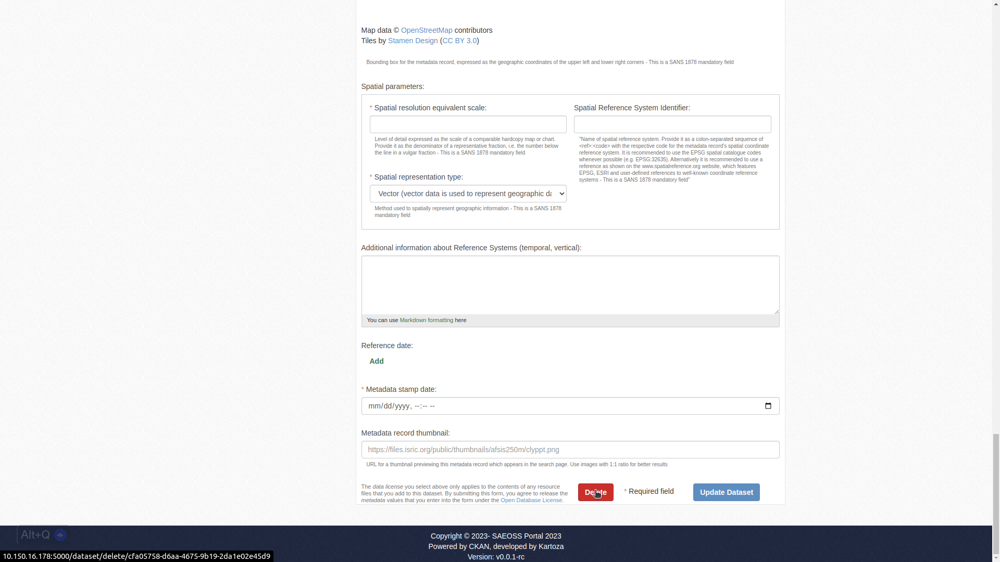

This only deletes from the site and not from the database, to completely delete the dataset from the database, 
go to the ckan-admin page (e.g. https://www.saeoss.com/ckan-admin) and press trash:

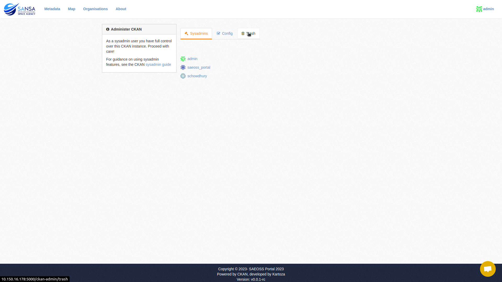

After going to the trash page, press purge beside the dataset to be deleted or press purge all to delete all datasets, 
orgs, harvesting sources ..etc. at once:

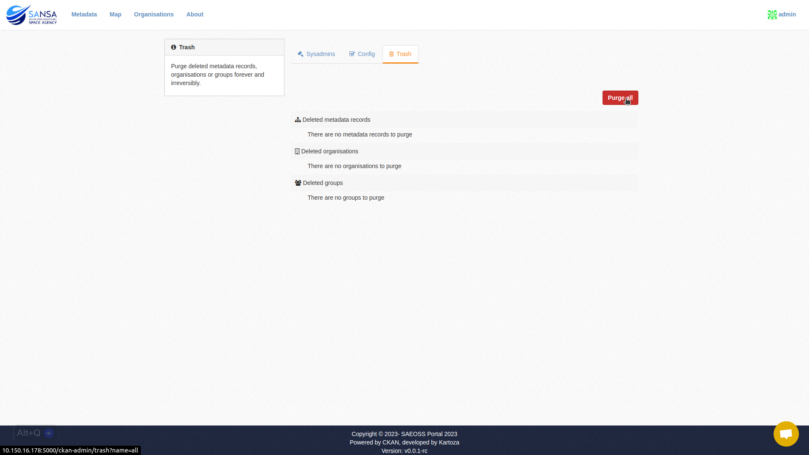


Through the API the dataset can be deleted with pakcage_delete endpoint where the id of the dataset is required in order to complete deletion:

```
curl -H "Authorization: 171f894f-cc8d-49ac-a0f6-f012fc2b0ea6" -X POST http://10.150.16.178:5000/api/3/action/package_patch -d '{"id":"cfa05758-d6aa-4675-9b19-2da1e02e45d9"}'
```

The following is the server response:

```
{"help": "http://10.150.16.178:5000/api/3/action/help_show?name=package_patch", "success": true, "result": 
{"author": null, "author_email": null, "creator_user_id": "e74babf7-60c8-447a-8a80-20344421a8a9", "doi": "", 
"featured": "false", "id": "cfa05758-d6aa-4675-9b19-2da1e02e45d9", "isopen": false, "license_id": null, 
"license_title": null, "lineage": "unknown", "maintainer": null, "maintainer_email": null, 
"metadata_created": "2023-07-08T11:54:02.382461", "metadata_modified": "2023-07-08T13:03:11.094010", 
"name": "package_test_1", "notes": "test updating datasets via patch endpint", "num_resources": 0, "num_tags": 0, 
"organization": {"id": "0792d3b6-f7cc-48af-9393-d4fbdb9fe1c1", "name": "isda", "title": "iSDA", "type": 
"organization", "description": "iSDA Africa", "image_url": "", "created": "2023-07-04T12:08:48.794504", 
"is_organization": true, "approval_status": "approved", "state": "active"}, 
"owner_org": "0792d3b6-f7cc-48af-9393-d4fbdb9fe1c1", "private": true, "spatial": "{\"type\": \"Polygon\", \"coordinates\": 
[[[16.4699, -34.8212], [32.8931, -34.8212], [32.8931, -22.1265], [16.4699, -22.1265], [16.4699, -34.8212]]]}", 
"state": "active", "title": "package_test_1", "type": "dataset", "url": null, "version": null, "resources": [], 
"tags": [], "groups": [], "relationships_as_subject": [], "relationships_as_object": []}}
```


## Data harvesting and operations over harvesting sources and jobs.

### Data Harvesting
Before starting harvest process a harvest datasource should be provided, the following steps illustrates how to add a 
harvesting source to the site:

1. Go /harvest url (e.g. https://www.saeoss.com/harvest)
2. Press add harvest source
   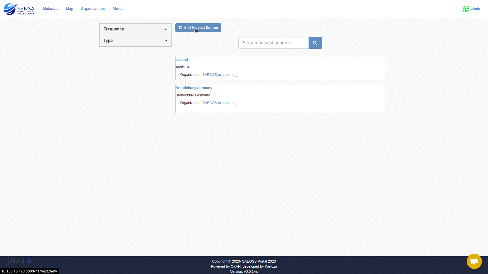
3. Fill in the harvest source form and press save
    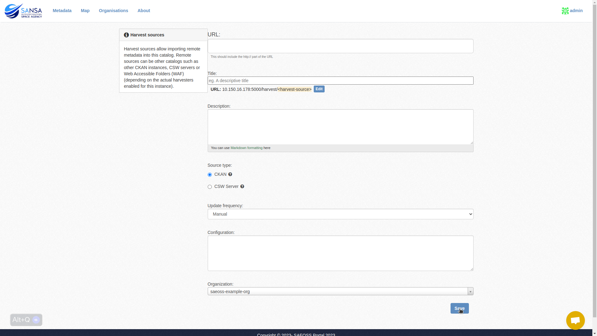
After a harvester source being added, harvesting process could be initiated, the following illustrates the steps to 
complete a harvest:
* Go to the harvest source page and press admin
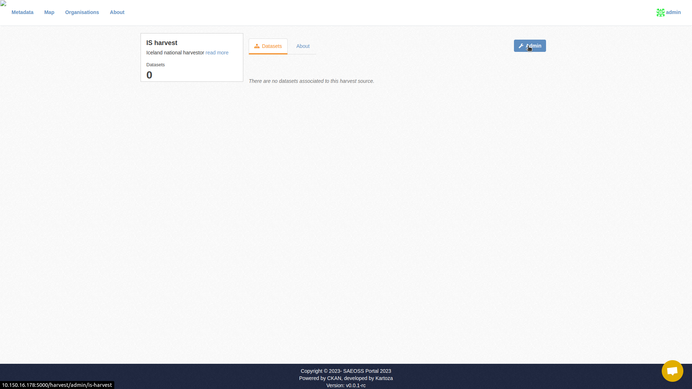

* On the harvest admin page press re-harvest and confirm, this will start the harvesting process
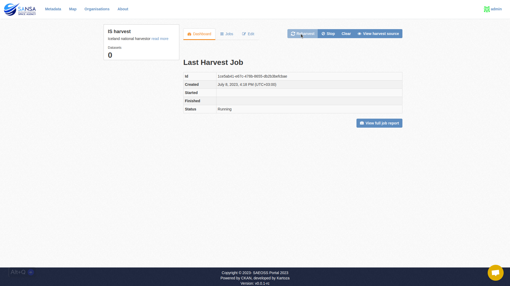

Harvesting can also be performed via cli commands, in order to complete a successful harvest there are 2 services that 
should be running in addition to ckan running service, these are saeoss-ckan-harvesting-gatherer-1 and saeoss-ckan-harvesting-fetcher-1, after adding a harvest source to the UI running and before running the harvest, run the following commands (docker commands, once the site is on other platform these should be treated as running services):

**This will run the harvester gatherer:**

```
docker exec -t saeoss-ckan-harvesting-gatherer-1 poetry run ckan harvester gather-consumer
```

**This will run the harvester fetcher:**
```
docker exec -t saeoss-ckan-harvesting-gatherer-1 poetry run ckan harvester fetch-consumer
```

**And to run the actual harvest process (this should be provided as a cron job):**
```
docker exec -t saeoss-ckan-harvesting-runner-1 poetry run ckan harvester run
```

For more info about how to add the source via cli and create jobs please navigate through [the docs here](https://github.com/ckan/ckanext-harvest)
### Stopping data harvest and view the harvest job state:

Stopping a harvest can simply be done by pressing stop while the harvest is running, after the harvesting is completed, 
the harvest page will show a summary about the datasets being added from the harvest source to the site, a full report 
can be viewed by pressing View full job report, the following image illustrates a report about a harvesting job:
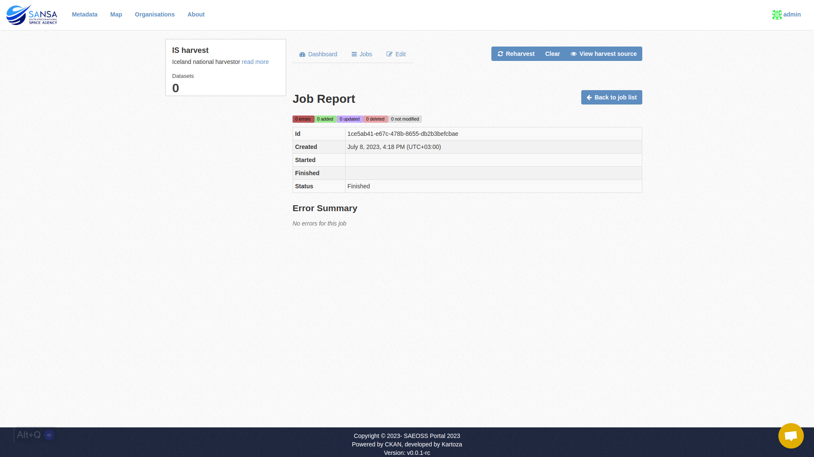

### View previous harvest jobs and jobs reports:

Jobs that was already initialised with a single harvest source are stored in the database and can be retrieved via the 
UI, with the harvest dashboard press jobs in order to see a list of the previous and current jobs related to one harvest source:
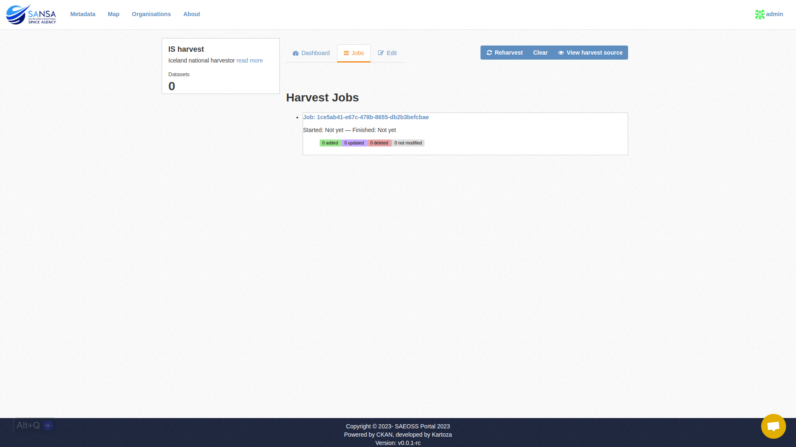

Pressing each single job link will view a report about that job.

### Clear harvest job reports:

Different job reports that belongs to one harvest source can be cleared along with the dataset created  without deleting 
the source itself, go to the harvest dashboard page, press clear and confirm
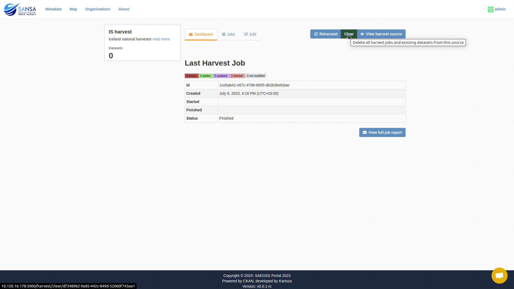

### Update harvest source:

Harvest source info (url, title, description ..etc.) can be updated by going to harvest source edit page where a form 
will be presented that holds the previous info, change the form then press save will update the harvest source info
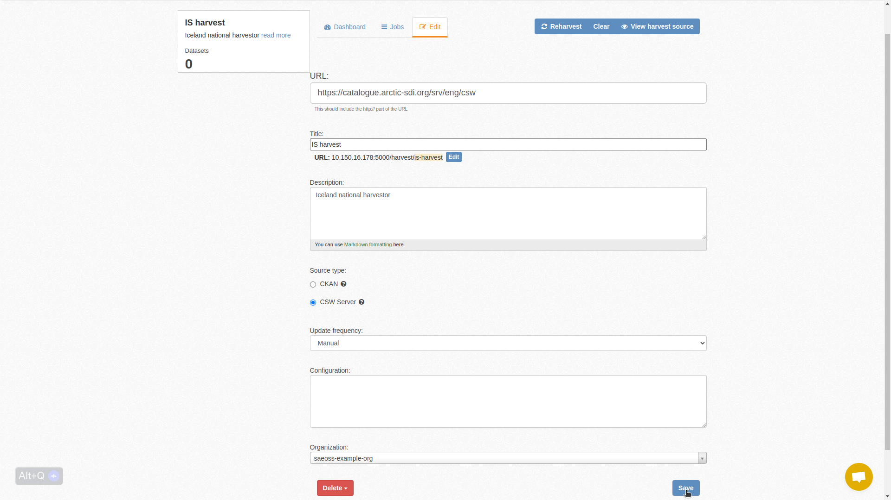

### Delete harvest source:

To delete a harvest source go to the same edit form as in update harvest source but press delete instead of save, the 
user will be presented with two options, either to delete the harvest source and clear the jobs and datasets, or only delete the source, the following illustrates these options
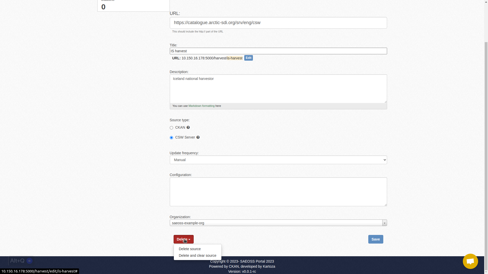

## Stac Harvesting
The idea of the stac harvester is to create datasets out of a stac catalogue, currently stac harvesting is provided as 
a cli tool, and there is only one command, further development would follow to provide more custom commands:
```
docker exec -ti saeoss-ckan-web-1 poetry run ckan saeoss stac create-stac-dataset --url <url> --user <username> --max <max_number_of_records>
```
