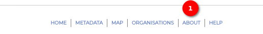
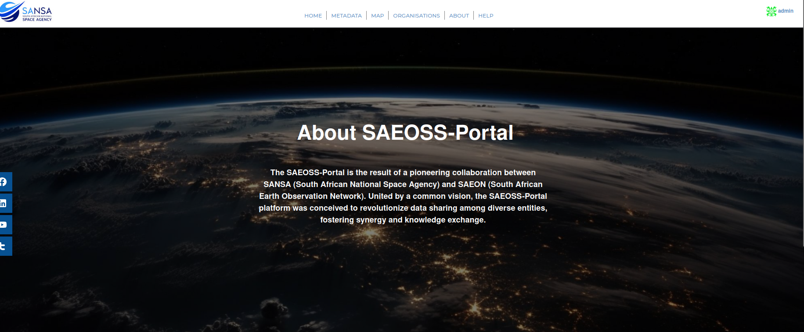

# About

The `About` page on the SAEOSS-Portal provides users with insightful information about the platform's vision and compelling reasons to contribute.

1. **About:** The users can navigate to the page by selecting `About` on the tab. Users will be able to read the vision of the portal and the reason to contribute.

## About SAEOSS-Portal

Welcome to the `SAEOSS-Portal`, a cutting-edge collaboration between SANSA (South African National Space Agency) and SAEON (South African Earth Observation Network). This platform is the result of a visionary partnership aimed at transforming the landscape of data sharing. The `SAEOSS-Portal` is dedicated to promoting synergy and knowledge exchange among diverse entities, contributing to a more interconnected world.

## Our Vision

At the `SAEOSS-Portal`, we envision a future where data knows no boundaries. Our vision is rooted in the belief that the true power of data lies not only in its creation but also in its responsible sharing and utilisation. This platform serves as a bridge, connecting organisations, governments, and individuals, propelling them toward data-driven excellence.

## Join the Data Revolution

1. **Inviting Participation:** We extend an invitation to organisations, institutions, and individuals to join the data revolution. Whether you represent a research institution, a government agency, or advocate for data-driven solutions, the SAEOSS-Portal offers a unique opportunity to contribute to a more interconnected and data-rich world.

2. **Create an Account:** To become a part of this transformative journey, create an account on the `SAEOSS-Portal`. By doing so, you not only become a catalyst for change in the data ecosystem but also gain access to a wealth of knowledge and insights.

3. **Benefits of Joining:**

    - **Access to Rich Data:** Explore and access a diverse range of data sets contributed by various entities.

    - **Collaboration Opportunities:** Connect with like-minded organisations and individuals for collaborative projects and initiatives.

    - **Data-Driven Excellence:** Harness the power of data to drive transformative decision-making across various sectors.

    - **Contribution to a Global Network:** Be a part of a community dedicated to responsible data sharing and utilisation.
