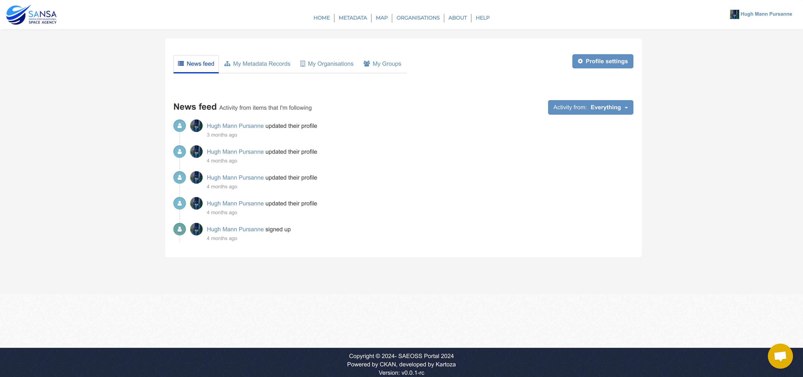
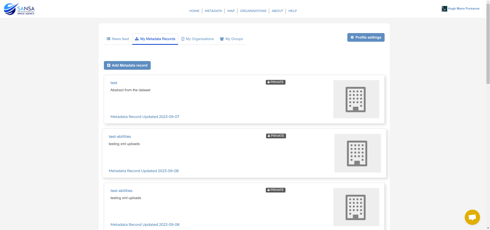
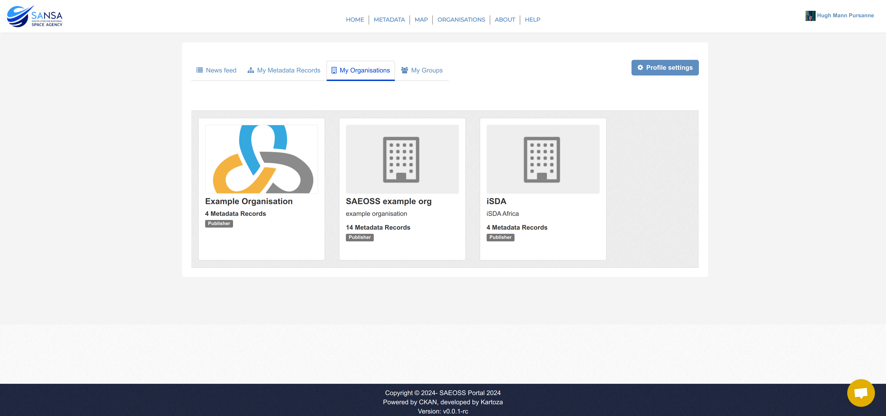
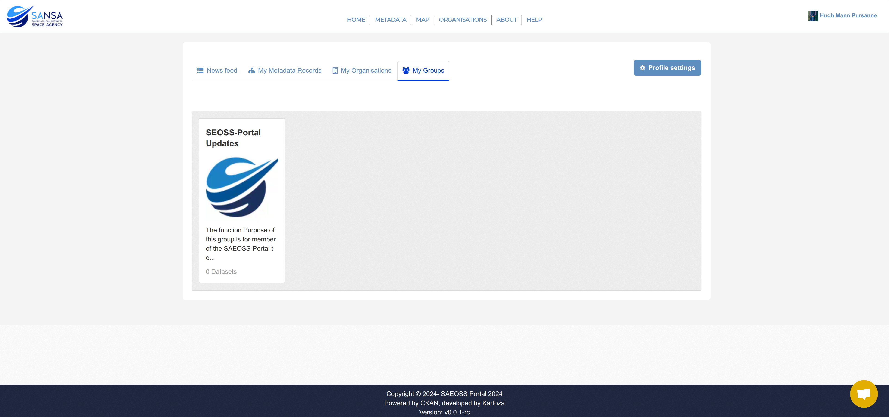

# Dashboard Page

Once a user has logged in, the dashboard page will be displayed. This is a central notification hub for communications from the SAEOSS-Portal platform.

The dashboard is broken into 4 main sections, namely:

   1. **[News Feed](#news-feed):** The news feed provides a user with all the recent activity of the groups and organisations they follow.
   2. **[My Metadata Records](#my-metadata-records):** Displays all the metadata uploaded by the user.
   3. **[My Organisations](#my-organisations):** Displays all metadata the user forms a part of.
   4. **[My Groups](#my-groups):** Displays all the groups the user forms a part of.

## Activity Button

The activity button allows you to filter the activity by organisation, group, or dataset. This allows you to see individual activity on specific topics of interest.

## News Feed

The news feed provides an overview of all recent activities of groups, organisations, or metadata you follow. This allows a user who is interested in a specific dataset/organisation/group to be up to date with any new changes or assets in the system. Users can follow a group/organisation/metadata dataset to receive these notifications. Learn more here: [Following datasets/groups/organisations](./metadata.md#following-datasets)

## My Metadata Records

This is a collection of all metadata records that you have created, published, or are working on (i.e. drafts).

## My Organisations

In this tab, you will find a list of all organisations you have been added to. Administrators can add you to an organisation, or you can be added to multiple organisations. This allows you to see any private metadata records for each individual organisation.

### What is an organisation?

CKAN Organisations are used to create, manage and publish collections of datasets. Users can have different roles within an Organisation, depending on their level of authorisation to create, edit and publish.

An organisation consists of users who are registered on the site and then in turn have permissions to view records that are not visible to other registered users (i.e. some records are only viewable by members of the organisation that owns the records). Within organisations there are 3 types of users:

1. **Publishers:** These are users who have the permissions to view, create, edit, and make public the metadata records belonging to the organisation.
2. **Editors:** These are users who have the permissions to view, create, and edit the metadata records belonging to the organisation but cannot make the records public.
3. **Members:** These are users who have permissions to view the metadata records belonging to the organisation.

## My Groups

This tab displays all the groups of which you are a part. You can be added to a single group or multiple groups.

### What is a group?

Groups are used to create and manage collections of datasets. This could be to catalogue datasets for a particular project or team, or on a particular theme, or as a very simple way to help people find and search user owned published datasets.

## Profile Settings

By selecting the `Profile Settings` button, you can adjust your profile settings like your username, bio, password, change profile picture, and generate API Keys. This page is explained in detail here: [Profile Settings](./profile-settings.md)

