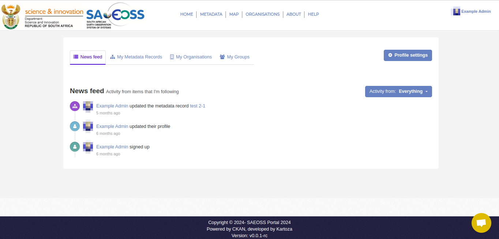
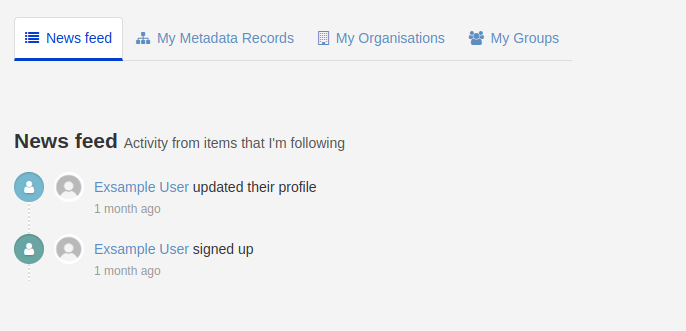
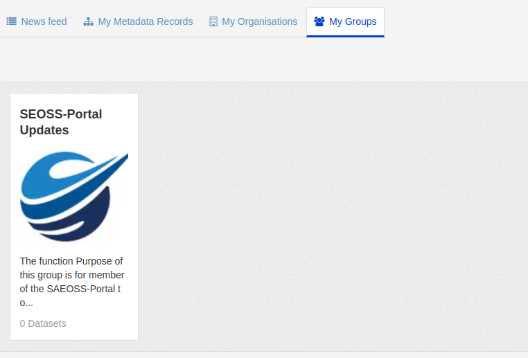

###### The previous chapter to this is the [Home Page](./home.md)

# Dashboard Page
Once a user has logged in, the dashboard page will be displayed. This is a central notification hub for communications from the SAEOSS-Portal platform.

The dashboard is broken into 4 main sections, namely:

   1. News Feed: The news feed provides a user with all the recent activity of the groups and organizations they follow.
   2. My Metadata Records: Displays all the metadata uploaded by the user.
   3. My Organization: Displays all metadata the user forms a part of.
   4. My Groups: Displays all the groups the user forms a part of.

#### Activity Button
The activity button allows you to filter the activity by organization, group, or dataset. This allows you to see individual activity on specific topics of interest.

### News Feed:
The news feed provides an overview of all recent activities of groups, organizations, or metadata you follow. This allows a user who is interested in a specific dataset/organization/group to be up to date with any new changes or assets in the system. Users can follow a group/organization/metadata dataset to receive these notifications. Learn more here: [Following datasets/groups/organizations](./metadata.md#following-datasets)

### My Metadata Records

This is a collection of all metadata records that you have published. Please confirm the validity of this.

### My Organizations

In this tab, you will find a list of all organizations you have been added to. Administrators can add you to an organization, or you can be added to multiple organizations. This allows you to see any private metadata records for each individual organization.
  

#### What is an organization?

### My Groups

This tab displays all the groups you are a part of. You can be added to a single group or multiple groups.

#### What is a group?

### Profile Settings
By selecting the `Profile Settings` button, you can adjust your profile settings like your username, bio, password, change profile picture, and generate API Keys. This page is explained in detail here: [Profile Settings](./profile_settings.md)

###### Next Chapter
In the next chapter, look at [Profile Settings](./profilesettings.md)
