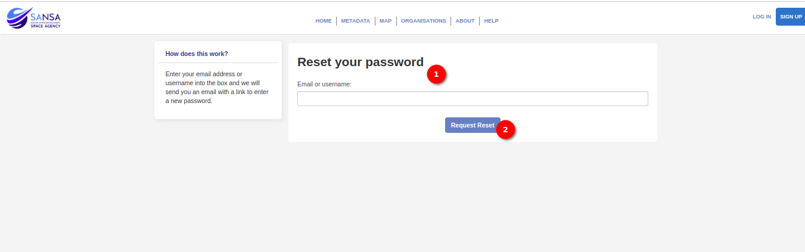

# Forgot Password User Manual

## Overview

The `Forgot Password` feature allows users to reset their password in case it is forgotten. This guide will walk the user through the steps to initiate the password reset process using the `Forgot your Password` button.

1. **Forgot Password Page:** Locate and click on the `Forgot your Password` button on the login page. When the user clicks on this button they will redirected to the `Reset Password` page.

## Reset Password Page

1. **Reset Password Form:** On the `Reset Password` page, the user will find a field to provide either their email or username. Choose either a registered email or username to proceed with the password reset.

2. **Request Reset Button:** After entering the email or username, click on the `Request Reset` button.
The system will initiate the password reset process and send instructions to the provided email address or associated account.

## Conclusion

Initiating a password reset is a straightforward process that ensures account security. Follow these steps to request a password reset, and the user will receive instructions on how to set a new password. If you encounter any difficulties or have questions, don't hesitate to reach out to the support team for assistance.
