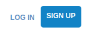
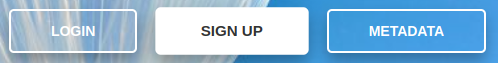
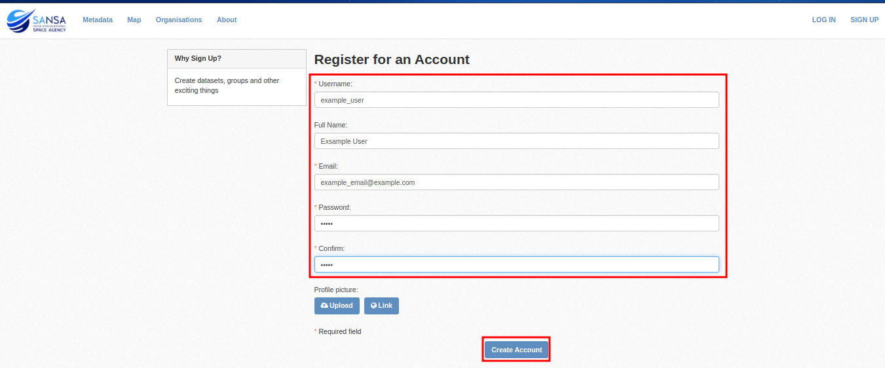
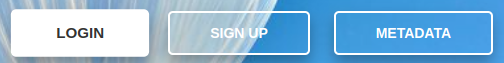
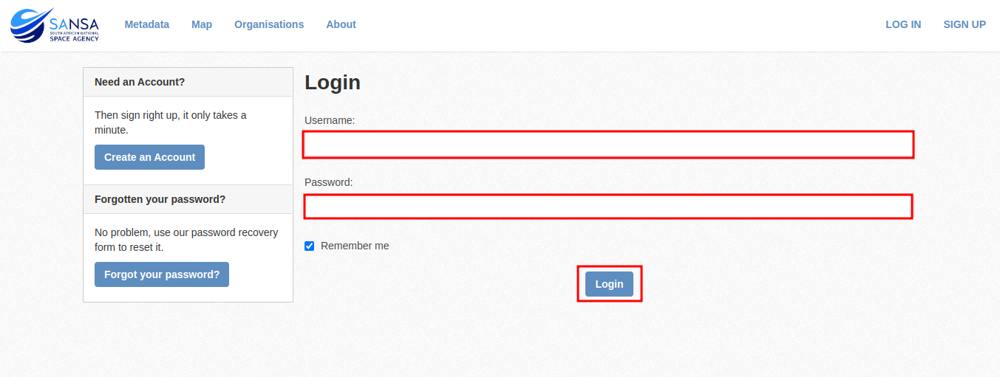

###### Previous: [Introduction](./index.md)

# Home Page
When first accessing the SAEOSS-Portal, the home page is displayed. From the home page, users are able to [create an account](), [login](), or view metadata.

Users are able to view any public metadata on the platform without the need to log in. Without an account, users are not able to be affiliated with any organization or group and will not be able to see any private data of that group or receive any notifications from the platform. 

### Navigation
From the home page, there are many ways to navigate to various pages on the platform. These navigational links can be summarized into the following: 

| Link              | Image                               | Explanation                                                                                          |
| ----------------- | --------------------------------    | ---------------------------------------------------------------------------------------------------- |
| Home Page         |    | By clicking on the SANSA logo from anywhere on the platform, the home page will be displayed.          |
| Login / Sign-Up    | | By selecting the login / sign-up button in the top right corner, users can log in or create an account.  |
| Social Media Links|      | Various social media pages for SANSA can be accessed through the social media links on the left. |
| Navbar / Navlinks / Navcards | | The navpane allows for easy access to all main pages of the platform.                                |

### Crisp Interface
> **Note:** *This interface sends emails to the administrator and might yield a long turnaround time.*

The crisp chat interface allows you to directly contact administrators of the platform should you need assistance with a problem not listed in the documentation.

|   |   |
 --- | --- |
|  |  |

## Workflows
### Signup
Users who wish to create a user account can do so by following these steps:

1. From the home screen, select one of the signup buttons:
   
   
   
   or

   

2. Complete the signup form with all the relevant details. 
   > **NOTE:** *Fields marked with an `*` are mandatory fields and cannot be left blank.*
   
   

   > **NOTE:** *Your password should contain at least `8` characters.*

### Login
Once a user account has been created, users can log in to the platform by following these steps:

1. From the home screen, select one of the following login buttons:

    
    
    or
    
    

2. Complete the login form and click on login.
   
   

3. When the dashboard is displayed, you have successfully logged in. 
   
   

###### Next: [Dashboard](./dashboard.md)
