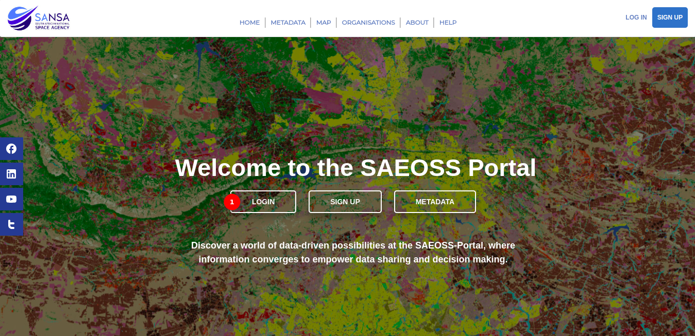

# Login Page User Manual

## Overview

The Login page is the gateway to accessing the features and content on the platform. This guide will walk the users through the steps to log in, create an account, and recover your password.

### Login Buttons

Users can access the login functionality from two locations on the home page.

1. **Login Button:** Click on the login button available in the middle of the home page.
2. **Other Login Button:** Alternatively, locate and click on the login button in the top right corner of the page.

    - Upon clicking the login button, the user will be directed to the `Login Page`.

## Login Page

1. **Login Form:** Provide the username and password in the designated fields. Optionally, use the `Remember Me` button to stay logged in on future visits. Click the `Login` button to complete the login process.

2. **Create an Account:** If the user does not have an account, click on the `Create an Account` link to navigate to the account creation page. Follow the instructions to set up the user's account by providing the necessary information.

3. **Forgot Your Password:** In case the user forgets their password, click on the `Forgot Your Password` link.
Follow the password recovery process to reset the password and regain access to the account.

## Conclusion

Logging in is a straightforward process, and the Login Page provides convenient options for account creation and password recovery. Whether the user is a returning user or a new member, these steps will guide the user through a seamless login experience. If you encounter any issues or have questions, feel free to contact the support team for assistance.
