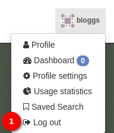
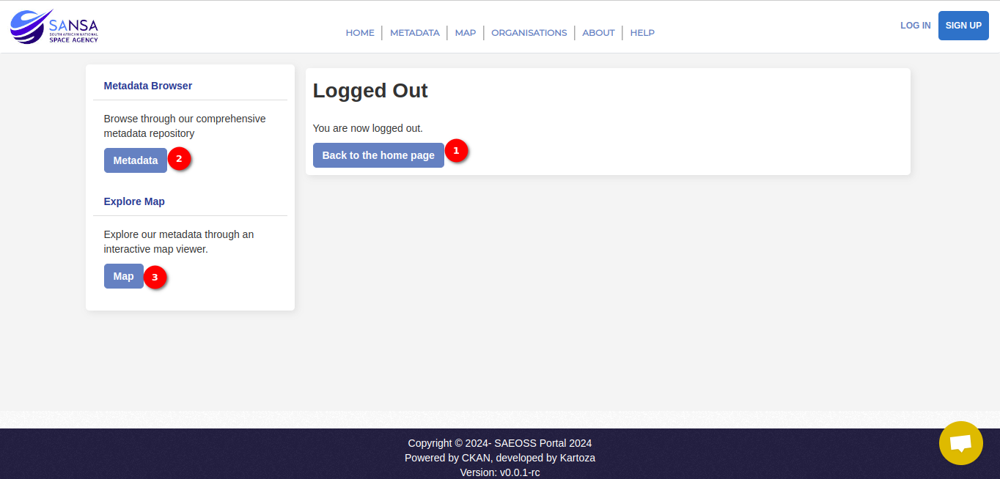

# Logout User Manual

## Overview

The `Logout` option provides users with a seamless way to log out of the system, ensuring a secure and controlled user experience. This guide will walk you through the process of accessing and utilising the `Logout` option.

- Click on the user profile to access the user-related options.

1. **Logout** Click on the `Logout` option. After clicking on the `Logout` option, the system will initiate the logout process. Upon successful logout, the user will be redirected to the logout page.

On the logout page, the user will find several buttons to navigate to different sections.

1. **Back to Home Page Button:** Click on this button to return to the home page, providing a quick way to access essential information and features.

2. **Metadata:** Navigate to the `Metadata` section by clicking on this button. Explore and discover valuable metadata records.

3. **Map:** Access the `Map` section by clicking on this button. Visualise spatial Earth Observation datasets and interact with the map interface.

## Conclusion

The Logout option ensures a secure end to the user's session, redirecting the user to a dedicated logout page. From there, the user can conveniently navigate to different sections, including the home page, login page, and signup page, using the provided buttons. Feel free to explore the various features available after logging out and return to the system at your convenience. If you have any further questions or need assistance, please reach out to our support team.
