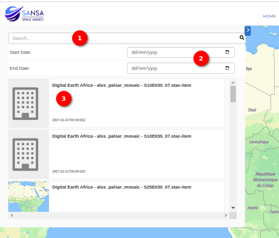

### Map
This interface displays footprints of datasets in polygon format by displaying the boundary that is covered by the respective metadata record.
The user is provided with a visual map to interact with to understand the extent, location and number of spatial Earth Observation datasets available.

These are some of the components found on the map tab:
1. Search filters: This provides a casual graphical interface to explore individual metadata records to discover items of interest in terms of content, time and location.This is where users can search for metadata by keywords and date.
2. Layer: This is the individual records that have been made public. Users can select a layer to see the thumnail of the metadata record.
3. Zoom functionality: This allows users to zoom in and out on the map.
4. Basemap options: This allows users to choose a specific basemap. 
