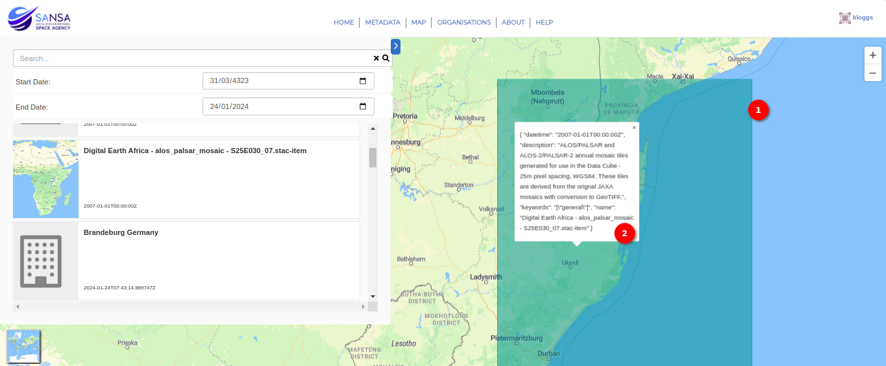

# Map User Manual

This interface displays footprints of datasets in polygon format by displaying the boundary that is covered by the respective metadata record.
The user is provided with a visual map to interact with to understand the extent, location and number of spatial Earth Observation datasets available.

These are some of the components found on the map tab:

1. **Right Arrow:** Users can view available metadata records by clicking on the `Right Arrow`. When the user clicks on this arrow, a side panel opens with the metadata record list and the search filter.

    

    1. **Search filters:** This provides a casual graphical interface to explore individual metadata records to discover items of interest in terms of content, time and location. This is where users can search for metadata by keywords and date.

        

    2. **Date:** Users can search for metadata records by specifying the start and end dates. Users can enter the dates directly into the fields or use the calendar icon to select the start and end dates.

        

    3. **Metadata Record:** To visualise the geographical area associated with the `Metadata Record`, users can click on the metadata, triggering its display on the map.

        

        1. **Highlighted Area:** The geographic area corresponding to the metadata is highlighted on the map, providing a visual reference for the user.

        2. **Data:** Users can obtain detailed information by clicking anywhere within the highlighted area. This action reveals specific data associated with the metadata, including:

            - DateTime
            - Description
            - Keyword
            - Name
        
        This detailed information provides insights into the metadata record, aiding users in understanding its specific attributes and content.

2. **Zoom functionality:** This allows users to zoom in and out on the map.
 
3. **Base map options:** This allows users to choose a specific base map.

{: style="height:200px"}

1. **OpenStreetMap Street View:**

    

    - Provides a traditional street map view.
    - Displays road networks, landmarks, and geographical features commonly found in urban and suburban areas.

2. **OpenStreetMap Hybrid View:**

    

    - Combines satellite imagery with street map information.
    - Offers a hybrid perspective, allowing users to see both the physical landscape and mapped infrastructure.

3. **OpenStreetMap Pioneer View:**

    
    
    - Designed for exploration and outdoor activities.
    - Highlights topographic details, terrain, and natural features, making it suitable for adventurous and nature-related mapping.

4. **OpenStreetMap Neighbourhood View:**

    

    - Emphasises localised mapping for neighbourhood-level details.
    - Useful for focusing on smaller-scale features, such as streets, parks, and amenities within specific neighbourhoods or community areas.
