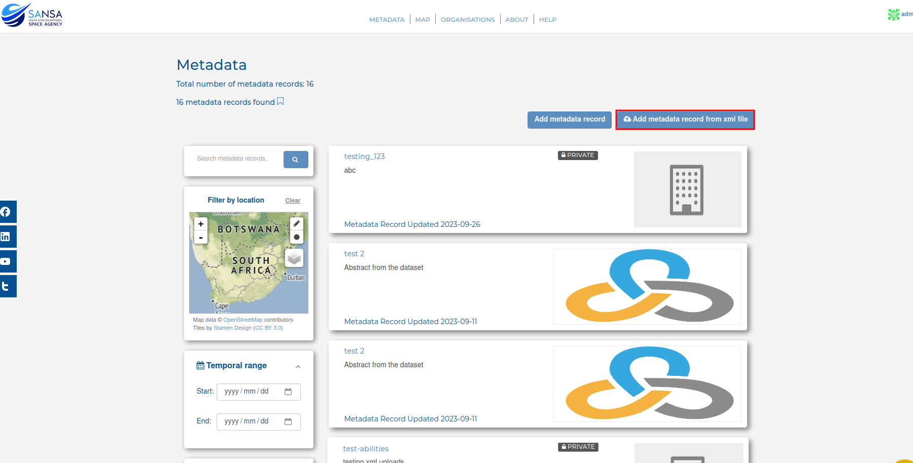

### Metadata capturing and publishing

#### Create metadata record in owned organisation using System UI

<b> Applicable roles</b>: Metadata editor, matadata publisher and system adminstrator

Method 1:

Navigate to 'Metadata' and select 'Add metadata record'.

This will take you to the form that needs to be completed in order to create metadata record.Fill in all the necessary information about the record. All fields marked with an asterisk (*) are mandatory. The information you add will become the information that is available on the site about the record you are adding.  When adding the metadata record thumbnail, make sure the image URL is a public image link and not a private one. Remember to also make sure that the image ratio is 1:1 for the best results.

 

Method 2:
Navigate to the organisation you belong to. You can do this by going to your profile and select 'Add metadata record' then fill out the form.

 

#### Create metadata record in owned organisation using XML upload

On the metadata page, select 'Add metadata record from xml file'.

Then select the XML file on your local machine.

The xml file should look something like this:

#### Edit metadata record using system UI
Navigate to the record you want to edit and select 'manage' and make the changes as required then click on 'Update' at the bottom of the page.
        