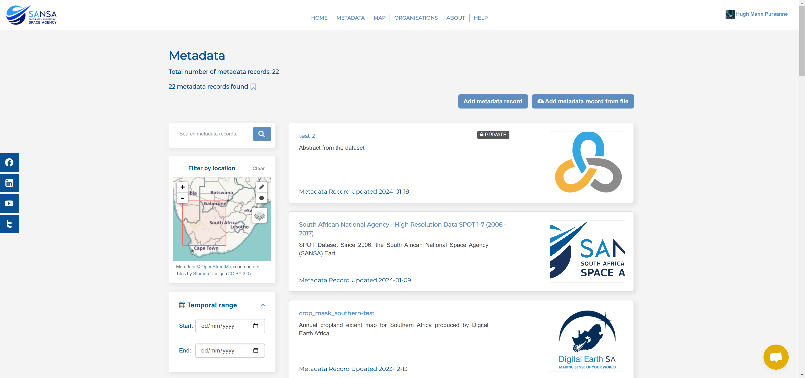

# Metadata

On this page, users can view all public metadata records on the platform and users who are part of organisations can view the organisation's private records.


## Overview

This section gives an overview of the number of records on the platform, records returned with the search and indicates if the user is utilising a [Saved Search](./saved-search.md)

{: style="height:200px"}

1. **Total number of metadata records:** This is the count of all of the metadata records on the platform.
2. **Records Returned:** This displays how many records are returned following the user's search criteria.
3. **Saved Search:** The flag indicates if a saved search is being utilised. If the flag is hollow ({: style="height:15px"}) the search has not been saved and if the flag is filled ({: style="height:15px"}) then a saved search is being utilised.

## Filters

The filters allow users to refine the list of records that they can see to meet their criteria.


1. **Search bar and `Search` button:** This allows users to filter records using words/terms related to desired records.
2. **Filter by location:** This allows users to utilise spatial filters to refine the list of records by location.
3. **Temporal range:** This allows users to refine the list of records between a date range.
4. **Organisations:** This allows users to refine the list records by the organisations that own them.
5. **Harvest source:** This allows users to refine the list records by the harvest sources.
6. **Featured Metadata records:** This allows users to refine the list records by whether or not the featured flag was used in the record's creation.
7. **Tags:** This allows users to refine the list records by keywords.

### Filter by location

The Filter by location section consists of:


1. **`Clear` button:** This clears all location filters currently applied.
2. **`Zoom In` and `Zoom Out` buttons:** These buttons allow users to change their zoom levels on the map.
3. **`Search with rectangle bounds` button:** This button expands the map to allow users to draw their preferred rectangular search area. Once the area is defined they can click on `Apply`.`
    
4. **`Search with circular` button:** This button expands the map to allow users to draw their preferred circular search area. Once the area is defined they can click on `Apply`.
    
5. **Spatial Layer search:** Hovering over this patch opens a menu of predefined spatial layers that users can apply and then click to define a search area.
    

    A user selects one of the four options (e.g. `Provinces`).
    

    Then clicks on one of the polygons to define a search area.
    

### Temporal range

The Temporal range section consists of:


1. **Start date:** This is the earliest date from which a user wants to search.
2. **End date:** This is the latest date until which a user wants to search.
3. **`Calendar` buttons:** These buttons allow users to set the start and end dates. They just need to click on a desired date.
    

### Other Filters

The Organisations section consists of:


1. **List of organisations:** This is a list of all the organisations on the platform.
2. **`x` button:** This allows users to remove the currently selected organisation(s) as a filter. It only becomes available once a user has selected an organisation.

The `Harvest source`, `Featured Metadata records`, and `Tags` sections function in the same manner as the `Organisations` section, whereby a user can select an applicable filter by clicking on it or remove the filter by clicking on the `x` button that appears.

## List of Metadata Records

This section of the page displays all public metadata records on the platform to all users and users with additional permissions (i.e. organisation members, or the system administrator) can view `private` metadata records within organisations.


1. **List of Records:** Users can click on a record to view details about it.
    

## Add Metadata Record

The `Add metadata record` button is only available to Organisation Editors, Organisation Publishers, and System Administrators.


1. **`Add metadata record` button:** This redirects users to the `Create metadata record` form.

### Create Metadata Record

This form allows users to specify details relating to the metadata record that they are creating. It is only available to Organisation Editors, Organisation Publishers, and System Administrators.


1. **Record Information:** These fields are based off of the SANS 1878 metadata standard and any field marked with an asterisk (`*`) is required to be populated with information. Underneath the fields is an informative description about what information is required, denoted by {: style="height:15px"}.

At the bottom of the form, users will be required to click on the `Next: Add Links` button.


Users are redirected to the `Metadata record details` form.


1. **Details fields:** These fields relate to the associated data source of the metadata record and users will be required to fill out the fields.
2. **`Upload` and `Link` buttons:** These buttons allow a user to choose how they would like to associate a data source with the metadata record.
3. **`Previous` Button:** This button allows a user to go back to edit the record's information.
4. **`Save & add another` button:** This button allows a user to save the current data source's information and add another associated data source.
5. **`Finish` button:** This button allows a user to finish adding data sources and save the metadata record as an unpublished record.

## Add Metadata Record From File

The `Add metadata record from file` button is only available to Organisation Editors, Organisation Publishers, and System Administrators.


1. **`Add metadata record from file`:** This button opens a file explorer on the user's machine for them to then explore and upload an `xml` file.

An example `xml` file would be:

```xml
<?xml version="1.0" encoding="UTF-8" ?>
<dataset>
        <title>Example Title</title>
        <MetadataStandardName>SANS1878</MetadataStandardName>
        <MetadataStandardVersion>1</MetadataStandardVersion>
        <notes>Abstract of Metadata Record</notes>
        <ResponsiblePartyIndividualName>Hugh Mann</ResponsiblePartyIndividualName>
        <ResponsiblePartyPositionName>Person</ResponsiblePartyPositionName>
        <ResponsiblePartyRole>publisher</ResponsiblePartyRole>
        <ResponsiblePartyElectronicMailAddress>example@example.com</ResponsiblePartyElectronicMailAddress>
        <IsoTopicCategory>society</IsoTopicCategory>
        <OwnerOrg>organisation</OwnerOrg>
        <private>True</private>
        <LineageStatement>Statement of lineage</LineageStatement>
        <spatial>-22.1265,16.4699,-34.8212,32.8931</spatial>
        <EquivalentScale>0</EquivalentScale>
        <SpatialRepresentationType>001</SpatialRepresentationType>
        <SpatialReferenceSystem>EPSG:4326</SpatialReferenceSystem>
        <ReferenceDate>2004-11-03T01:00:00</ReferenceDate>
        <ReferenceDateType>Publication</ReferenceDateType>
        <StampDate>2003-09-11T10:30:15</StampDate>
        <StampDateType>Creation</StampDateType>
        <DistributionFormatName>format name</DistributionFormatName>
        <DistributionFormatVersion>1.0</DistributionFormatVersion>
        <DatasetLanguage>english</DatasetLanguage>
        <MetadataLanguage>English</MetadataLanguage>
        <DatasetCharacterset>UCS-2</DatasetCharacterset>
        <MetadataCharacterset>UCS-2</MetadataCharacterset>
</dataset>
```
