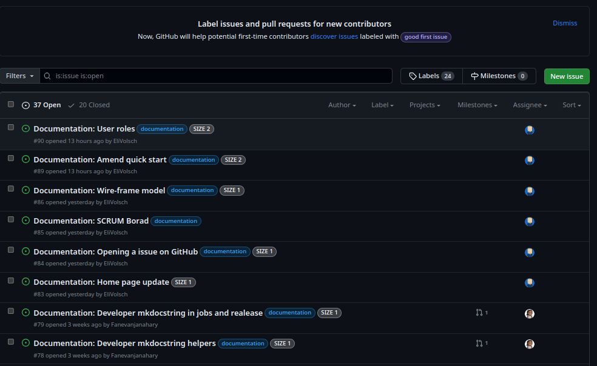
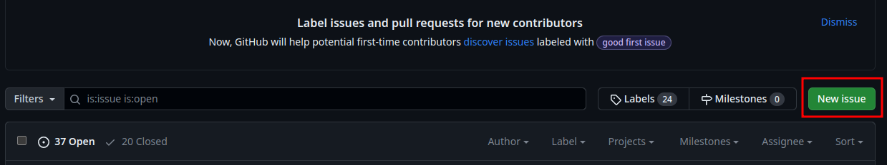

## How to open issues on GitHub:

This GitHub project repository serves as a project planning and progress tracking platform for the development teams and clients. This repository is public and for anyone to view. The repository can be accessed [here](https://github.com/kartoza/SAEOSS-Portal).

### Tickets: 
Tickets on the [SAEOSS-Portal GitHub Project Board](https://github.com/kartoza/SAEOSS-Portal/issues) are created first as issues and converted into tickets to work on during the sprint at the SAEOSS-Portal catchup meeting. This workflow ensures work required by the client gets done as well as allows the opportunity to clear up any doubts as to work that needs to be done. When issues are created a clear description of what needs to happen is required as well as any accompanying screenshots or videos. If a developer has any doubt, he can simply comment on the ticket and the creator of the ticket as well as any assigned developers will be notified via email. 

### Creating new Github issues/tickets:
When encountering a new issue with the platform is is best practice to create an issue or ticket on the [SAEOSS-Portal GitHub Issues Page](https://github.com/kartoza/SAEOSS-Portal/issues). This ensures developers are made aware of the issue at hand and can work to get the problem fixed as soon as possible. 

### Templates:

A standard workflow for creating tickets is advised to make sure enough information about the problem is related, cutting down on time developers would spend trying to understand the issue at hand. 

To ensure this a general approach has been created to make sure users are able to create a GitHub ticket with as much detail as possible. The following [template](../../developer/guide/templates/bug-report-message-template.md) can be copied and used to create a new ticket.

> **NOTE:** *Github supports various forms of media including: Markdown syntax, images and video. All of these can be used to better and more accurately describe your issue. [Read more](https://docs.github.com/en/get-started/writing-on-github/getting-started-with-writing-and-formatting-on-github/basic-writing-and-formatting-syntax)*

### Workflow for creating GitHub issues

To report an issue, users should first access the SAEOSS-Portal [Project Page](https://github.com/kartoza/SAEOSS-Portal). Ensure you are logged in as users who do not have a GitHub account will not be able to create new issues. If you do not have an GitHub account you can create a [free account](https://github.com/signup?ref_cta=Sign+up&ref_loc=header+logged+out&ref_page=%2F&source=header-home)

1. From the navigation pane select Issues to display all the current GitHub issue tickets. Make sure to study the issues page to determine if the issue has been reported by another user before creating a new issue.
    
    

2. If the issue has not been reported, select the create new button.
    

3. Copy template and complete the template whilst taking care to provide as much detail as possible. Remember to add a descriptive title and screenshots.
    

4. Preview the ticket by selecting the preview tab. This will generate the ticket from markdown syntax (if used) and will also display images, giving you a view of what the completed ticket will look like. 
    

5. When satisfied, select submit from the green button at the bottom. Your issue has now been created an will appear at the top of the issues with a "#" number assigned to it. 

<!-- move below to developer or somewhere else --------------------------- -->

<!-- 
#### Labels

Tickets have accompanying labels which will be assigned by the development team once reviewing the ticket. These labels aim to give a better description of the type of issue as well as keeping development on track with coordinated effort. During the development of the product some team members can be assigned to deal with only certain types of tickets. The team lead or technical lead on the project will upon reviewing the ticket assign the ticket to the correct team member and also add necessary labels. 

Creators of the ticket will be informed of any activity with the ticket via email notification. This includes when tickets have been resolved or being assigned to development team members. Once the ticket has been resolved and closed a final notification will be sent via email stating that the ticket has been resolved/closed. 

#### Ticket Sizing:  

Each issue is sized according to its expected time to accomplish. Labels are rated by size with the following labels: 

 

- size [N/A] - Applied to issues where size is not applicable. 
- Size [1] - It's quick I will have this done in about 1 hour. 
- Size [2] - Give me 2 hours and I will have it for you. 
- Size [5] - It will take between half a day and a full day. 
- Size [8] - This is a full-day job. 
- Size [13] - I'm going to need about a day and a half to two days. 
- Size [20] - It will take at least two to three days. 
- Size [40] - This will take a full week. 

Tickets larger than SIZE 8 are usually broken down into smaller tickets/tasks to better display development progress. SIZE N/A labels are reserved for tasks which are difficult to estimate, like debugging and complex issues. 

 -->
