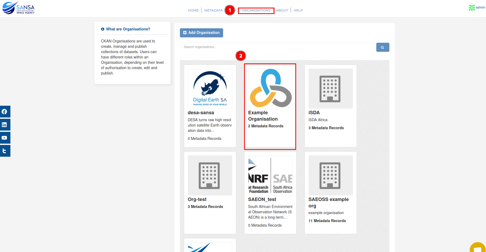
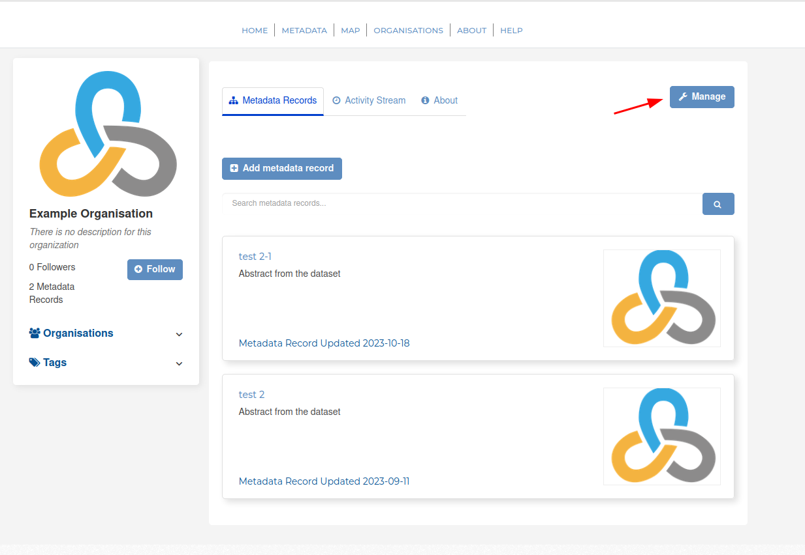
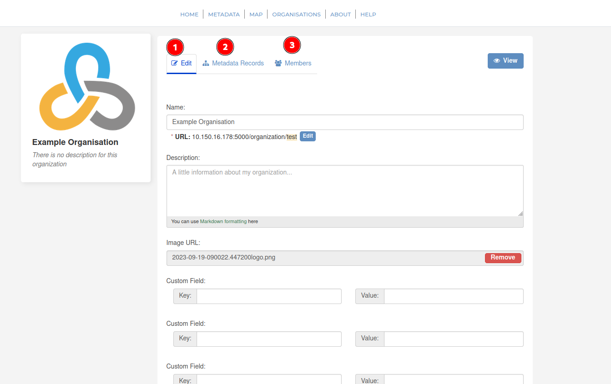
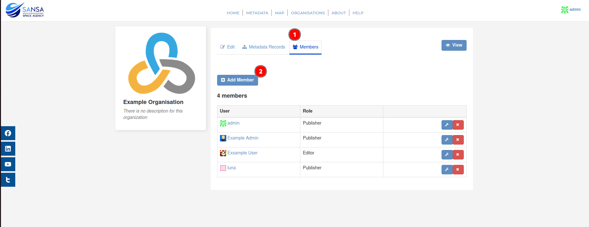
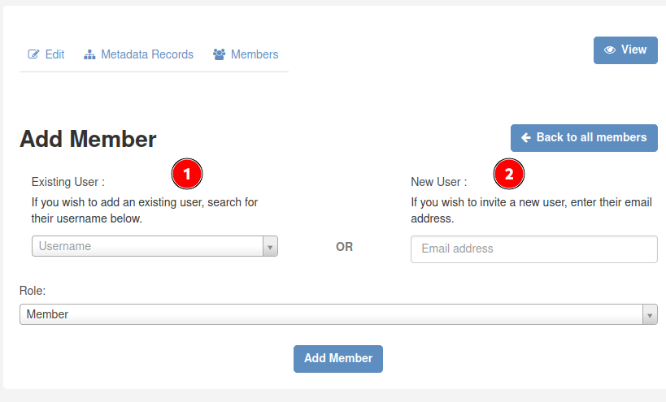
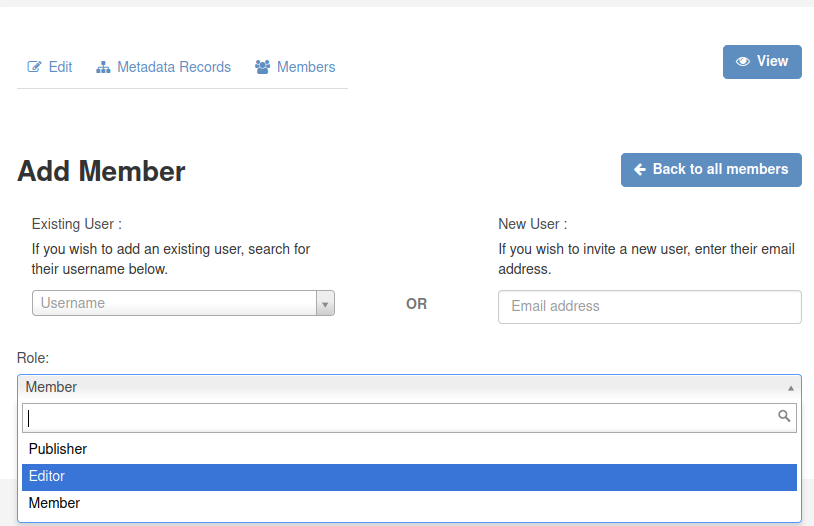
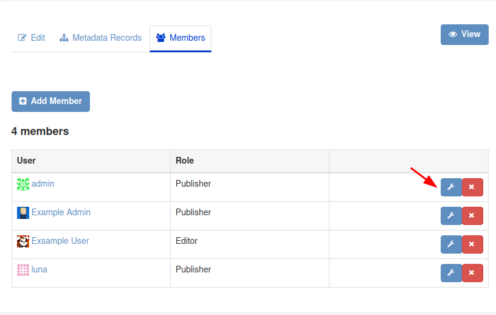
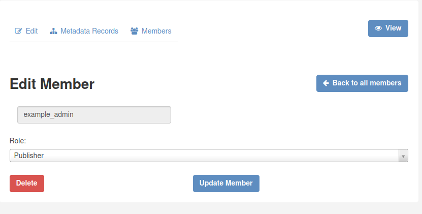
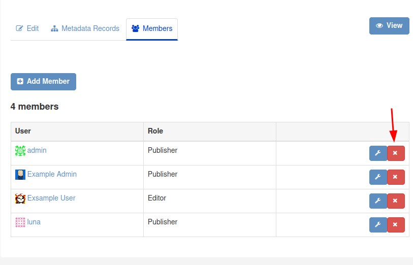

# Organisation

Users can view all the organisations on this tab. If you have administrative rights for certain organisations, you are able to manage your organisation from here. Additionally, if you have administrative rights on the site, this is where you can add an organisations.

## Managing the organisation

Click on 'Organisation' to navigate to this tab and select the organisation you have administrative rights over:

Select `Manage`.

You are able to:

1. Edit information about the organisation.
2. View/edit metadata records belonging to the organisation.
3. Edit/add organisation members.

### Adding members to the organisation

To add a member:

1. Select `Members`
2. Select `Add Member`

This will take you to the page below, where you are required to either add member by username (if they are already registered on the site) or to add user by email.

Then you are required to define the user role of the user. More information regarding the different user roles can be found [here](user-roles.md)

Finally, click on `Add member`.

### Editing organisational member user roles

If the member's user role needs to be updated, user can click on the icon shown below next to the member that requires editing.

You can then change the member's user role. Please note that you cannot change your own user role.

### Removing members from the organisation

You can remove members from your organisation by clicking on the icon shown below next to the member's name:

