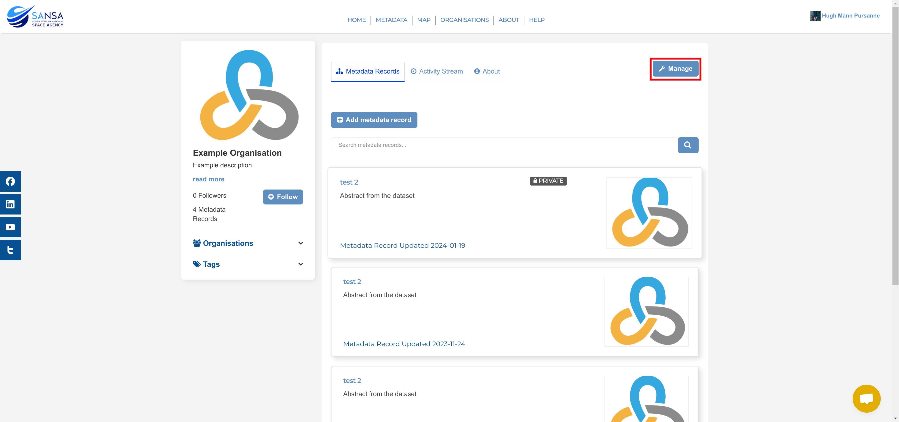
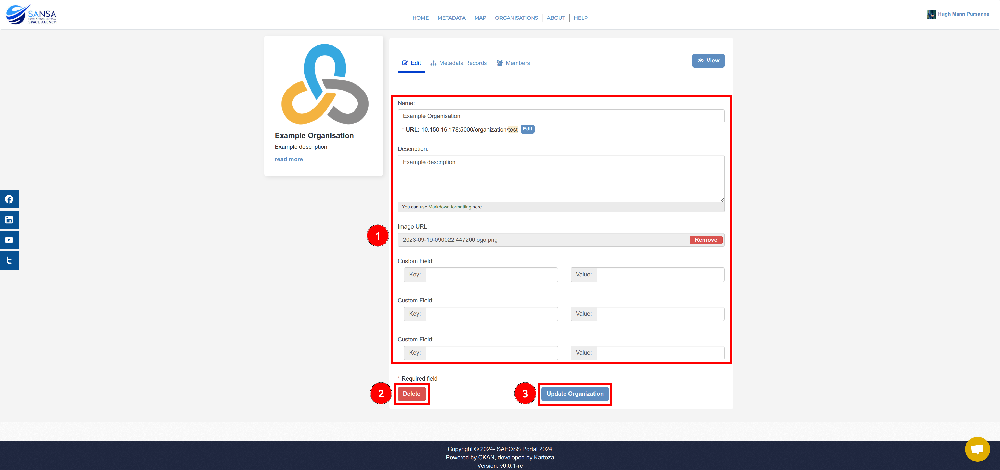
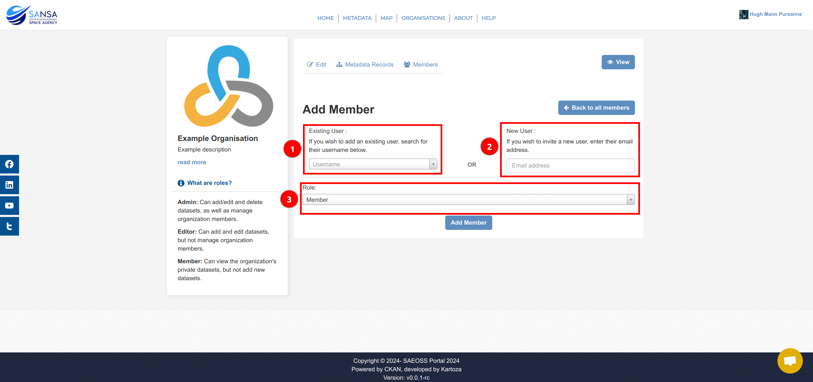

# Organisations

Users can view all the organisations on the platform on this page. Users with administrative rights for certain organisations are able to manage the organisation from this page. Additionally, if system administrators can add an organisations on this page.

## Organisation Home Page

Users can view an organisation's home page by clicking on an organisation on the `Organisations` page.

They will then be redirected to the organisation's home page. There are four main elements on an organisation's home page that all users can see:

1. **[The Overview](#overview)**
2. **[Metadata Records](#metadata-records)**
3. **[Activity Stream](#activity-stream)**
4. **[About](#about)**

Only the System Administrator and the Organisation's Publishers can see:

5. **[Manage Button](#manage-button)**

### Overview

The overview contains information regarding the organisation. This includes the organisation's profile picture, the organisation's name, a description of the organisation, the number of followers, the number of records, and the `Follow` button. The `Organisations` and `Tags` subsections, can be populated with reference links to keywords and organisations to filter the organisation's metadata records.

1. **Profile Picture:** This is an image (usually a logo) that is visually associated with the organisation.
2. **Organisation Name:** This is the name of the organisation.
3. **Description:** This is a short descriptor regarding the organisation (if provided).
4. **Number of Followers:** This is the number of users who follow the organisation.
5. **Number of Records:** This is the number of public records the organisation owns.
6. **`Follow` button:** This button allows users to follow the organisation and in turn receive notifications on their respective dashboards when there is activity from the organisation.

### Metadata Records

The `Metadata Records` section of an organisation's home page displays all of the organisation's public metadata records to all users.

If a user is a member, editor, or publisher (or system administrator) of the organisation then they will see all of the organisation's metadata records, including `Private` records.

1. **`Add metadata record` button:** Publishers and Editors within the organisation can see this button which allows them to add records to the organisation.
2. **Search bar and `Search` button:** All users can search for public records using the search functionality while organisation members, editors, and publishers can search for all the metadata records within the organisation.
3. **Metadata records:** These are the records that a user can see, either only the public, or all of the organisation's, records.

### Activity Stream

The `Activity Stream` section of an organisation's home page displays all of the activity related to the organisation, including members creating records, updates to the organisation, and more.

### About

The `About` section of an organisation's home page displays the full description about the organisation (if added) as some organisations may have longer descriptions that will not fully display in the overview panel.

### Manage Button

If organisation users with the necessary permissions (publishers and the system administrator), click on the `Manage` button.

This will redirect you to the management page of the organisation.

#### Edit Details

The `Edit` tab allows users with the necessary permissions to change multiple details relating to the organisation. There is also the choice to update the organisation's details or to delete the organisation, utilising the relevant buttons at the bottom of the form.

1. **Details:** These are fields that can be populated to change the organisation's displayed information in the [Overview](#overview) and [About](#about) sections.
2. **`Update Organisation` button:** This button stores changes made to the organisation's details.
3. **`Delete` button:** This button will delete organisation.

#### Manage Metadata Records

The `Metadata Records` tab allows users with the necessary permissions to add/delete, publish/unpublish, or search for the organisation's metadata records.

1. **`Add metadata record` button:** This will redirect users to the [Add metadata](./metadata.md#add-metadata-record) form.
2. **Search bar and `Search` button:** Users can search for specific records with which they would like to interact.
3. **`Make public` button:** This button will "publish" a metadata record so that all users can see it.
4. **`Make private` button:** This button will "unpublish" a metadata record so that only the organisation's users can see it.
5. **`Delete` button:** This button will delete the metadata record from the organisation and the entirety of the platform.
6. **Checkboxes:** These allow users to select one, or many, metadata record(s) to perform an action on. The topmost checkbox will select all of the records.

#### Manage Members

The `Members` tab allows users with the necessary permissions to change other members' relative permissions within the organisation and to add new members to the organisation.

1. **`Add Member` button:** This button redirects users to the [Add Member](#add-member) page.
2. **Number of members:** This displays the total number of members within the organisation.
3. **Table of users:** This table displays the organisation members and their respective roles.
4. **`Edit Member` button:** This button redirects users to the [Edit Member](#edit-member) page.
5. **`Delete Member` button:** This button causes the [Delete Member](#delete-member) popup to appear.

##### Add Member

The `Add Member` page allows users with the necessary permissions to add a current user on the platform to the organisation or to invite a new user to the platform and in turn the organisation. There is a description of the various user role permissions in the overview on the left.

1. **Existing User:** This dropdown is where a current user's username should be entered.
    
2. **New User:** This field is where a new user's email address should be entered.
    
3. **Role:** The user's role (member, editor, or publisher) should be selected from this dropdown.
    

##### Edit Member

The `Edit Member` page allows users with the necessary permissions to change a user's role within the organisation. There is a description of the various user role permissions in the overview on the left.

1. **Role:** The user's role (member, editor, or publisher) should be selected from this dropdown.
    
2. **`Update Member` button:** This button will commit the changes made to the member's role.
3. **`Delete` button:** This button will cause the [Delete Member](#delete-member) popup to appear.

##### Delete Member

The `Delete Member` popup prompts the user to confirm their action.

1. **`Confirm` button:** This confirms the removal of the user from the organisation.
2. **`Cancel` button:** This cancels the action and closes the popup.

#### `View` Button

This button will redirect users back to the organisation's landing page.

