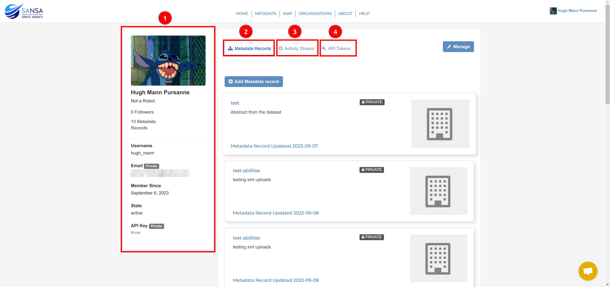
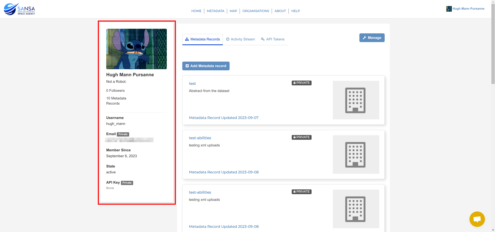
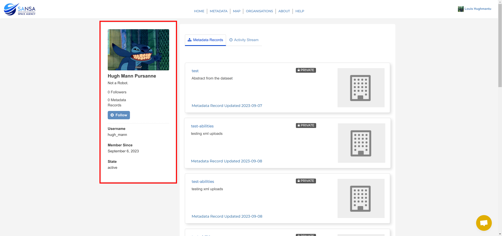
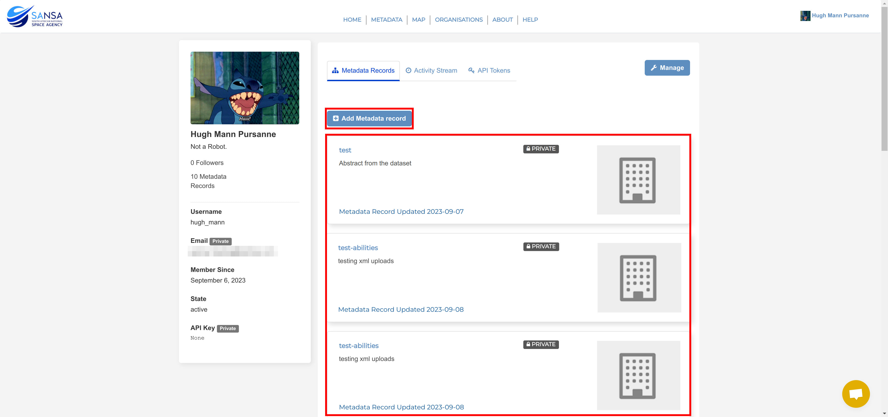
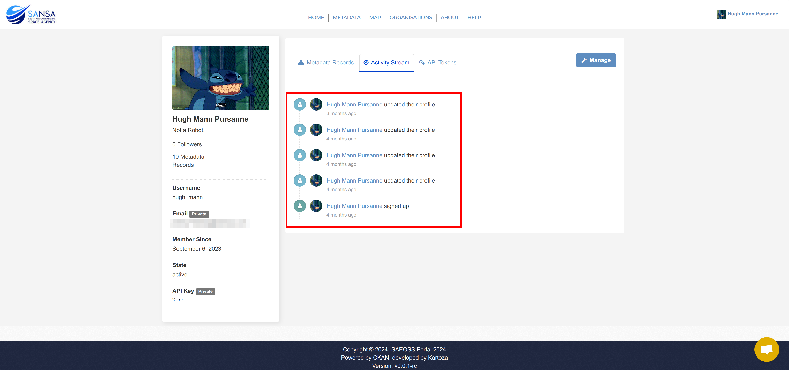
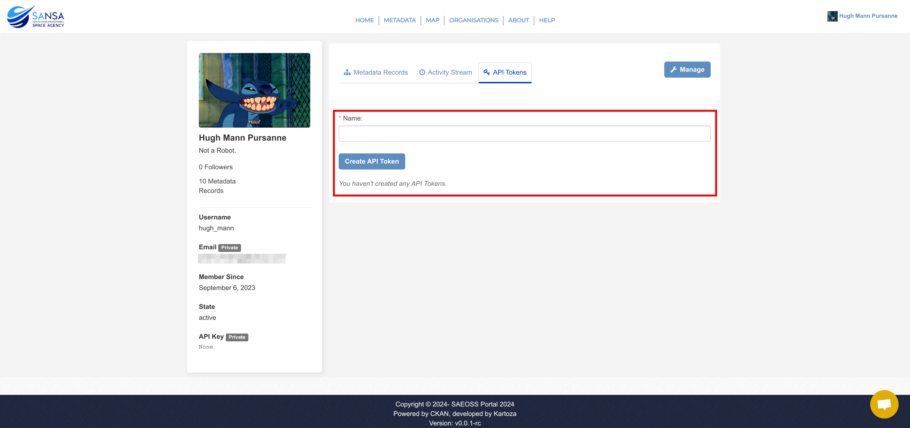

# Profile Page

The profile page provides a preview of what a user's profile will look like when viewed by other users on the platform. Additionally, it's also a collector for information regarding the user's profile.

This page is broken into 4 main sections:

1. **[Overview](#overview)**
2. **[Metadata Records](#metadata-records)**
3. **[Activity Stream](#activity-stream)**
4. **[API Tokens](#api-tokens)**

## Overview

When users click on `Profile`, the preview of the user's account will be displayed.

The user's profile picture, first name, username, email address, date of registration, account status and API key are displayed on the left. Users are also able to see the number of metadata records they have uploaded, how many followers they have and their biography (if added by the user).

> The email address and API key will not be viewable to other users (a System Administrator will be able to see it). This user has not generated an API key hence `None` is returned.

Example of what a user will see if they look at another user's profile.

## Metadata Records

Users are able to see their created metadata records in this section. Users are also able to add metadata records on this tab if they click on the `Add Metadata record` button.

## Activity Stream

This is where you see the latest activities on your account. This includes account registration, metadata record upload

## API Tokens

This is where users can create an API token, which can later be used to upload data. They need to specify the token name and then click on `Create API Token` to generate a unique token to be associated with their profile.

