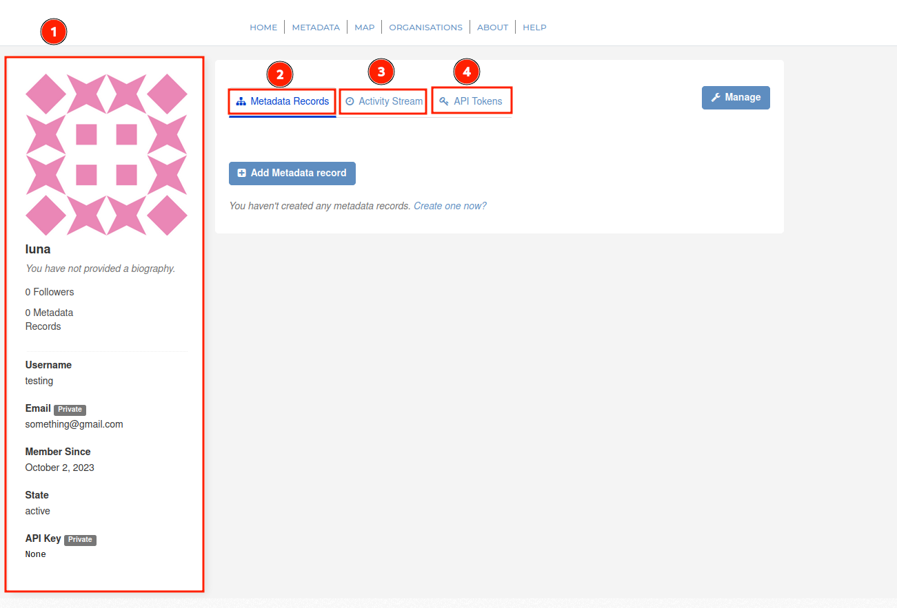
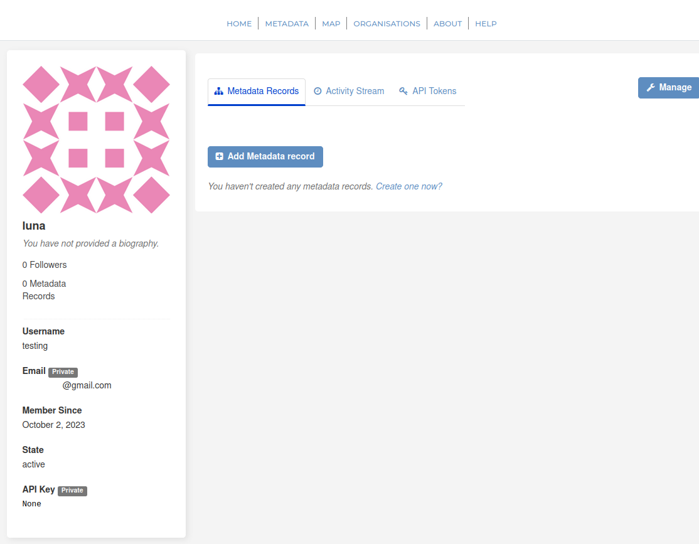
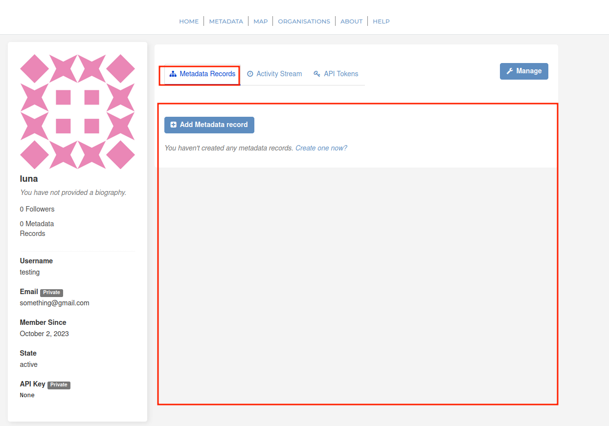
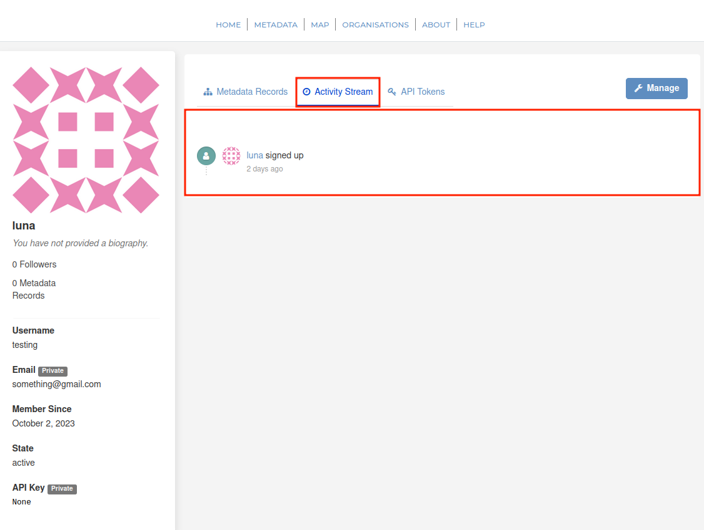
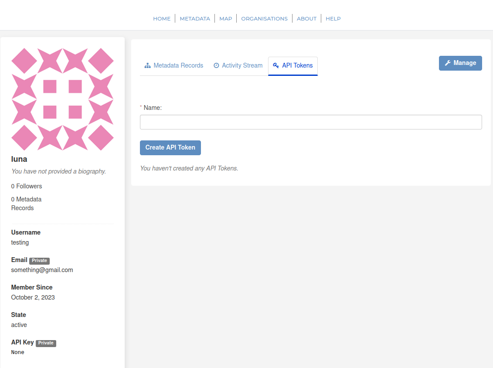

###### Previous Page: [Dashboard](dashboard.md)

# Profile Page

The profile page provides a preview of what your profile will look like when viewed by other users on the platform. Additionally, it's also a collector for information regarding your profile.

This page is broken into 4 main sections:

- **[Preview](#preview)**
- **[Metadata Records](#metadata-records)**
- **[Activity Stream](#activity-stream)**
- **[API Tokens](#api-tokens)**

### Preview

When you click on 'Profile', the preview of your account will be displayed.

As seen above, your first name, username, email address, day of registration, account status and API key are displayed on the left. Since this user has not generated an API key yet, 'None' is returned. You are also able to see the number of metadata records you have uploaded, how many followed you have and your biography (if added by user).

### Metadata Records

You are able to see your created metadata records in this section. You are also allowed to add metadata record on this tab when you select 'Add Metadata record'.

### Activity Stream

This is where you see the latest activities on your account. This includes account registration, metadata record upload

### API Tokens

This is where user can create an API token, which can later be used to upload data.

###### Next Page: [Profile Settings](profile-settings.md)
