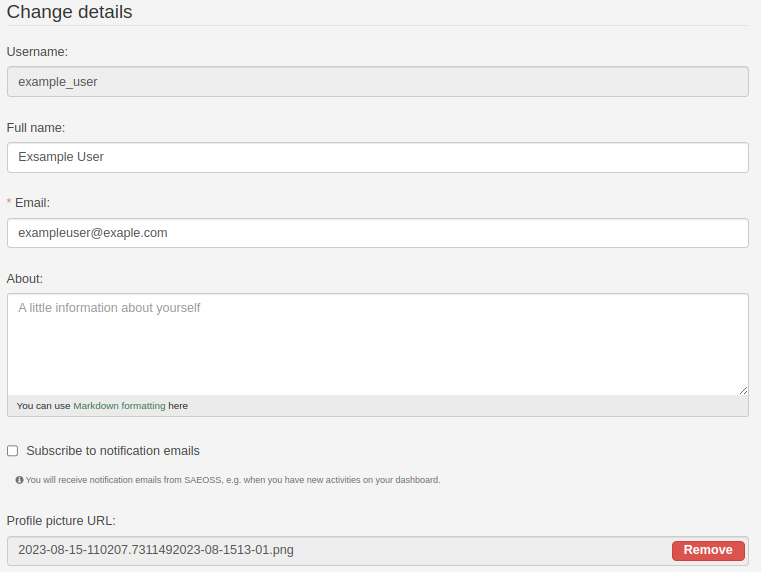
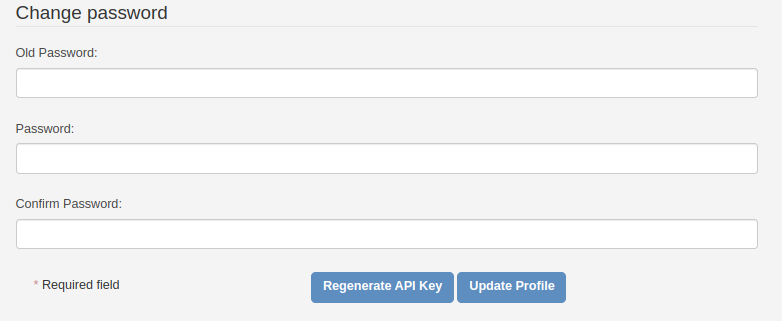

# Profile Settings

On the profile settings page, all user profile-related settings can be managed. This page can be accessed by following the steps in [this guide](../guide/profile-management.md).

## Key Elements

The profile settings page consists of three main sections, each consisting of key elements:

- **Change details:** Users can change their public details. This refers to their username, email, about section, and profile picture. Most of this information will be in the public domain (not a user's email address), and other users of the platform will be able to see this information.
  

- **Extra details:** Users can add extra details like affiliations and professional occupations.
  

- **Change Password:** Users can change their password from this section if required.
  

- **Regenerate API Key:** Causes a popup to appear asking if the user to confirm their action. To learn more about API tokens, follow this link. [Read more](./profile-page.md#api-tokens)
  
