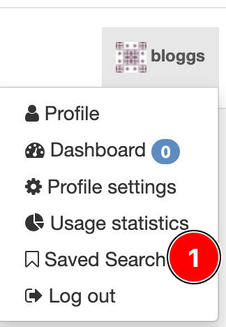
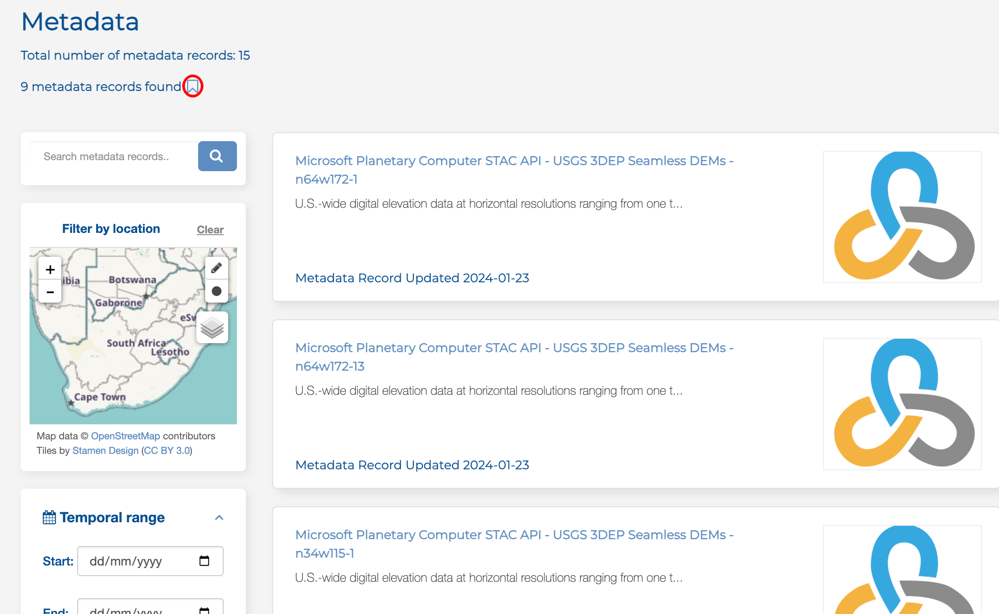

# Saved Searches

The Kartoza team integrated `Saved search` into CKAN. It allows users to store and reuse specific search queries. Users 
can save the search criteria for future reference when performing a complex or frequently used search.

## Save Search

Search historic can't be saved automatically. A user can choose to save a search or not. 
After filtering the metadata, click on the icon circled in red.

## Saved Search

1. Click on `Saved Search.`  To see all search historic. A `Saved Search` can be deleted or applied again. 

