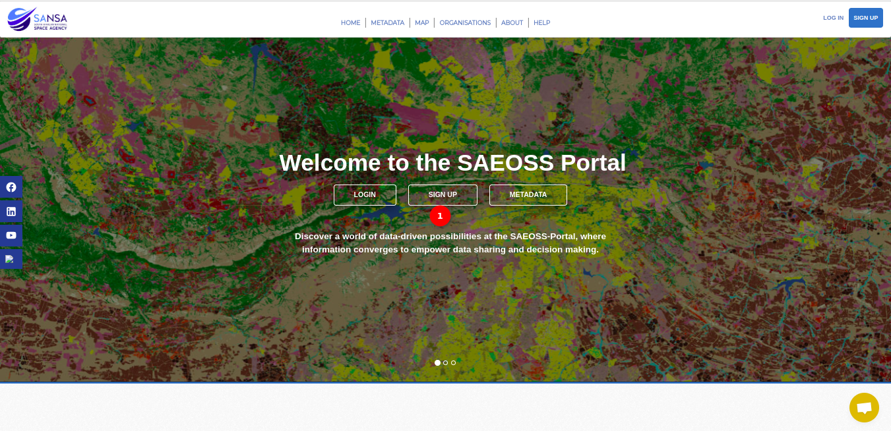
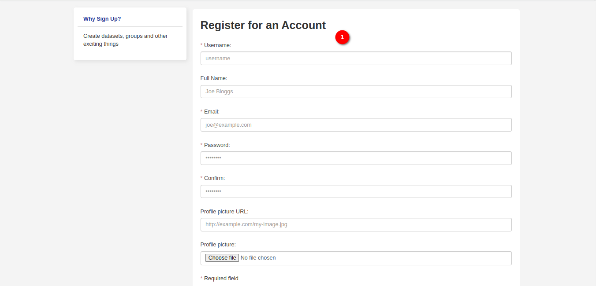

# Sign Up Page User Manual

## Overview

The `Sign Up` page allows users to create a new account, providing access to personalised features and content on the platform. This guide will walk users through the steps to sign up, including filling out the required fields and creating their account.

1. **Access Sign Up Page:** Click on the `SIGN UP` button available in the middle of the home page. 
2. **Other Access to Sign Up Page:** Alternatively, locate and click on the `SIGN UP` button in the top right corner of the page, where the user can find an option to create an account.

## Sign Up Page

1. **Fill Out Sign up Form:**

    The sign up form includes the following fields:
    - Username (Required)
    - Full Name
    - Email (Required)
    - Password (Required)
    - Confirm Password (Required)
    - Profile Picture URL: Enter the URL for the user's profile picture.
    - Profile Picture: Optionally, upload a profile picture by selecting a file.

    *Note:* Fields marked with * are required.

2. **Captcha:** Complete the Captcha form to verify that you are not a robot. The Captcha form serves as a security measure to differentiate between human users and automated bots attempting to access or interact with the system. It helps prevent spam, abuse, and unauthorised access by requiring users to prove their identity as a human user.

3. **Create Account:** After filling out the required fields, click on the `Create Account` button.
The system will process the user's information and create the user's account.

## Conclusion

Creating a new account is a simple and essential step to unlock personalised features on our platform. Follow these steps to complete the sign up process, and the user be ready to explore and engage with our community. If the user encounters any issues or has questions, feel free to contact the support team for assistance.
