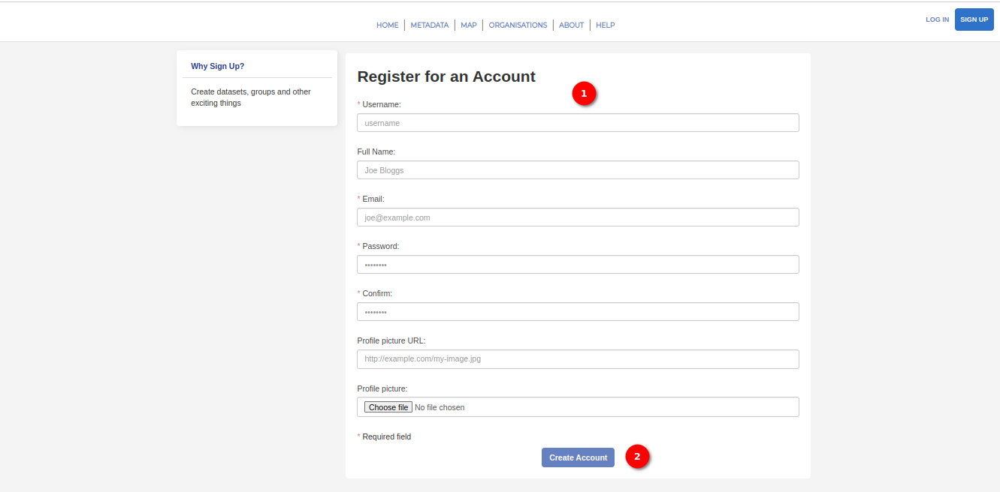

# Signup Page User Manual

## Overview

The `Signup` page allows users to create a new account, providing access to personalised features and content on the platform. This guide will walk users through the steps to sign up, including filling out the required fields and creating their account.

1. **Access Signup Page:** Click on the signup button available in the middle of the home page. Alternatively, locate and click on the login button in the top right corner of the page, where the user can find an option to create an account.

## Signup Page

1. **Fill Out Signup Form:**

    The signup form includes the following fields:
    - Username (Required)
    - Full Name
    - Email (Required)
    - Password (Required)
    - Confirm Password (Required)
    - Profile Picture URL: Enter the URL for the user's profile picture.
    - Profile Picture: Optionally, upload a profile picture by selecting a file.

    *Note:* Fields marked with * are required.

2. **Create Account:** After filling out the required fields, click on the `Create Account` button.
The system will process the user's information and create the user's account.

## Conclusion

Creating a new account is a simple and essential step to unlock personalised features on our platform. Follow these steps to complete the signup process, and the user be ready to explore and engage with our community. If the user encounters any issues or has questions, feel free to contact the support team for assistance.